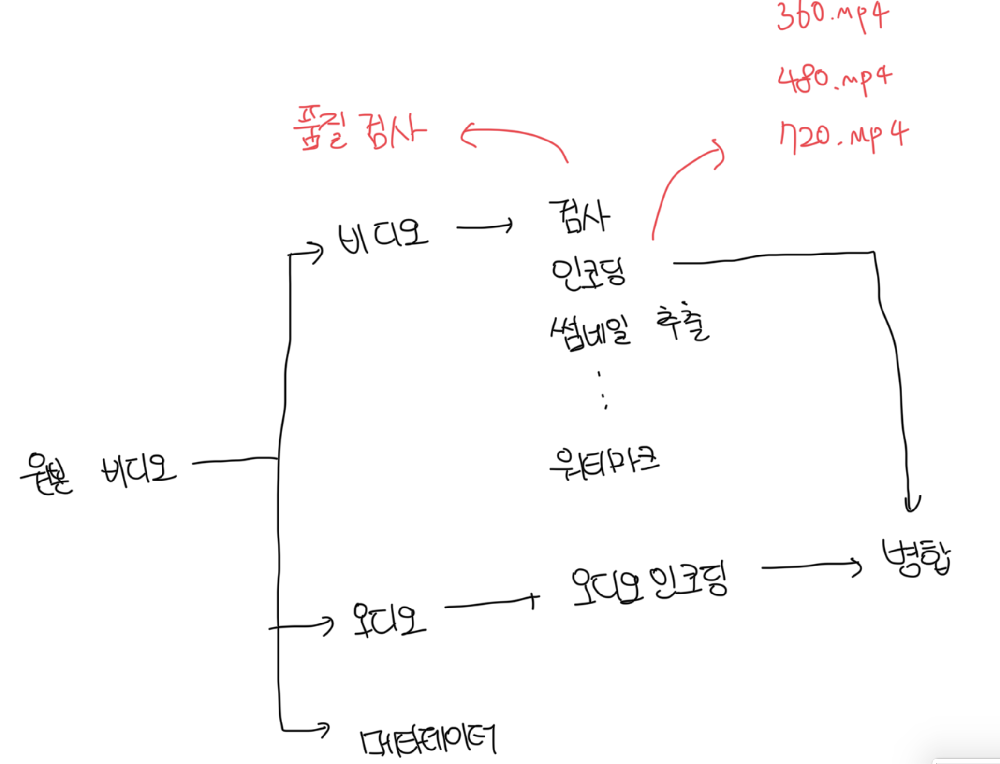
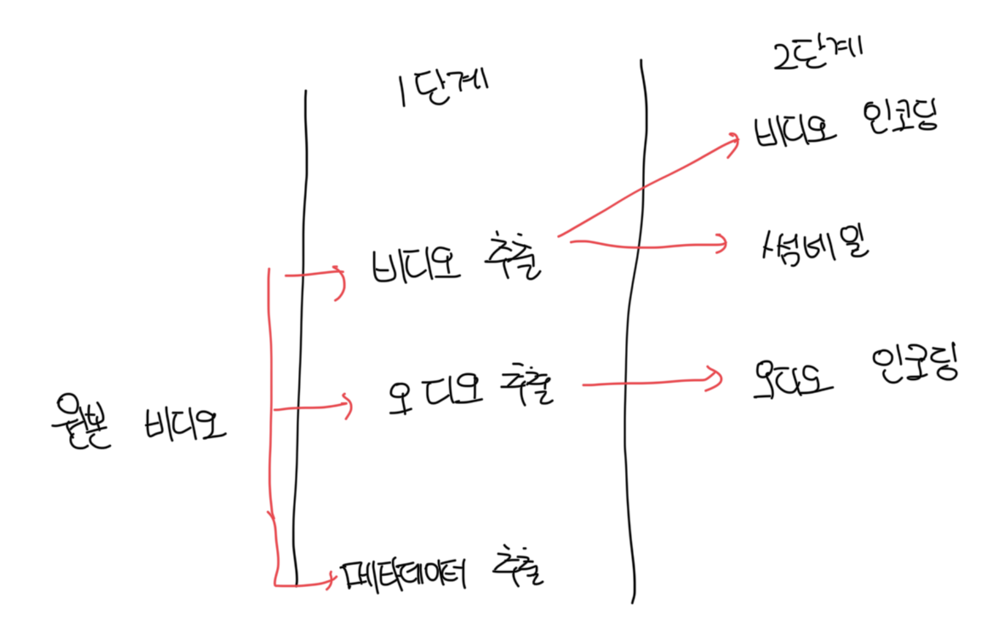
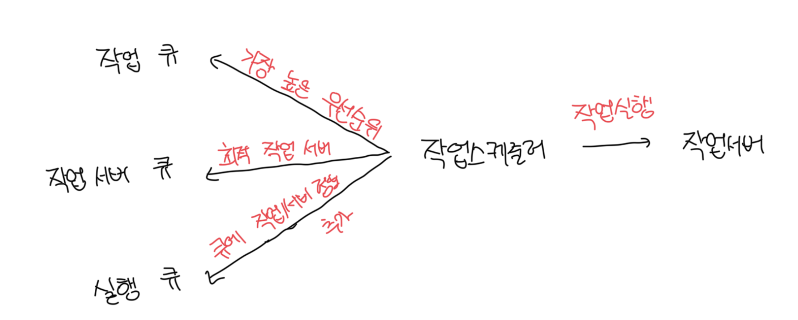
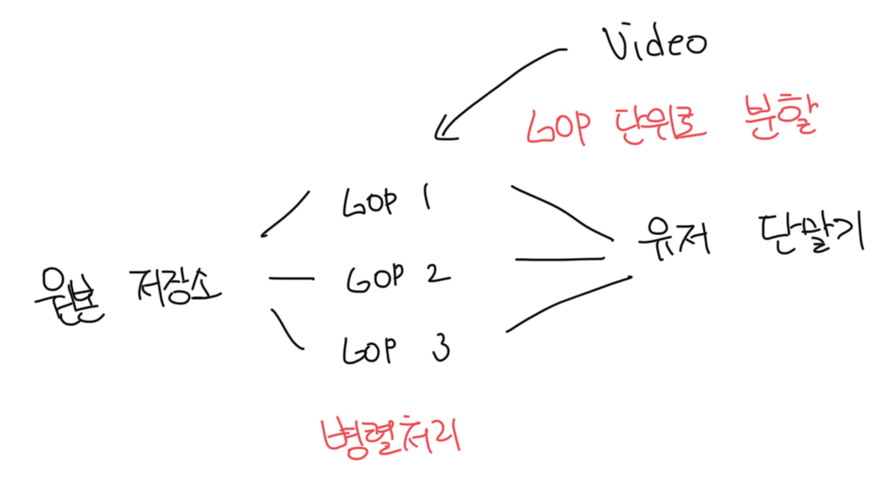
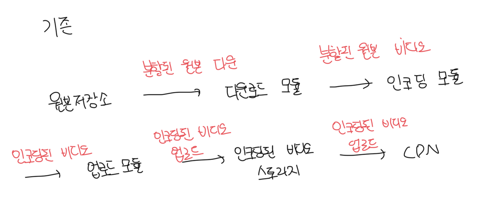
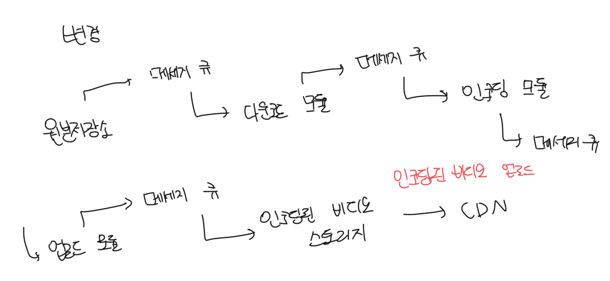
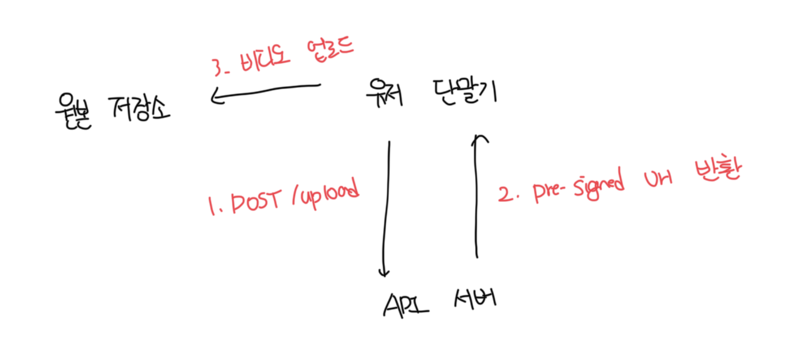

# 비디오 트랜스코딩

- 비트레이트는 비디오를 구성하는 비트가 얼마나 빨리 처리되야 하는지 나타냄
- 비트레이트가 높을수록 비디오의 화질이 높음
- 높은 비트레이트의 비디오를 재생할려면 고성능 컴퓨팅 파워와 회선이 있어야함

<br>

### 비디오 트랜스코딩이 중요한 이유

- 원본비디오(Raw Video)는 저장공간을 많이 사용함
- 초당 60FPS로 녹화된 HD 비디오는 수백 GB의 공간을 차지할수도 있음
- 상당수의 단말과 브라우저는 특정 종류의 비디오 포맷만 지원함
  - 여러개의 단말과 브라우저를 지원하기 위해서는 여러개의 포맷으로 인코딩하는게 좋음
- 사용자에게 끊김 없는 비디오를 보여주기 위해서는 네트워크 대역폭에 따라서 고화질, 저화질 비디오 모두 제공할 수 있어야함

<br>

### 인코딩 포맷

- 다양한 포맷이 존재하지만 크게 2부분으로 구분이 가능함
- 컨테이너
  - 비디오 파일, 오디오, 메타데이터를 담는 바구니
  - 컨테이너 포멧은 .avi, .mov. .mp4 같은 파일 확장자로 구분이 가능함
- 코덱
  - 비디오 화질은 보존하고 파일 크기를 줄일 목적으로 고안된 압축/해제 프로토콜
  - 가장 많이 사용되는 코덱은 H.264, Vp9, HEVC가 있음

<br>

# 유향 비순환 그래프(DAG) 모델

- 모든 비디오는 유저 취향에 따라서 다양한 커스텀이 들어가게됨
- 각기 다른 유형의 비디오 프로세싱 파이프라인을 지원하면서 병렬처리의 효율성을 높일려면 적절한 수준의 추상화 도입이 필요함
- 예를 들면 클라이언트에서 직접 실행할 작업을 손수 정의할 수 있게 하는등 이 있음



<br>

# 비디오 트랜스코딩 아키텍쳐

### 전처리기(preprocessor)

- 비디오 분할(video splitting)
  - 비디오 스트림을 GOP(Group of Picture) 단위로 쪼갬
  - 하나의 GOP는 독립적으로 재생이 가능하고, 보통 몇초정도다
  - 구버전 단말이나 브라우저는 GOP 단위 분할을 지원하지 않아서 전처리기가 대신 담당함
- DAG 생성
  - 클라이언트가 작성한 설정 파일에 따라서 DAG를 생성함
  ```json
  {
    "name": "transcode",
    "type": "Transcode",
    "input": {
      "input": "context.input"
    }
  }
  ```
- 데이터 캐시
  - 전처리기는 분할된 비디오의 캐시기도 함
  - GOP와 메타데이터를 임시 저장소에 보관하고, 인코딩 실패시 보관된 데이터로 재개함

<br>

### DAG 스케줄러

- DAG 그래프를 몇개의 단계로 분할해서 그 각각을 자원관리자의 작업 큐에 집어넣음



<br>

### 자원 관리자

- 자원 배분을 효과적으로 수행하는 역할을 담당함
- 작업 큐(task queue) : 실행될 작업이 들어있는 우선순위 큐
- 작업 서버 큐(worker queue) : 작업 서버의 가용 상태 정보가 보관된 큐
- 실행 큐(running queue) : 현재 실행중인 작업 및 작업 서버 정보가 보관된 큐
- 작업 스케줄러 : 최적의 서버와 작업을 골라서 해당 작업 서버가 작업을 수행하도록 지시하는 역할



<br>

### 임시 저장소

- 임시 저장소 구현은 저장할 데이터 유형, 크기, 이용빈도 등에 따라서 선택해야함
- 메타데이터는 작업 서버가 빈번하게 참조하는 정보고 크기도 작은게 보통임
- 오디오나 동영상을 저장할려면 BLOB 스토리지에 두는게 좋음
- 임시 저장소에 보관된 데이터는 비디오 프로세싱이 끝나면 삭제한다

<br>

# 시스템 최적화

### 속도 최적화 : 비디오 병렬 업로드

- 비디어 전부를 한번의 업로드로 올리는건 비효율적이다
- 비디오를 GOP 단위로 분할하고 병렬로 업로드하면 효율적이다
  - 중간에 실패해도 업로드 한 지점에서부터 이어서 작업이 가능함
  - 병렬로 처리되기 때문에 업로드 속도가 올라감



<br>

### 속도 최적화 : 업로드 센터를 위치기반으로 지정

- 업로드 센터를 여러곳에 배치하는 방법이다
- 미국 거주자는 미국 업로드 센터로, 중국은 아시아로 보내게된다
- 이를 위해서 CDN을 업로드 센터로 활용이 가능하다

<br>

### 속도 최적화 : 모든 절차를 병렬화

- 낮은 레이턴시를 달성하는건 어렵다
- 이를 시도하기 위한 또 다른 방법은 느슨하게 결합된 시스템을 만들어서 병렬성을 높이는 작업이다
- 기존에는 선행 작업을 대기하고 이후 작업이 진행되었지만 메세지 큐 도입을 통한 느슨한 결합으로 이벤트 각각을 병렬적으로 처리가 가능해짐




<br>

### 안정성 최적화 : pre-signed url

- 허가받은 사용자만 동영상 업로드가 가능하도록 제한이 가능함
- 대표적으로 AWS S3의 pre-signed url이 있음



<br>

### 안정성 최적화 : 비디오 보호

- 디지털 저작권 관리(DRM, Digital Rights Management) 도입
  - 해당 부분에서 가장 널리 사용되는 시스템
  - 애플의 Fairplay, 구글의 Widevine, MS의 PlayReady가 있음
- AES 암호화(encryption) 도입
  - 비디오를 암호화하고 접근권한을 설정하는 방식
  - 암호화된 비디오는 재생시에만 복호화됨
  - 허락된 사용자만 암호화 된 비디오 시청이 가능함
- 워터마크(watermark) 도입
  - 비디오 위에 소유자 정보를 포함하는 이미지 오버레이를 올리는 것
  - 회사 로고나 이름 등을 이 용도에서 사용이 가능함

<br>

# 비용 최적화

- CDN은 해당 서비스의 핵심이고 가장 많은 요금을 지불하는 서비스다
- 연구결과에 따르면 유투브 비디오 스트링은 롱테일 분포를 따른다
  - 인기있는건 자주 재생되지만, 나머지는 거의 보는 사람이 없다
- 인기가 별로 없는 인코딩이 필요없을수도 있고, 짧은 비디오면 그냥 필요할 때 인코딩해서 재생시켜줄수도 있다
- 어떤 비디오는 특정 지역에서만 인기가 높아서, 다른 지역에 옮길 필요가 없을수도 있음
- ISP와 계약을 맺어서 CDN을 직접 구축할수도 있다. 기존 통신비보다는 절감되겠지만 CDN을 직접 구축하는건 매우 힘든일이다

<br>

# 오류처리

- 대형 시스템에서는 불가피하다
- 가능하면 장애를 아주 잘 감내하는 서비스를 만들어서 우하하게 처리하고 빠르게 회복해야한다

<br>

### 회복 가능 오류(Revocerable error)

- 특정 비디오 세그먼트를 트랜스코딩하다 실패 등 이런 오류는 회복이 가능하다
- 일반적으로는 몇 번 재시도를 통해서 해결된다
- 만약 N번 이상 재시도를 했는데 여전히 실패한다면 적절한 오류코드를 반환해야한다

<br>

### 회복 불가능 오류(non-revocerable error)

- 비디오 포맷이 잘못되거나 회복 불가능한 오류가 발견되면 시스템은 해당 비디오에 대한 작업을 중단하고 적절한 오류코드를 반환해야한다
