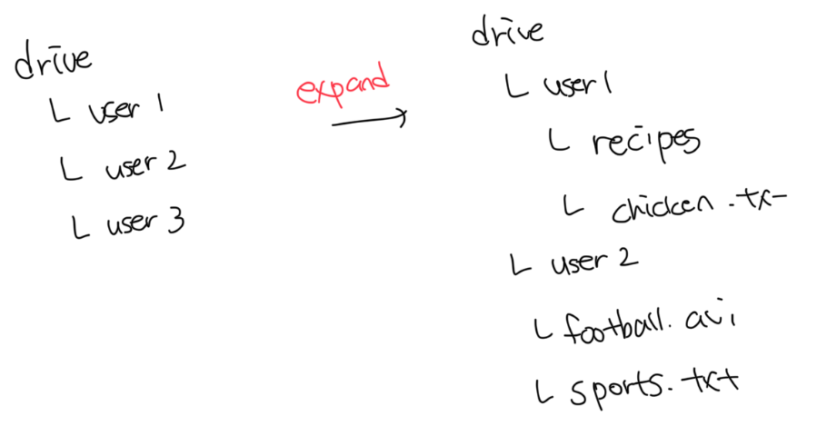
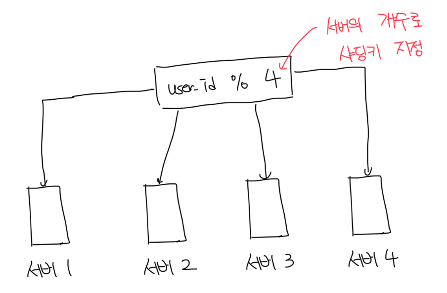
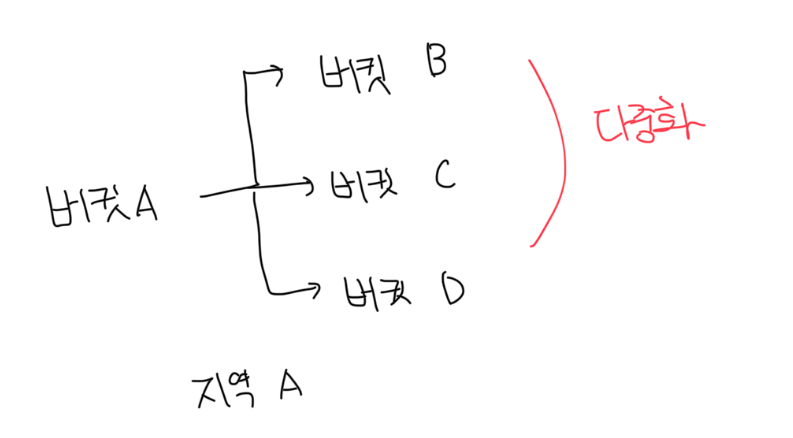
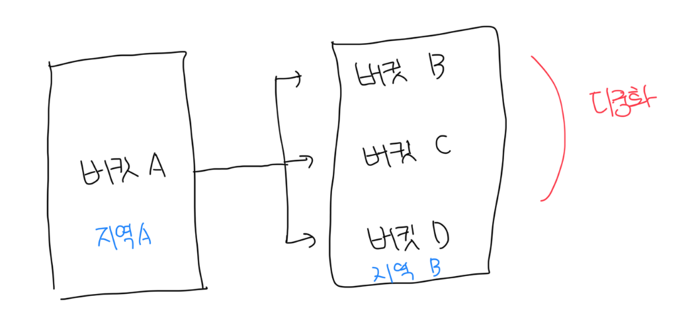
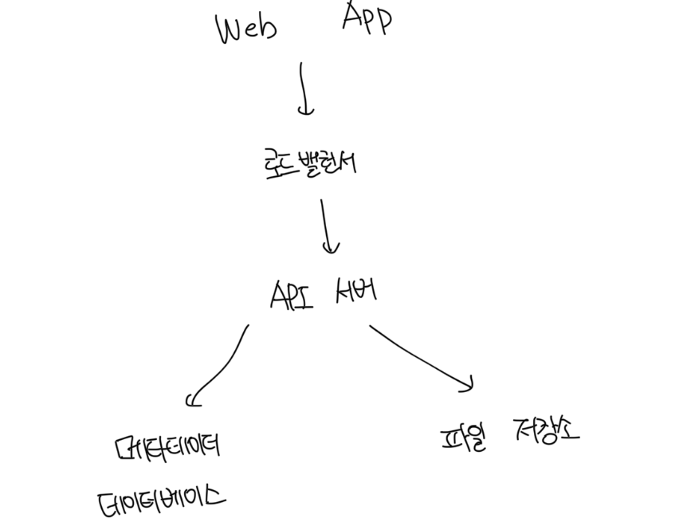
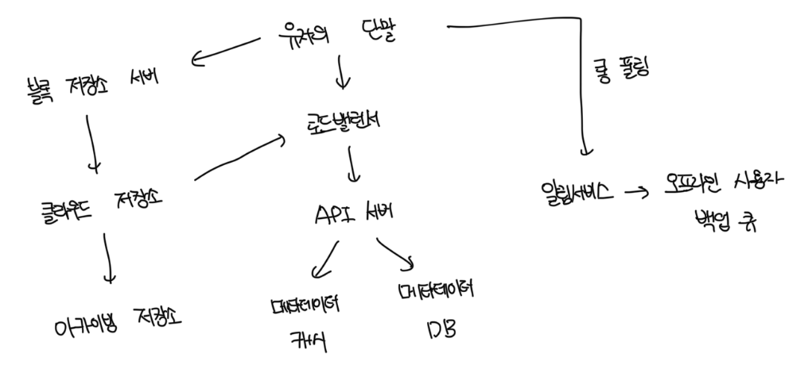

# 요구사항

- 파일 업로드, 다운로드
- 여러 단말에 파일 동기화
- 파일 갱신 이력 조회
- 파일 공유
- 파일 편집, 삭제, 공유됬을때 알람표시

<br>

# 비 기능적 요구사항

- 안정성 : 데이터 손실이 발생하면 안됨
- 빠른 동기화 속도 : 파일 동기화에 시간이 너무 오래걸리면 안됨
- 네트워크 대역폭 : 최대한 적은 네트워크 사용
- 규모 확장성 : 아주 많은 양의 트래픽도 처리가 가능해야함
- 높은 가용성 : 일부 서버에 장애가 나거나 느려지거나 네트워크가 끊겨도 시스템은 계속 사용 가능해야함

<br>

# 개략적 추정치

- 가입자는 5000만명, DAU는 1000만
- 모든 사용자에게 10GB의 무료 저장공간 제공
- 매일 각 사용자가 평균 2개의 파일을 업로드 한다고 가정함, 파일의 평균은 500KB
- 읽기 : 쓰기 비율은 1:1이다
- 필요한 저장공간 총량 : 5000만 & 10GB = 500PB
- 업로드 API QPS = 1000만 \* 2회 / 24시간 / 3600초 = 약 240회
- 최대 QPS = 240 \* 2 = 480회

<br>

# 개략적 설계안

- 처음부터 거대한 시스템 대신 단일서버에서 시작
- 파일 업로드, 다운로드를 처리할 웹 서버
- 유저 데이터, 로그인 정보, 파일정보 등 메타데이터를 저장할 디비
- 파일을 저장할 저장공간, 파일 저장을 위해 1TB의 공간 사용

<br>

### 저장 공간의 구조



<br>

# API 설계

### 파일 업로드 API

> POST https://api.example.com/files/upload?uploadType=resumeable

- 단순 업로드 : 파일 크기가 작을 때 사용함
- 이어 올리기(resumeable upload) : 파일 사이즈가 크고, 네트워크 문제로 업로드가 중단될 가능성이 높다고 생각하면 사용
  - 인자 : uploadType=resumable, data=데이터
  - 이어 올리기 URL을 받기 위한 최초 요청 전송
- 데이터를 업로드하고 업로드 상태 모니터링
- 업로드에 장애가 발생시 장애 발생시점부터 업로드 재시작

<br>

### 파일 다운로드 API

> POST https://api.example.com/files/download

- 인자 : 다운로드할 파일의 경로

```json
{
  "path": "path/to/file"
}
```

<br/>

### 파일 갱신 히스토리 API

> POST https://api.example.com/files/list_revisions

- 인자
  - path : 갱신 히스토리를 가져올 파일의 경로
  - limit : 갱신 히스토리를 가져올 만큼 제한

```json
{
  "path": "path/to/file",
  "limit": 10
}
```

<br>

# 한대 서버의 제약 극복

- 만약 1TB의 서버의 용량이 가득 찻다고 가정한다
- 이 때 가장먼저 떠오르느 해결은 데이터를 샤딩하는 방식이다

<br>

### 샤딩

- 샤딩키를 통해서 저장되는 서버를 분산한다
- 하지만 여전히 장애로 인한 가용성 문제가 남아있다



<br>

### AWS S3

- S3는 아마존에서 제공하는 객체 저장소 서비스로 업계 최고의 규모확장, 가용성, 보안 등을 제공한다
- 넷플릭스나 에어비엔비 같은 기업들도 저장공간으로 S3를 사용한다
- 동일 지역이나 여러개의 지역(region)에서 다중화도 지원한다
- S3의 버킷은 마치 파일 시스템의 폴더와 동일하다




<br>

### 최종 데이터베이스와 저장공간 구조

- 데이터베이스와 파일 저장시스템 분리를 통한 SPOF 회피
- S3 사용을 통한 가용성과 무손실을 보장



<br>

# 동기화 충돌

- 두 명 이상의 사용자가 같은 파일이나 폴더를 동시에 업데이트하려고 하면 동기화 충돌이 발생함
- 이에 대한 해결전략은 먼저 처리되는건 성공한것으로 보고, 나중에 처리되는건 충돌이 발생한 것으로 표시하는것임
- 결국 충돌난 파일에 대해서 두 파일을 하나로 합칠지 또는 둘중 하나를 다른 파일로 대체할지 정해야한다


<br>

# 개략적 설계안



<br>

### 블록 저장소 서버(Block Server)

- 파일 블록을 클라우드 저장소에 업로드 하는 서버
- 파일을 여러개의 블록으로 나눠서 저장하고, 각 블록에는 고유한 해시값이 저장됨
- 해시값은 메타데이터 디비에 저장됨
- 이후에 원본 파일을 재구성 할려면 블록들을 원래 순서대로 합쳐야함

<br>

### 아카이빙 저장소(Cold Sotrage)

- 오랫동안 사용되지 않은 비활성 데이터를 저장하기 위한 컴퓨터 시스템

<br>

### 메타데이터 데이터베이스

- 사용자 파일, 블록, 버전 등 메타데이터 정보를 저장함
- 실제 파일은 클라우드에 보관하고, 해당 디비는 오직 메타데이터만 관리함

<br>

### 메타데이터 캐시

- 성능을 높이기 위해서 자주 사용하는 메타데이터를 캐시함

<br>

### 오프라인 사용자 백업 큐(Offline Backup Queue)

- 클라이언트가 접속중이 아니라서 파일의 최신 상태 확인이 불가능할때 해당 정보를 해당 큐에 추가함
- 큐에 추가된 정보로 클라이언트가 나중에 접속했을 때 동기화가 될 수 있도록 함
