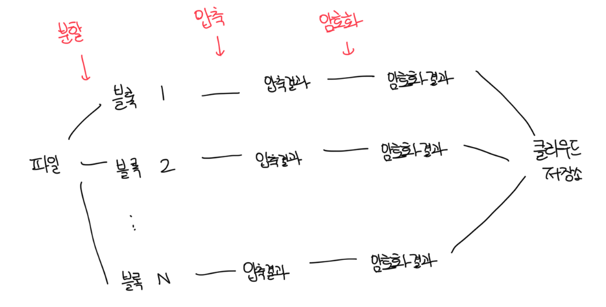
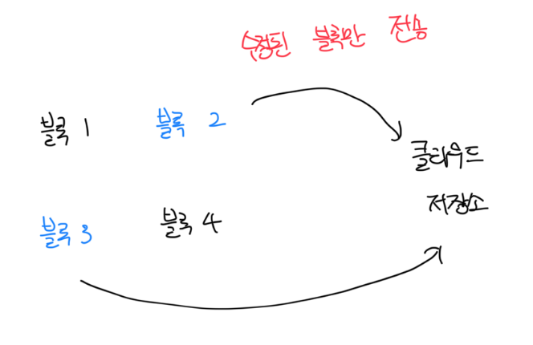

# 블록 저장소 서버

- 큰 파일을 업데이트 할떄 전체 파일을 보내면 대역폭을 많이 잡아먹게됨
- 이를 최적화 하는 방법엔 2가지가 있음

 

### 델타 동기화(Delta Sync)

- 파일이 수정되면 전체 파일 대신 수정이 일어난 블록만 동기화

 

### 압축(Compression)

- 블록 단위로 압축해서 데이터 크기 절약이 가능함
- 압축 알고리즘은 파일에 따라서 달라짐

 

# 높은 일관성 요구사항

- 강환 일관성(strong consistency) 모델을 기본적으로 지원해야함
  - 같은 파일이 단말이나 사용자에 따라서 다르게 보이면 안됨
- 메모리 캐시는 결과적 일관성(eventual consistency)을 지원함
  - 캐시에 보관된 사본과 디비에 있는 원본이 일치함
  - 디비에 보관된 원본에 변경이 발생하면 캐시에 있는 사본을 무효화함

 

# 업로드 절차

### 파일에 메타데이터 추가

- 클라이언트 1이 새로운 파일의 메타데이터를 추가하기 위한 요청 전송
- 새 파일의 메타데이터를 디비에 저장하고 업로드 상태를 대기중(PENDING)으로 변경
- 새 파일이 추가되었음을 알림 서비스에 통지
- 알림 서비스는 관련된 클라이언트(클라이언트 2)에게 파일이 업로드 됬다고 통지

 

### 파일을 클라우드 저장소에 업로드

- 클라이언트 1이 파일을 블록 저장소 서버에 업로드
- 블록 저장소 서버는 파일을 블록 단위로 분할, 압축, 암호화 후 클라우드 저장소에 업로드
- 업로드가 끝나면 클라우드 스토리지는 완료 콜백을 호출, 해당 콜백은 API 서버로 전송됨
- 메타데이터 디비에 기록된 해당 파일의 상태를 완료로 변경
- 알림 서비스에 파일 업로드 완료 통지
- 알림 서비스는 관련된 클라이언트(클라이언트 2)에게 파일이 업로드 됬다고 통지

 

# 다운로드 절차

### 다른 클라이언트가 파일을 편집, 추가했을떄 감지하는 방법

- 클라이언트 A가 접속중이고 다른 클라이언트가 파일을 변경하면 알림 서비스가 클라이언트 A에게 파일 변경이 발생했으니 새 버전을 가져가라고 알림
- 클라이언트 A가 네트워크에 연결된 상태가 아닌 경우 데이터는 캐시에 보관됨. 이후 상태가 바뀌면 그 때 새로운 버전을 가져감

 

# 알림 서비스

- 파일의 일관성 유지를 위해서 변경이 발생하면 알림을 통해서 다른 클라이언트에게 이러한 사실을 통보함
- 알림은 롱 폴링이나 웹소켓으로 전송됨
-

 

### 저장소 시스템에는 롱 폴링이 적합하다?

- 채팅서비스와 달리 양방향 알림이 필요하지 않음
- 서버는 파일이 변경된 사실을 클라이언트에게 알려줘야 하지만, 반대는 그렇지 않음
- 각 클라이언트는 알림 서버와 롱 폴링 연결을 유지하다가 변경사항이 생기면 해당 연결을 끊음
- 이후에 반드시 메타데이터 서버와 연결해서 파일의 최신 내역을 다운로드 해야함
- 다운로드 작업이 종료됬거나 폴링 타임아웃 시 즉시 새로운 요청을 보내서 롱 폴링 연결을 복원하고 유지해야함

 

# 저장소 공간 절약

- 저장소 시스템은 갱신 이력을 보존하고 안정성을 보장하기 위해 여러개의 버전을 관리해야함
- 단순히 변경된 버전을 여러개 업로드하면 금방 저장공간이 부족해질수도 있음

 

### 중복 제거(de-deupe)

- 중복된 파일 블록을 계정 차원에서 제거하는 방법
- 두 블록이 같은 블록인지는 해시값을 통해서 비교하여 판단함

 

### 지능적 백업 전략 도입

- 한도 설정 : 보관해야 하는 파일 버전 개수에 상한을 둠, 상한을 초과하면 제일 오래된 버전부터 제거함
- 중요한 버전만 보관 : 불필요한 버전과 사본이 만들어지는걸 피할려면 그 가운데 중요한것만 골라내야함
- 아키이빙 저장소 사용 : 몇달 또는 수년간 이용되지 않은 데이터는 아카이빙 데이터에 옮긴다
  - S3의 글레이어 같은 아카이빙 저장소 이용료는 S3보다 훨씬 저렴함

 

# 장애처리

### 로드밸런서

- 로드밸런서에 장애가 발생하면 부(secondary) 로드밸런서를 통해서 트래픽을 이어받아야함
- 로드밸런서 끼리는 보통 박동 신호를주기적으로 보내서 상태를 모니터링함

 

### 블록 저장소 서버 장애

- 블록 저장소 서버도 한 서버에 장애가 발생하면 다른 서버가 작업을 이어받아야함

 

### 클라우드 저장소 장애

- S3 버킷은 여러개의 리전에 배치가 가능하므로 한 지역에 장애가 발생하면 다른 지역에서 가져와야함

 

### API 서버 장애

- API 서버들은 무상태다
- 로드밸런서는 API 서버에 장애가 발생하면 트래픽을 해당 서버에 가지 않도록 격리한다

 

### 메타 데이터 캐시 장애

- 메타데이터 캐시 서버도 다중화 한다
- 마찬가지로 다른 캐시서버에서 데이터를 가져올 수 있게 하고 장애가 발생한 서버는 새로운 서버로 교체한다

 

### 메타데이터 디비 장애

- 주 서버 장애 : 부 서버중 하나를 주 서버로 변경하고, 부 서버를 새로 하나 추가한다
- 부 서버 장애 : 다른 부 서버가 읽기 연산을 처리하도록 페일오버 하고, 그 동안 새로운 부 서버를 추가한다

 

### 알림 서비스 장애

- 알림 서비스는 롱 폴링을 유지해야한다
- 드롭박스 기준 한대당 100만개 이상의 커넥션을 처리한다
- 100만개의 롱 폴링 연결은 쉽지만, 장애가 발생했을때 다른 서버에 단시간에 100만개의 요청을 받기는 힘들다
- 페일오버시에는 상대적으로 느릴수도 있다

 

### 오프라인 사용자 백업 큐 장애

- 큐 또한 이중화가 되어야한다
- 큐에 장애가 발생하면 구독 중인 클라이언트들은 백업 큐로 구독 관계를 재설정 해줘야한다
