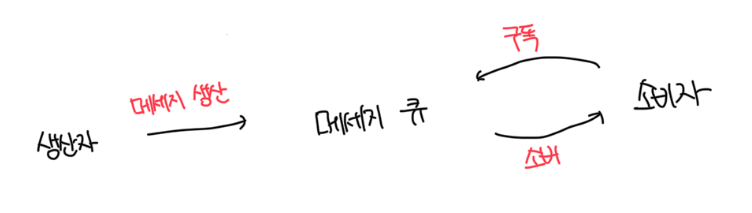
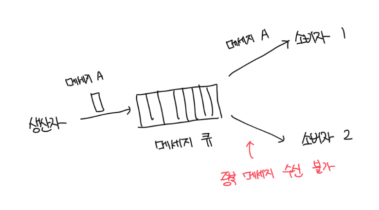
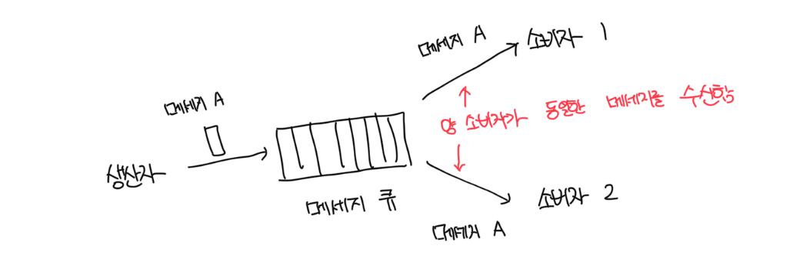
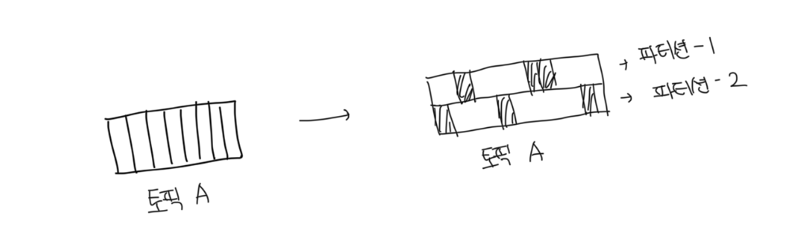
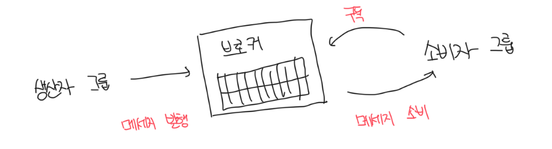
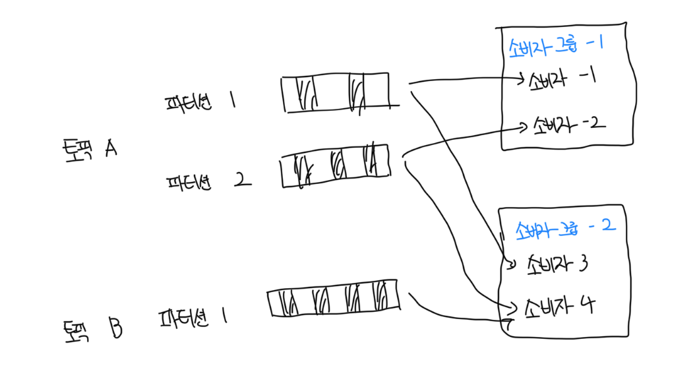
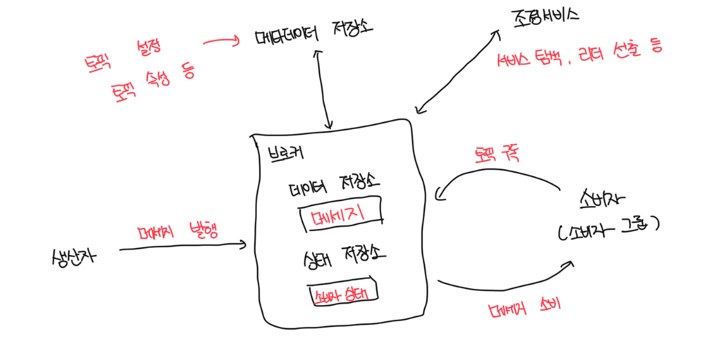

# 기본적인 기능

- 생산자는 메세지 큐에 메세지를 발행하고 소비자는 큐를 구독하고 메세지를 소비함
- 메세지 큐는 생산자, 소비자 사이 결합을 느슨하게 하는 서비스로
  - 생산자와 소비자의 독립적인 운영 및 규모 확장을 가능하게 하는 역할 담당
- 생산자 소비자는 모두 클라이언트/서버 모델 관점에서 보면 클라이언트다
- 서버 역할을 하는 것은 메세지 큐고 이 클라이언트와 서버는 네트워크를 통해 통신함

 

# 메세지 모델

### 일대일 모델

- 흔히 발견되는 전통적인 모델
- 큐에 전송된 메세지는 오직 하나의 소비자만 가져갈 수 있음
- 소비자가 가져갔다고 메세지 큐에 알리면 해당 메세지는 삭제됨
- 소비자가 메세지를 가져갈 수 없을 때 큐에 알리면 메세지가 삭제됨
  - 즉 데이터 보관(date retention)을 지원하지 않음

 

### 발행-구독 모델

- 해당 모델에서는 토픽(topic)이라는 새로운 개념이 등장하는데, 이는 메세지를 주제별로 정리하는데 사용됨
- 각 토픽은 메세지 큐 서비스 전반에 고유한 이름을 가지고, 보낼떄와 받을때 모두 토픽을 통해서 처리함
- 전통적인 메세지 큐와 다르게 토픽에 전달된 메세지는 해당 토픽을 구독하는 모든 소비자에게 전달됨

 

# 토픽, 파티션, 브로커

- 토픽에 보관되는 메세지의 양이 커지면, 서버 한 대로 감당하기 힘든 상황이 벌어진다
- 이 때 파티션 즉 샤딩 기법을 활용하면 처리가 가능하다
- 토픽을 여러 파티션으로 분할한 다음에 메세지를 모든 파티션에 균등하게 나눠서 보낸다

- 파티션을 유지하는 서버는 보통 브로커라고 부른다
- 파티션을 브로커에 분산하는 것이 높은 규모 확장을 달성하는 비결이다.
  - 만약 토픽의 용량을 확장하고 싶다면, 파티션 개수를 늘리면 되기 때문이다
- 각 토픽 파티션은 FIFO로 동작한다. 즉 같은 파티션 안에서는 메세지의 순서가 유지된다

 

# 소비자 그룹

- 소비자 그룹 내 소비자는 토픽에서 메세지를 소비하기 위해서 서로 협력함
- 하나의 소비자 그룹은 여러 토픽 구독이 가능하고, 오프셋을 별도로 관리한다
- 같은 그룹 내의 소비자는 메세지를 병렬로 소비할 수 있다

 

### 소비자 그룹의 소비순서 문제

- 데이터를 병렬로 처리하면 대역폭(throughput) 측면에서는 좋지만, 파티션 안에 있는 메세지를 순서대로 소비할 수 없음
- 어떤 파티션의 메세지는 한 그룹 안에서는 오직 한 소비자만 읽을 수 있도록 제한하면 해결됨
- 위 제약사항을 도입하면 모든 소비자를 같은 소비자 그룹에 두면 같은 파티션의 메세지는 오직 하나의 소비가만 가져갈 수 있음
  - 결국 1:1 모델에 수렴하게됨

 

# 개략적 설계안

- 서비스 탐색 : 어떤 브로커가 살아있는지 알려줌
- 리더 선출 : 브로커 중 1개는 컨트롤러를 담당함. 한 클러스터에는 반드시 하나의 활성 컨트롤러가 존재해야함. 파티션 배치를 담당
  - 일반적으로 아파치 Zookeeper, etcd가 보통 컨트롤러 선출을 담당함

