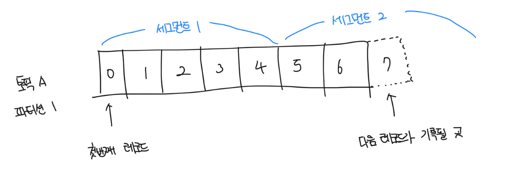
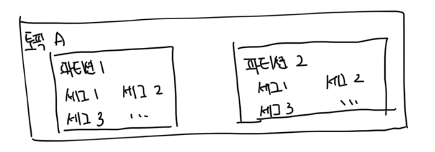
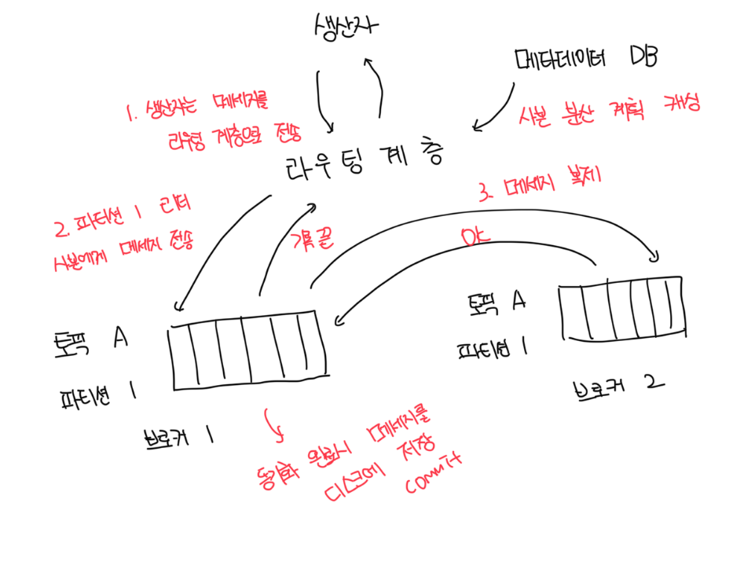
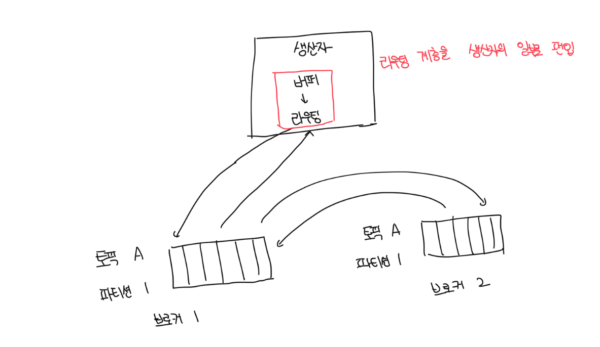
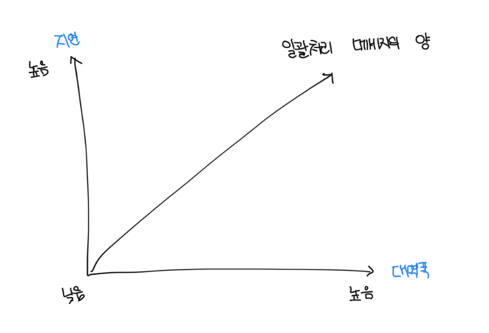

# 높은 대역폭을 제공하기 위한 설계

- 회전식 디스크 사용과 적극적 디스크 캐시 전략
  - 높은 순차 탐색 성능 제공
  - 현재적 OS가 제공하는 전략으로 디스크 기반 자료구조를 활용
- 메세지가 생산자로부터 소비자로 전달되는 순간까지 아무 수정 없이도 전송이 가능하도록 하는 메세지 자료 구조 설계하고 활용하기
  - 데이터의 양이 막대한 경우 메세지 복사에 드는 비용을 최소화하기 위함
- 일괄처리를 우선시 하는 시스템 설계
  - 소규모 I/O가 많은 경우는 높은 대역폭 지원이 어려움
  - 생산자는 메세지를 일괄 전송
  - 메세지 큐는 메세지들을 더 큰 단위로 묶어서 보관
  - 소비자도 가능하면 메세지를 일괄 수신하도록함

 

# 데이터 저장소

- 메세지 큐의 트래픽 패턴
  - 읽기와 쓰기가 빈번하게 발생
  - 갱신/삭제 연산은 발생하지 않음, 순차적인 읽기/쓰기가 대부분임

 

### 선택지 1 : 데이터베이스

- 관계형 디비
  - 토픽별로 테이블을 만듬
  - 토픽에 보내지는 메세지는 해당 테이블에 새로운 레코드로 추가됨
- NoSQL 디비
  - 토릭별로 컬렉션을 만듬
  - 토픽에 보내는 메세지는 하나의 문서가 됨
- 읽기/쓰기 연산이 동시에 대규모로 빈번하게 발생하는 디비 설계는 어렵다
- 최적의 선택지가 될 수 없고 오히려 병목지점이 될수도있음

 

### 선택지 2 : 쓰기 우선 로그(Write-Ahead Log, WAL)

- 새로운 항목이 추가되기만 하는 `append-only` 일반 파일
  - 대표적으로 mYsql의 redo log, 아파치 주키머가 해당 기술을 사용함
- 지속성을 보장해야 하는 메세지는 디스크에 WAL로 보관할 것을 추천함

- 접근 패턴은 읽기/쓰기 전부 순차적이고, 접근 패턴이 순차적일때 디스크는 아주 좋은 성능을 보임
- 파일의 크기가 무한정 커질때는 세그먼트 단위로 나누는게 바람직함
- 새 메세지는 활성 상태의 세그먼트에만 추가되고, 가득 차게되면 비활성 상태로 바꿈
  - 비활성 세그먼트는 보관 기한이 만료되거나 용량 한계에 다다르면 삭제해버릴수 있음

 

# 디스크의 성능 관련 유의사항

- 요즘 HDD(회전식 디스크)가 느리다는건 널리 퍼진 편견임
- 회전식 디스크가 정말로 느려지는 것은 데이터 접근 패턴이 무작위(random)일때임
- 순차적으로 접근하는 경우 RAID 구성을 하면 오히려 초당 수백메가바이트 단위 처리도 가능하고 비용도 저렴함

 

# 메세지 자료 구조

- 메세지 자료 구조는 생산자, 메세지 큐, 소비자 사이의 계약(contract)임
- 시스템의 컴포넌트 간 이러한 계약을 받아들이지 못하면 메세지 변경이 필요하고 값비싼 복사로 이어짐, 시스템 전반적인 성능이 저하됨

 

### 메세지 자료 구조 스키마

| 필드 이름 | 데이터 자료형 |
| --------- | ------------- |
| key       | byte[]        |
| value     | byte[]        |
| topic     | string        |
| partition | int           |
| offset    | long          |
| timestamp | long          |
| size      | integer       |
| crc       | integer       |

 

### 메세지의 key

- key는 파티션을 정할 떄 사용됨. 주어지지 않으면 메세지의 파티션은 무작위로 결정됨
- 키가 주어진 경우는 `hash(key) % 4`로 결정됨
- 키에는 비즈니스에 관련된 정보가 담기는 것이 보통이고, 클라이언트에 노출되지 않음
- 이는 일반적으로 키-값 저장소에서 말하는 키와 다름. 메세지의 키는 중복될수도 있음

 

### 메세지 value

- 메세지의 내용, 즉 payload를 뜻함
- 일반 텍스트 일수도 있고 압축된 이진 블록일수도 있음

 

### 메세지 기타 필드

- 토픽 : 메세지가 속한 토픽 이름
- 파티션 : 메세지가 속한 파티션의 ID
- 오프셋 : 파티션 내 메세지의 위치. 메세지는 토픽, 파티션, 오프셋 3가지 정보를 알면 찾을 수 있음
- 타임스탬프 : 메세지가 저장된 시각
- 크기 : 메세지의 크기
- CRC : 순환 중복 검사(Cyclic Redundancy Check)의 약자로, 주어진 데이터의 무결성 보장에 사용됨

 

# 일괄처리

- 생산자, 소비자, 메세지 큐는 메세지를 가급적 일괄 처리함
- 여러개의 메세지를 일괄로 보내면 한번에 네트워크 요청을 통해서 전송이 가능하므로 비싼 네트워크 왕복비용을 아낄 수 있음
- 여러 메세지를 한번에 로그에 저장하면 더 큰 규모의 순차 쓰기 연산이 발생함
  - OS가 관리하는 디스크 캐시에서 더 큰 규모의 연선된 공간 점유가 가능하고, 더 높은 디스크 접근 대역폭을 달성할 수 있음

 

# 생산자 측 작업 흐름

- 라우팅 계층은 적절한 브로커에 메세지를 보내는 역할을 담당한다
- 라우팅 계층 도입을 통해서 생산자가 어떤 파티션에 메세지를 보낼지 알 수 있다
- 만약 브로커를 여러 개로 복제해서 운영하는 경우는 메세지를 받을 적절한 브로커는 `리더(leader) 브로커`다

 

### 리더와 사본이 필요한 이유

- 장애 감내(fault tolerance)를 위해서 동기화가 필요함
- 라우팅 계층을 도입하면 거쳐야 할 네트워크 노드가 하나 더 늘어나서 오버헤드가 발생해서 전송 지연이 늘어남
- 일괄처리가 가능하면 효율을 많이 높일 수 있는데 그런 점이 고려되지않음

 

### 개선된 구조

- 생산자와 라우터계층 간 네트워크 통신이 없어져서 전송 지연이 줄어듬
- 생산자는 메세지를 어떤 파티션에 보낼지 자신만의 로직을 가질 수 있음
- 전송할 메세지를 버퍼 메모리에 보관했다가 목적지로 일괄로 전송해서 대역폭을 높일 수 있음

 

### 얼마나 많은 메세지를 일괄 처리할지

- 결국 대역폭과 응답 지연 사이에서 타협점을 찾는게 좋음
- 일괄 처리될 메세지의 양을 늘리면 대역폭은 늘어나지만 응답 속도는 느려짐
- 일괄 처리될 메세지의 양을 줄이면 대역폭은 줄어들지만 응답 속도가 빨라짐
- 생산자느 메세키 큐의 용도를 감안해서 일괄 처리 메세지 양을 조절해야함

 

# 소비자 측 작업 흐름
