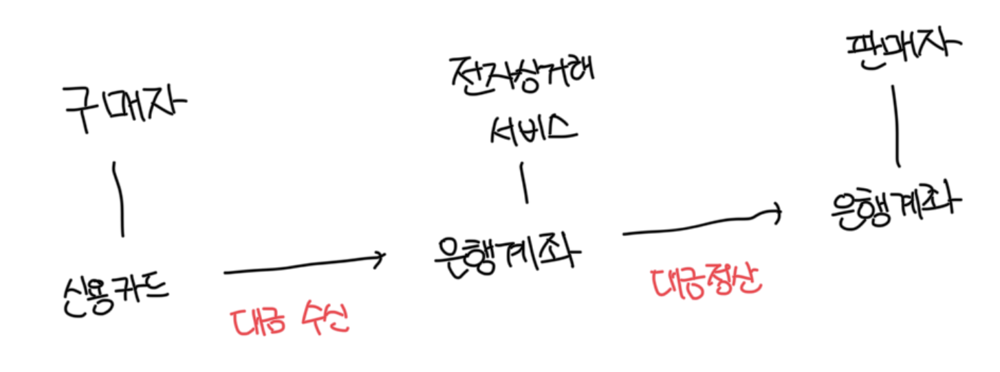
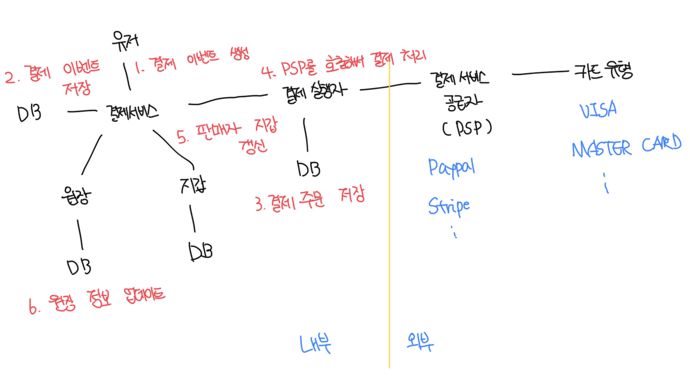

# 대금 수신 흐름

- 예를 들어 아마존에서 구매자가 주문을 하게되면 아마존의 은행 계좌로 돈이 들어오는데 이게 대금 수신 흐름이다
- 실제 돈은 아마존의 은행 계좌에 존재하지만, 판매자가 상당 부분을 소유한다
- 실제 배송이 완료되면 계좌에 묶여있던 판매대금에서 수수료를 제외한 금액이 판매자의 은행 계좌로 지급된다



<br>

### 결제 서비스(Payment Service)

- 유저로부터 결제 이벤트를 수락하고 결제 프로세스를 조율하는 역할
- AML/CFT와 같은 규정 준수, 자금 세탁 등 범죄행위가 아닌지 위험 점검을 진행함
- 이러한 점검을 통과한 서비스만 결제가 가능하고, 점검과정은 매우 복잡하고 고도로 전문화 되어있어서 보통 제3사 서비스를 이용함

<br>

### 결제 실행자(Payment Executor)

- `결제 실행자`는 `결제 서비스 공급자`를 통해 결제 주문 하나를 실행함
- 하나의 결제 이벤트에는 여러 결제 주문의 포함될 수 있음

<br>

### 결제 서비스 공급자(Payment Service Provider, PSP)

- A -> B로 돈을 옮기는 역할을 담당함
- 해당 예제에서는 구매자의 신용카드 계좌에서 돈을 인출하는 역할을 담당함
- 대표적으로 Paypal, stripe, odyen 등이 있음

<br>

### 카드 유형

- 카드사는 신용 카드 업무를 처리하는 조직이다
- 비자, 마스터칻, 디스커버리 등이 존재하고, 매우 복잡하다

<br>

### 원장(Ledger)

- 결제 트랜잭션에 대한 금융 기록
- 원장 시스템은 전자상거래 웹사이트의 총 수익을 계산하거나, 향후 수익 예측 등 결제 후 분석에서 매우 중요한 역할을 담당함
- 예를 들면 유저가 1달러를 결제하면 사용자로 부터 1달러를 인출하고 판매자에게 1달러를 지급하는 기록을 남김

<br>

### 지갑(Wallet)

- `판매자`의 계정 잔액을 기록함
- 특정 사용자가 결제한 총 금액을 기록할수도 있음

<br>

#### 일반적인 결제의 흐름

- 주문하기 버튼을 누르면 결제 이벤트가 생성되서 결제 서비스로 전송됨
- 결제 서비스는 결제 이벤트를 디비에 저장함
- 떄로는 단일 결제 이벤트에 여러개의 결제 주문이 포함될 수 있는데 한번 결제로 여러 판매자의 제품을 처리하는 경우가 그 예다
  - 한 결제를 여러개의 주문으로 분할하는 경우는 결제 서비스는 결제 주문마다 결제 실행자를 호출함
- 결제 실행자는 결제 주문을디비에 저장하고, 외부 PSP 호출을 통해서 신용카드 결제를 처리함
- 결제 실행자가 결제를 성공적으로 처리하고 나면 결제 서비스는 지갑을 갱신해서 특정 판매자의 잔고를 기록함
- 지갑서버는 갱신된 잔고 정보를 디비에 저장함
- 지갑 서비스가 판매자 잔고를 성공적으로 갱신하면 결제 서비스는 원장을 호출해서 새로운 원장 정보를 디비에 기록함



<br>

# 결제 서비스 API

### POST /v1/payments

- 결제 이벤트를 실행하는 엔드포인트

#### Request Body

```json
{
  "buyer_info": { ... },
  "checkout_id": "string",
  "credit_card_info": { ... },
  "payment_orders": {
    "seller_account": "string",
    "amount": "string",
    "currency": "string",
    "payment_order_id": "string"
  }
}
```

<br>

#### Body 설명

| 필드             | 설명                                              | 타입   |
| ---------------- | ------------------------------------------------- | ------ |
| buyer_info       | 구매자 정보                                       | json   |
| checkout_id      | 결제 이벤트 식별하는 전역적으로 고유한 ID         | string |
| credit_card_info | 암호화된 신용카드 정보나 결제토큰, PSP마다 상이함 | json   |
| payment_orders   | 결제 주문 목록                                    | array  |

<br>

#### payment_orders 내부 데이터

- 하나의 결제에 여러개의 주문이 포함될 수 있기때문에 결제 주문 목록을 배열로 처리함
- amount를 문자열로 처리하는 이유는 환경마다 숫자 정밀도가 다를수 있으므로 문자로 처리하고 실제 계산시에만 숫자로 변경해서 처리함
- `payment_order_id`는 PSP에 결제 요청을 전송할 때 중복제거 아이디로 활용함
  - 이는 멱등 키(idempotent key)라고도 부름

| 필드             | 설명                                      | 타입   |
| ---------------- | ----------------------------------------- | ------ |
| seller_account   | 대금을 수령할 판매자                      | string |
| amount           | 결제 금액                                 | string |
| currency         | 통화 단위(ISO 4217을 따름)                | string |
| payment_order_id | 결제 주문을 식별하는 전역적으로 고유한 ID | string |

<br>

### GET /v1/payments/{:id}

- 단일 결제 주문의 실행 상태를 반환하는 엔드포인트
- 해당 API는 잘 알려진 일부 PSP에서 제공하는 API랑 유사함

<br>

# 결제 서비스데이터 모델

- `결제 이벤트(Payment Event)`와 `결제 주문(Payment Order)` 개념의 두 개의 테이블이 필요함
- 일반적으로 결제 시스템용 저장소 솔루션을 고를때는 일반적으로 성능은 가장 중요한 고려사항은 아님

<br>

### 데이터베이스를 고르는 중점사항

- 다른 금융 회사에서 수년동안 긍정적인 피드백을 받으면서 사용된적이 있는가? = 검증되었는가?
- 모니터링 및 데이터 탐사(investigation)에 필요한 도구가 풍부하게 지원되는가?
- DBA 채용 시장이 성숙했는가? 즉 숙련된 DBA를 쉽게 구할 수 있는가?
- 일반적으로 NoSQL/NewSQL 보다는 `ACID 트랜잭션을 지원하는 RDBMS`를 사용하는게 좋다

<br>

### 테이블 구조

#### payment_service

| 필드             | 타입                |
| ---------------- | ------------------- |
| checkout_id      | string / PK         |
| buyer_info       | string              |
| seller_info      | string              |
| credit_card_info | PSP 업체별로 상이함 |
| is_payment_done  | boolean             |

<br>

#### payment_order

- `checkout_id`는 FK로 한번의 결제 행위 하나는 결제 이벤트를 만들고, 하나의 결제 이벤트에는 여러개의 결제 주문이 포함됨
- `payment_order_status`는 보통 ENUM으로 처리하는데 프로세스는 아래와 같음
  - 초기값은 `NOT_STARTED`로 시작한다
  - 결제 실행자에 주문을 전송하면 `EXECUTING`으로 변경한다
  - 결제 서비스는 결제 처리자의 응답에 따라서 `SUCCESS` 또는 `FAILED`로 변경한다
- 상태가 `SUCCESS`로 변경되면 지갑과 원장 서비스를 호출해서 각 상태를 변경하고 @\_updated 컬럼을 `true`로 변경한다

| 필드                 | 타입         |
| -------------------- | ------------ |
| payment_order_id     | string / PK  |
| buyer_account        | string       |
| amount               | string       |
| currency             | string       |
| checkout_id          | string / FK  |
| payment_order_status | string(ENUM) |
| ledger_updated       | boolean      |
| wallet_updated       | boolean      |

<br>

# 복식부기 원장 시스템

- 원장 시스템에는 복식부기(double-entry)라는 원장 시스템이 존재함
  - 복식부기 회계(accounting)/부기(bookeeping) 라고도 부름
- 모든 결제 시스템의 필수 요소로 정확한 기록을 남기는데 핵심적은 역할을 담당함
- 모든 거래 항목의 합계는 0이여야 하고, 누군가 1원을 잃으면 다른 누군가는 1원을 얻어야함


<br>

# 외부 결제 페이지

- 대부분 기업은 신용 카드 정보를 내부에 저장하지 않음
- 만약 정보를 내부에 저장하는 경우는 미국의 PCI DSS 규정을 준수해야하는데 매우 복잡함
- 보통 PSP 제공하는 외부 결제페이지를 이용하는데 위젯, Iframe, SDK 등 다양하게 제공해줌

<br>

# 대금 정산 흐름

- 대금 수신 흐름과 아주 유사하다
- 대금 수신에서는 PSP를 통한 A -> B로 돈을 옮겼지만 대금 정산에서는 정산 시스템을 통해서 판매자 은행 계좌로 돈을 입금한다
- 일반적으로 다양한 부기 및 규제 요구사항이 있기때문에 Tipalti 같은 외상매입금 지급 서비스를 이용하곤 한다
