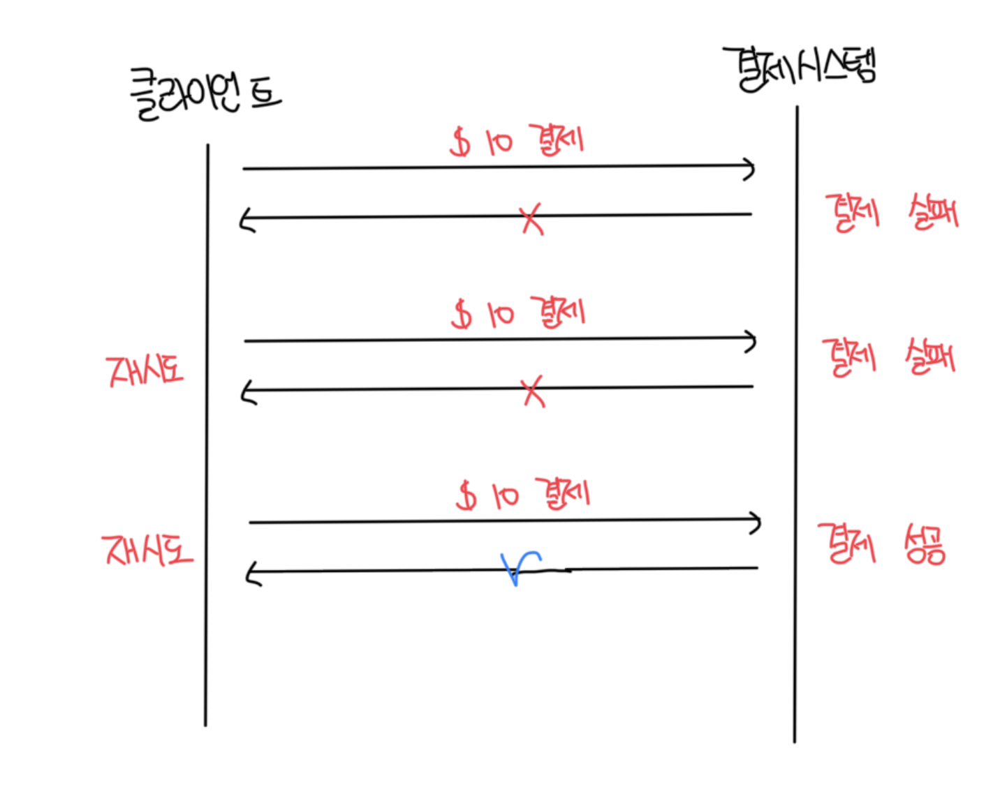

# PSP(Payment Service Provider) 연동

- 직접 은행이나 카드 시스템을 통해 PSP 없이도 결제는 가능하다
- 하지만 일반적으로 이러한 시스템 구축은 일부 기업만 가능하고 매우 특이한 경우다
- 아래 플로우에서 중간에 네트워크 문제로 실패할수도 있는데 이를 체계적으로 처리할 수 있는 방법이 조정이다

 

# 조정(reconciliation)

- PSP를 통한 결제 시스템은 비동기적으로 작동하기 때문에 일관성 보장이 힘들다
- 이런 경우는 서비스 간 상태를 주기적으로 비교해서 일치하는지 검사하는데 일반적으로 결제 시스템의 마지막 방어선으로 받아들여진다
- 매일 밤 PSP나 은행은 고객에게 정산(settlement) 파일을 보내는데 이를 바탕으로 조정 시스템은 원장 시스템과 비교를 진행한다

 

### 불일치 문제와 해결방안

- 어떤 유형의 문제인지 알고 있으며 문제 해결 절차 자동화가 가능한 경우
  - 원인과 해결 방법을 알고 있고, 자동화 프로그램 작성이 비용적으로 효율적인 경우
  - 엔지니어는 발생한 불일치 문제의 분류와 조정 작업을 모두 자동화 할 수 있음
- 어떤 유형의 문제인지는 알지만 해결 절차 자동화가 불가능한 경우
  - 자동 조정 프로그램의 작성 비용이 너무 높다
  - 발생한 불일치는 작업 대기열에 넣고 재무팀에서 직접 수동으로 수동하도록 함
- 분류할 수 없는 유형의 문제
  - 원인을 알지 못하는 경우다. 특별 작업 대기열에 넣고 재무팀에서 조사하도록 한다

 

# 결제 지연 처리

- 결제 요청은 여러개의 컴포넌트가 존재하고, 다양한 처리 주체와 연동함
- 일부는 몇초만에 처리되지만, 일부는 몇분/몇일이 걸릴수도 있음
  - PSP에서 해당 결제에 대해서 보류하는 경우
  - 카드 소유자의 보안 인증(3D Secure)이 필요한 경우
- 결제 시스템은 이렇게 지연되는 결제에 대해서도 처리할 수 있어야 함
- 처리 방법은 아래와 같이 진행이 가능함
  - 결제 대기 상태를 알리는 상태 정보를 클라이언트에 반환하고 유저에게 표시
  - PSP는 대기 중인 결제에 대해서 상태를 추적하고 완료되면 결제 시스템으로 웹훅요청

 

# 내부 서비스 간 커뮤니케이션

- 일반적으로 동기식 통신은 설계하기 쉽지만 서비스의 자율성을 높이기에는 적합하지 못함
  - 의존성 그래프가 커진다면 전반적인 성능이 낮아짐

### 동기식 통신

- HTTP 같은 동기식 통신은 소규모 시스템에서는 잘 작동하지만 규모가 커지면 단점이 드러남
- 동기식 통신에서 한 요청에 응답을 만드는 처리 주기는 관련된 서비스가 많을수록 길어짐

 

#### 단점들

- 성능저하 : 요청 처리에 관계된 서비스 중 하나에 발생한 성능 문제가 전체 시스템에 영향을 미침
- 장애 격리 곤란 : PSP 등 서비스에 장액 발생하면 클라이언트는 더이상 응답을 못받음
- 높은 결합도 : 요청 발신자는 수신자를 알아야함
- 낮은 확장성 : 큐를 버퍼로 사용하지 않고서는 갑작스러운 트래픽 증가에 대응할 수 있도록 시스템 확장이 힘듬

 

### 비동기 통신

#### 단일 수신자

- 각 요청은 하나의 수신자 또는 서비스가 처리
- 일반적으로 공유 메세지 큐를 통해서 구현하며, 큐에는 복수의 구독자가 있을 수 있으나 처리된 메세지는 큐에서 바로 제거됨

 

#### 다중 수신자

- 각 요청은 여러 수신자나 서버가 처리하게된다
- 대표적으로 카프카를 사용하면 이러한 시나리오를 원할하게 처리가 가능함
  - 카프카는 소비자가 수신한 메세지가 바로 사라지지 않음

 

# 결제 실패 처리

- 모든 결제 시스템은 실패한 결제에 대해서 적절한 처리가 필수임
- 안정성 및 결함 내성은 결제 시스템의 핵심적 요구사항임

 

### 결제 상태 추적

- 결제 주기의 모든 단계에서 결제 상태를 정확하게 유지하는건 매우 중요함
- 실패가 발생할 때 마다 재시도 또는 환불이 필요한지 여부를 결정함
- 결제 상태는 데이터 추가만 가능한 테이블에 보관한다

 

### 재시도 큐 및 실패 메세지 큐

- 일반적으로 우하한 실패 처리를 위해서는 `재시도 큐(retry queue)`와 `실패 메세지 큐(dead letter queue)`를 사용하는게 바람직함
  - 재시도 큐 : 일시적 오류 같은 재시도 가능 오류는 재시도 큐에 보관
  - 실패 메세지 큐 : 반복적으로 처리에 실패한 메세지는 결국 실패 메세지 큐로 발송함
    - 이 큐는 문제가 있는 메세지를 디버깅하고 격리해서 성공적으로 처리되지 않은 이유를 파악하기 위한 검사에 유용함

 

#### 실패한 결제 처리 프로세스

 

# 정확히 한 번 전달

- 결제 시스템에 발생 가능한 제일 심각한 문제는 고객에게 이중으로 청구하는것임
- 결제 주문이 정확히 한 번만 실행되도록 결제 시스템을 설계하는게 중요함

 

### 재시도

- 간혹 네트워크나 시간초과로 인해 거래를 다시 시도해야되는 경우가 존재함
- 이 때 재시도 매커니즘을 사용하면 어떤 결제가 최소 한 번은 실행되도록 보장이 가능함
- 재시도 매커니즘을 도입할 때는 얼마나 간격을 두고 재시도할지 정하는게 중요함
- 재시도 전략을 결정하는건 어렵고 모든 상황에 맞는 해결책은 없음
- 일반적으로 가능한 지침은 네트워크 문제가 단시간 내 해결될 것 같지 않다면 `지수적 백오프(exponential backoff)` 전략을 사용하는게 좋음
- 또한 재시도에서 발생할 수 있는 문제중 하나는 이중결제다. 결제는 멱등성을 보장해야한다

 

#### 재시도 전략들

- 즉시 재시도(Immediate Retry) : 클라이언트는 즉시 요청을 다시 보냄
- 고정 간격(fixed interval) : 재시도 전에 일정 시간 기다리는 방안
- 증분 간격(incremental interval) : 재시도 전 기다리는 시간을 특정한 양 만큼 점진적으로 늘려 나가는 방안
- 지수적 백오프(exponential backoff) : 재시도 전 기다리는 시간을 직전 재시도 대비 2배씩 늘려나가는 방안
- 취소(cancel) : 요청을 철회하는 방안, 실패가 영구적이거나 재시도를 하더라도 성공 가능성이 낮은 경우 흔히 사용함

 

### 멱등성

- 최대 한번 실행을 보장하기 위한 핵심 개념
- API 관점에서 생각하면 같은 API를 여러번 호출하더라도 동일한 결과가 나와야된다는 뜻임
- 일반적으로 PSP는 멱등키로 UUID를 사용하고, 이를 사용할려면 HTTP 헤더에 `<멱등 키:값>` 형태를 담아서 요청하면된다

 

#### 시나리오 1 : 고객이 결제 버튼을 빠르게 2번 누르는 경우

- 일반적으로 전자상거래 웹 사이트에서 멱등 키는 일반적으로 결제가 이루어지기 직전의 장바구니 ID를 사용함
- PSP에서 동시에 같은 멱등키로 여러개의 요청이 발생하면 하나만 처리하고 나머지는 HTTP 429 응답을 반환함
- 내부 결제시스템에서 멱등성을 활용하는 방법은 DB의 PK를 멱등키로 사용하는 것이다
  - 새로운 결제건이 잘 추가되면 이전에 결제가 없던거고, 동일한 값을 또 추가할려고 하면 에러가 발생할것이다

 

#### 시나리오 2 : PSP가 결제를 처리헀지만, 네트워크 오류로 응답이 전달되지 못해 사용자가 결제를 다시 누르는 경우

- 최초 결제 위젯이나 페이지를 받을때는 PSP에서 난수의 토큰을 전달해줌
- 이미 결제가 완료된 거래를 해당 토큰을 통해 파악하고 종전의 결과를 반환해줌
- 해당 토큰도 멱등성을 위해서 사용될 수 있음

 

# 일관성

- 결제 실행 과정엣는 상태 정보를 유지 관리하는 여러개의 서비스가 호출됨
- 특히 분산 환경에서는 서비스 간 통신 문제로 데이터 불일치가 발생할 수 있음
- 요청이 정확히 한번만 처리되도록 보장하는건 매우 중요하고, 내부와 외부 서비스간 일관성 보장을 위해서 멱등성과 조정 프로세스를 활용함
  - 이 떄 PSP가 멱등을 지원한다고 해서 완전히 신뢰하면 안되므로 조정 프로세스는 생략할 수 없음
- 또한 예외케이스로 디비가 분산된 경우 동기화 딜레이로 인해서 불일치가 발생할 수 있음
  - 메인 디비에서 모든걸 처리하는건 비효율적이다
  - Raft, Paxos같은 합의 알고리즘을 통해 모든 사본을 동기화 하거나 합의 기반 분산 디비인 Yuagbyte DB, CockroachDB 등 을 사용할수도 있음

 
