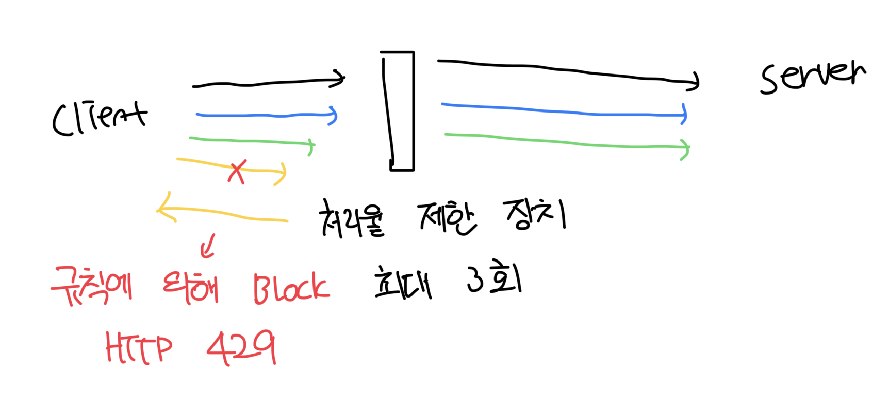

# 처리율 제한 장치를 배치하는 위치?

### 클라이언트에 두기

- 일반적으로는 처리율 제한을 안정적으로 걸 수 있는 장소가 못된다
- 클라이언트 요청은 너무 쉽게 변조가 가능하다

 

### 서버에 두기

- 클라이언트와 서버 중간에 처리율 제한 장치를 구성한다
- 마치 미들웨어 처럼 동작하는데 이는 보통 API Gateway라고 부르는곳에 구현된다
- 처리율에 제한이 걸리게되면 HTTP 429 Too Many Requests를 반환한다

 

### 고려 사항

- 현재 사용중인 프로그래밍 언어가 서버 측 구현을 지원하기 충분할 정도인지 확인하기
- 사업에 필요한 올바른 알고리즘을 선택하기
- 기존 MSA 구조에서 API Gateway를 사용중이라면 거기에 포함시켜야 될수도 있음
- 직접 만드는건 오래걸린다, 바쁘다면 상용 서비스를 사용하자

 
