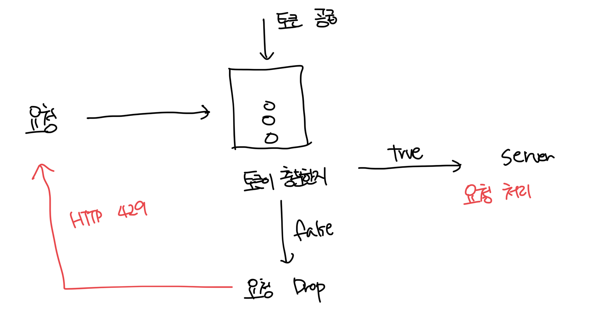
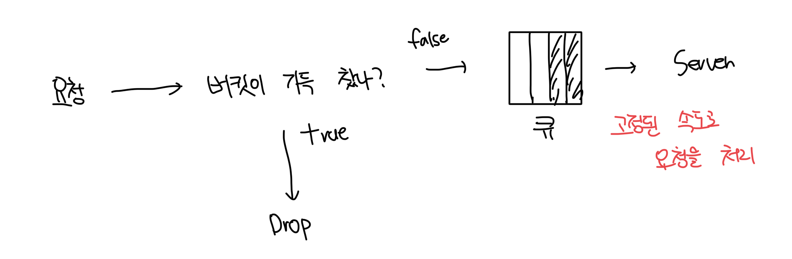
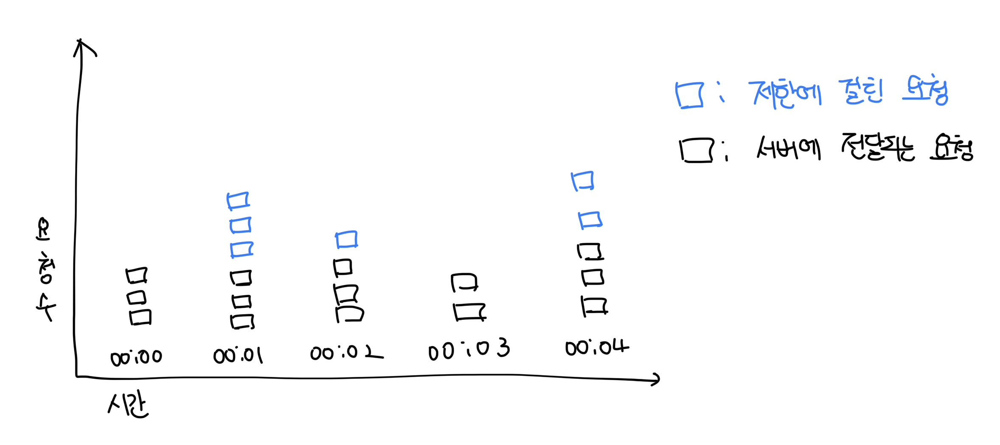
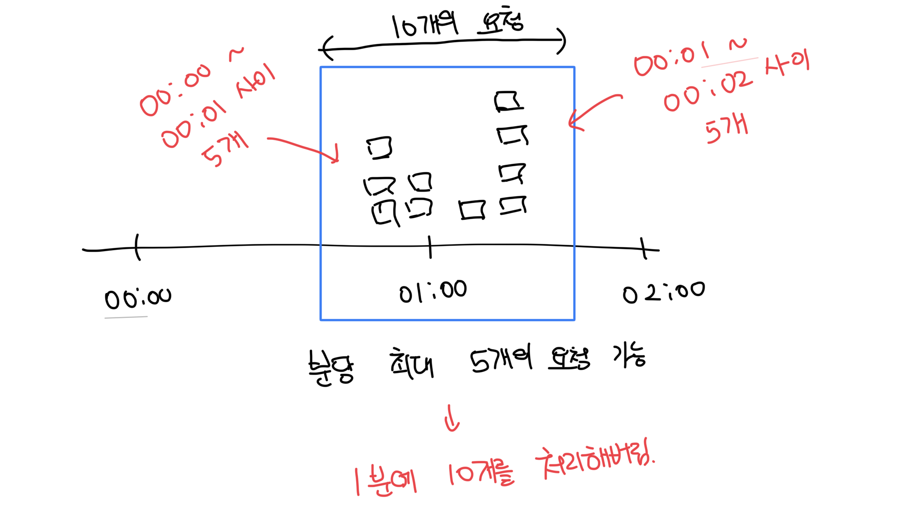
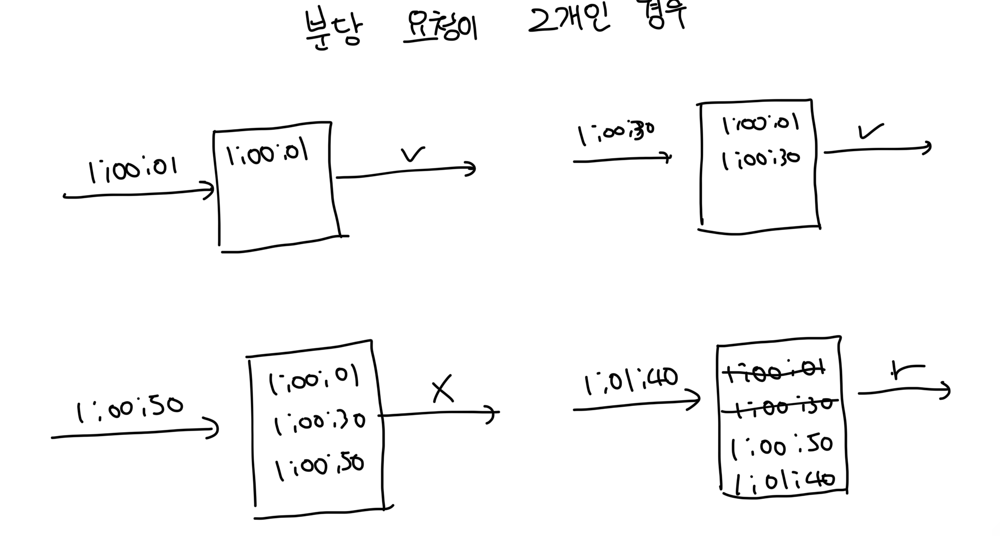

# 토큰 버킷

- 처리율 제한에 폭넓게 이용되고 있다
- 아마존과 스트라이프에서 API 요청에 대해 통제하기 위해서 사용중인 방법이다

 

### 동작 원리

- 토큰 버킷은 지정된 용량을 가지는 컨테이너다
- 지정된 주기마다 새로운 토큰이 추가되고 용량을 넘는건 버려진다
- 각 요청은 처리될 떄마다 하나의 토큰을 사용한다
- 충분한 토큰이 있다면 처리하고, 없다면 요청을 버린다

 

### 세부사항

- 내부 인자로는 버킷의 크기와 토큰 공급률을 가진다
  - 버킷크기 : 버킷에 담을 수 있는 최대 토큰의 개수
  - 토큰 공급률 : 주기마다 추가되는 토큰의 개수
- 버킷을 사용하는 개수
  - API마다 버킷을 배치하게 되는데 유저를 기반으로 한다면 제한하는 기능이 3개라면 유저별로 3개의 버킷이 필요할것이다
  - IP 기반으로 처리한다면 IP 주소마다 버킷이 필요하다
  - 시스템 전체 처리율을 10000개라고 사이즈 10000의 버킷을 시스템 전체가 공유한다

 

### 장점

- 구현이 쉽고 메모리 효율적이다
- 짧은 시간에 집중되는 트래픽도 처리가 가능함

 

### 단점

- 버킷크기와 공급률 인자를 커스텀하는게 까다롭다

 

# 누출 버킷 알고리즘

- 토큰 버킷과 비슷하지만 요청 처리율이 고정되어있다는 점이 다름
- 누출 버킷 알고리즘은 보통 큐(FIFO)로 구성함

 

### 동작 원리

- 요청이 도작하면 큐가 가득차있는지 확인, 빈자리가 있다면 큐에 요청 추가
- 큐가 가득 차 있다면 요청은 버리고, 지정된 시간마다 큐에서 요청을 꺼내어 처리
- shopify 라는 서비스가 해당 알고리즘을 사용하고 있음

 

### 세부사항

- 버킷크기, 처리율을 인자로 가짐
  - 버킷 크기 : 총 작업의 처리량을 저장
  - 처리율 : 지정된 시간당 몇개의 항목을 처리할지 지정

 

### 장점

- 큐의 크기가 제한되어 있어서 메모리 사용량 측면에서 효율적임
- 고정된 처리율을 가지고있어 안정적인 출력이 필요한 경우 적합

 

### 단점

- 단시간에 많은 트래픽이 몰리면 큐에는 오래된 요청이 쌓이고 최신 요청은 버려지게됨
- 두개의 인자 튜닝이 까다로움

 

# 고정 윈도 카운터 알고리즘

- 타임라인을 고정된 윈도우로 나누고, 윈도마다 카운터를 붙임
- 요청이 접수되면 카운터의 값이 1씩 증가함
- 카운터가 임계치에 도달하면 새로운 요청은 새 윈도가 열릴때까지 모두 버려짐

 

### 예시(타임라인: 1초, 임계치: 초당 3개)

 

### 문제점

 

### 장점

- 메모리 효율이 좋고 이해하기 쉬움
- 윈도우가 닫히는 시점에 카운터를 초기화 하는 방식은 특정 트래픽 패턴을 처리하기 적합함

 

### 단점

- 윈도 경계 부근에서 일시적으로 많은 트래픽이 몰리면 기대했던거보다 더 많은 처리가 이루어짐

 

# 이동 윈도 로깅 알고리즘

- 요청의 타임스탬프를 추적해서 레디스의 sorted set 같은곳에 보관한다
- 새로운 요청이 오면 만료됨 타임스탬프를 제거함
- 로그의 크기가 허용치보다 작거나 같으면 요청을 시스템에 전달함, 그렇지 않으면 요청을 거부함

 

### 예시

- 요청이 1:00:01에서 로그는 비어있어서 요청이 처리됨
- 1:00:30 요청이 들어오고 타임스탬프가 추가, 아직 크기가 2라서 허용됨
- 1:00:50 요청이 들어옴, 타임스탬프에 추가되지만 크기가 3이라 요청이 거부됨
- 1:01:40 요청이 들어옴, 이전의 타임스탬프가 전부 만료되서 1:00:01, 1:00:30을 지우고나면 2개이므로 통과됨

 

### 장점

- 메커니즘이 아주 정교함, 어느 순간의 윈도를 보더라도 허용되는 요청 개수는 한도를 넘지 않음

 

### 단점

- 거부된 요청의 타임스탬프를 포함한 많은 로그를 저장해서 다량의 메모리가 사용됨

 

# 이중 윈도 카운터 알고리즘

- 고정 윈도 카운터와 이동 윈도 로깅을 결합한 형태
