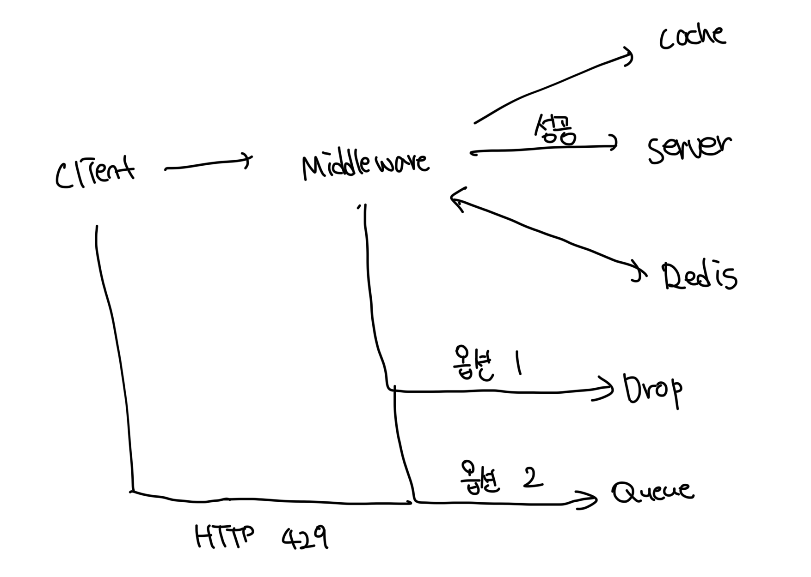

# 처리율 제한 규칙

- 설정 파일의 경우는 보통 디스크 내부에 저장된다

```yml
domain: messageing
descriptos:
  - key: message_type
  value: marketing
  rate_limit:
    unit: day
    requests_per_unit: 1000
```

<br>

# 처리율 한도 트래픽의 처리

- 요청이 처리 한도에 걸릴 경우 HTTP 429를 반환한다
- 경우에 따라서 제한이 걸린 요청을 나중에 처리할 수 있도록 큐에 보관하기도 한다

<br>

### 처리율 제한 장치가 사용하는 HTTP 헤더

- 클라이언트는 HTTP 헤더를 통해서 현재 요청이 제한에 걸렸는지 확인이 가능하다
- `X-Ratelimit-Renaming` : 남은 처리 가능 요청의 수
- `X-Ratelimit-Limit`: 전송할 수 있는 요청의 수
- `X-Ratelimit-Retry-After`: 다음 요청을 보낼 수 있는 시간

<br>

# 상세 설계

- 처리율 제한 규칙은 디스크에서 보관, 작업 프로세스는 수시로 파일을 읽어서 캐싱한다
- 클라이언트에서 요청을 하게되면 먼저 미들웨어에 도달한다
- 미들웨어는 제한 규칙을 캐시에서 가져오고, 그 외 정보는 레디스 캐시에서 가져온다



<br>

# 분산 환경에서 미들웨어

- 여러대의 서버와 병렬스레드를 지원하도록 시스템을 확장하는건 또 다른 문제가 존재한다
- 경쟁조건과 동기화에 대한 문제를 풀어야한다

<br>

### 경쟁조건(Race Condition)

- 여러곳에서 동시에 레디스의 카운터를 올리는 상황을 예로 든다
- INCR을 통해서 3일때 1번, 4일때 1번 올리면 5가 되어야하는데 4가 될수도 있다
- 가장 널리 알려진 방법은 LOCK을 사용하는것이며 루아스크립트나 sorted set을 토대로 구현한다

<br>

### 동기화(Synchronization) 이슈

- 수백만명의 유저가 사용하는 서비스는 단일 미들웨어로 충분하지 않을수도 있다
- 여러대를 배치했을때 스티키 세션을 사용하면 동일한 미들웨어로 접근이 보장되지면 확장성에 있어서 권장되진 않는다
- 미들웨어끼리도 공유저장소(레디스 등)을 통해서 처리하는걸 권장한다

<br>

### 성능최적화

- 이러한 미들웨어도 유저 입장에서 가장 가까운 엣지에 배치되면 레이턴시가 줄어든다

<br>

### 모니터링

- 미들웨어를 설치하고나서 의도한대로 동작하고 있는지 모니터링이 필요하다
- 알고리즘의 효율과 규칙이 잘 적용되고 있는지 확인해야한다
- 제한 규칙이 너무 타이트하다면 요청을 많이 버릴수도 있다
