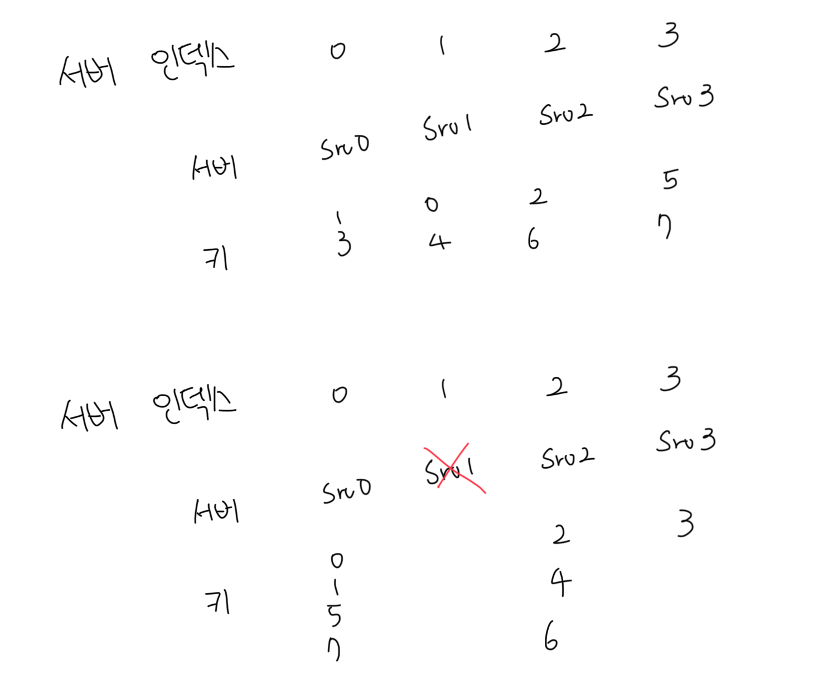

# 해시 키 재배치(refresh) 문제

- 보편적으로 서버들에 부하를 분산하기 위해서 해시함수 사용이 가능함
- `serverIndex = hash(key) % N(서버개수)` 공식을 통해서 어떤 서버에 접근할지 결정함
- 해당 방식은 서버 풀의 크기가 고정되어있고 데이터 분포가 균등할때는 잘 동작하
- 만약 N대의 서버중 1대에 장애가 발생하면 나머지 연산읕 통한 인덱스 값은 달라질것임
  - 대규모 캐시 미스가 발생하게됨

 
