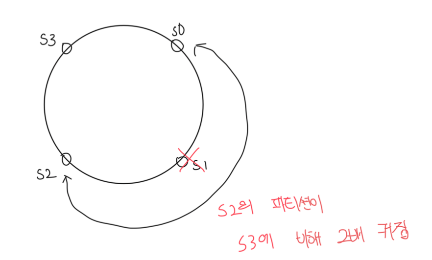

# 안정해시

- 테이블 크기가 조정될 때 평균적으로 오직 k/n 개의 키만 재배치하는 해시 기술
  - k = 키의 개수
  - n = 슬롯의 개수
- 이와 달리 대부분의 전통적 해시 테이블은 슬롯의 수가 바뀌면 거의 대부분 키를 재배치함

 

### 해시 공간과 해시 링

- 해시 함수로는 SHA-1을 사용한다고 가정함
  - SHA-1의 해시 공간의 범위는 0 ~ 2^160 - 1이다
  - 즉 x = 0, xn = 2^160 - 1이다

 

### 해시 서버

- 해시함수 f를 사용하면 서버 IP나 이름을 링 위에 어떤 위치에 대응시킬 수 있음

 

### 해시 키

- 여기서 사용된 해시 키는 나머지 연산을 통해 사용하지 않고 있음
- 해시 키 또한 링 위에 어느 지점에 배치할 수 있음

 

### 서버 조회

- 어떤 키가 저장되는 서버는 해당 키의 위치에서 시계 방향으로 링을 탐색하면서 만나는 첫번째 서버임

 

### 서버 추가

- 서버를 축하더라도 키 가운데 일부만 재배치하면 된다
- 아래 그림에서는 기존 k0 -> s0 구조에서 s4가 추가되면서 k0은 s4에 저장하게 된다

 

### 서버 제거

- 하나의 서버가 제거되면 추가와 동일하게 일부만 재배치된다
- 아래 그림에선 s1이 삭제되어 k1이 s2에 저장되게 된다

 

### 안정 해시의 기본 절차

- 서버와 키를 균등 분포 해시함수를 통해 해시 링에 배치한다
- 키의 위치에서 링을 시계방향으로 탐색하다 만나는 최초의 서버가 키가 저장될 서버다

 

### 기본 절차에서 발생하는 2가지 문제

- 파티션(인접한 서버 사이의 해시 공간)의 크기를 균등하게 유지하는게 불가능하다
- 어떤 서버는 작은 해시공간을 할당받고 또 어떤 서버는 큰 해시공간을 할당받음

 

- 키의 균등한 분포를 달성하기가 어려움
- 이는 가상노드를 통해서 해결이 가능함

 

### 가상 노드

- 실제 노드 또는 서버를 가리키는 노드로 하나의 서버는 링 위에 여러개의 가상 노드를 가질 수 있음
- 각 서버는 하나가 아닌 여러개의 파티션을 관리해야함
- 동일하게 링을 탐색하다 만나는 최초의 가상 노드가 해당 키가 저장될 서버가됨
- 가상 노드의 개수를 늘리면 키의 분포는 점점 균등해지나 그만큼 저장공간은 더 많이 필요함
  - 해당 부분은 시스템 요구사항에 맞춰서 적절한 trade-off가 필요함

 

### 재배치할 키 결정

- 서버가 추가되거나 제거되면 데이터 일부는 재배치가 필요함
- 삭제된 서버의 다음 서버가 해당 키가 저장될 서버가 됨

