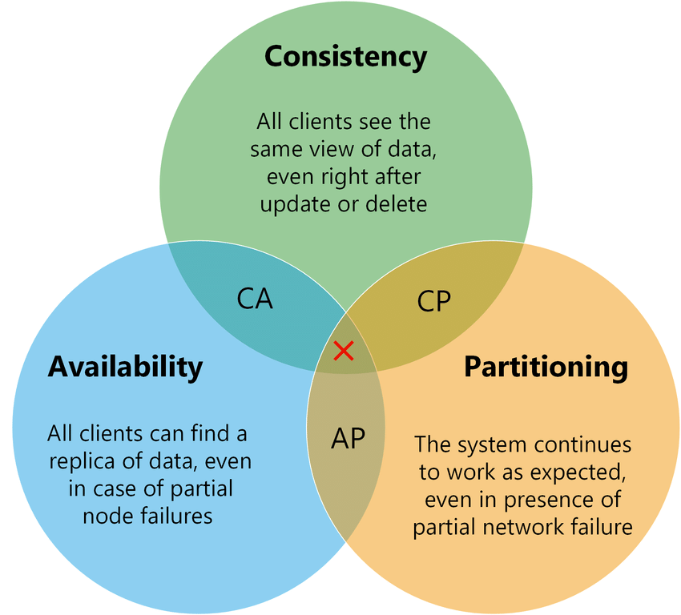
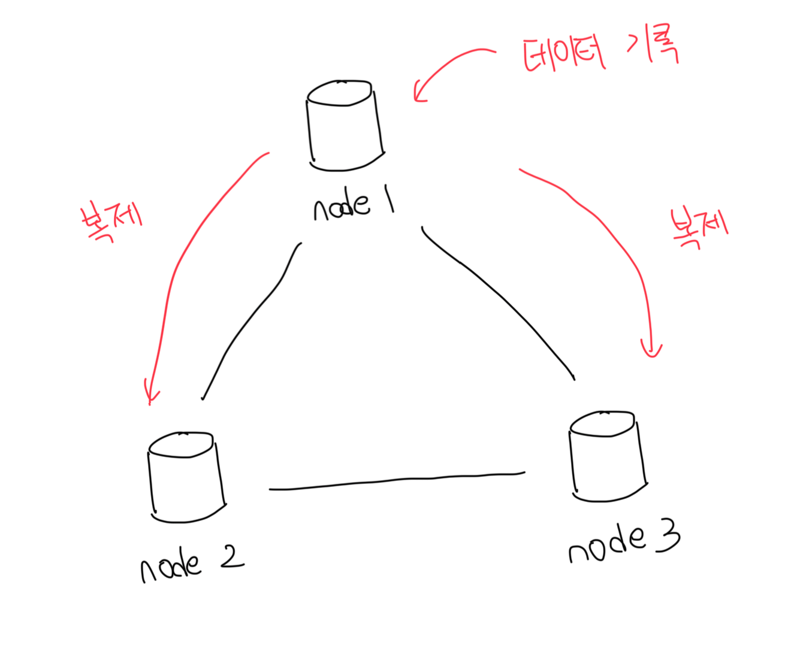
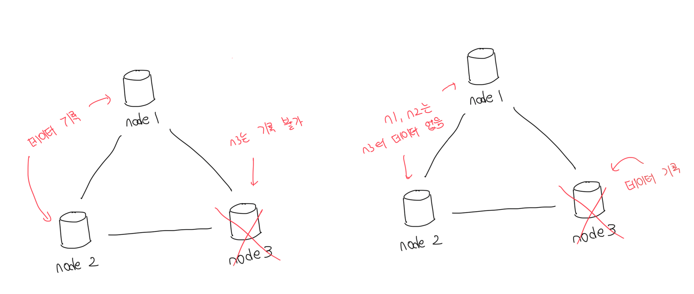
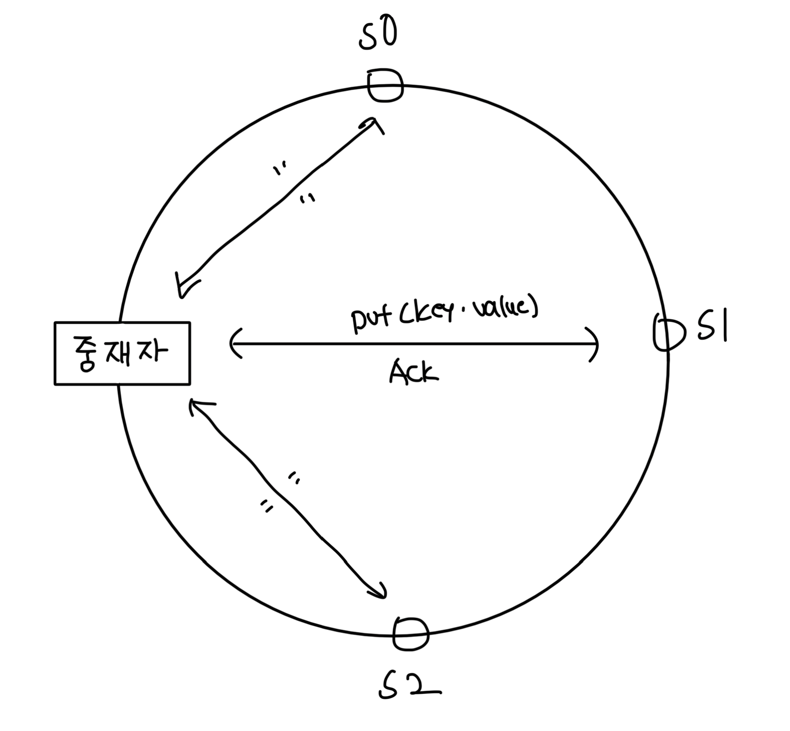
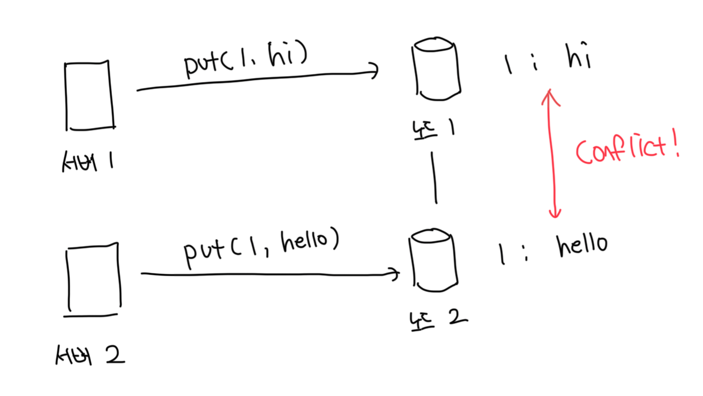
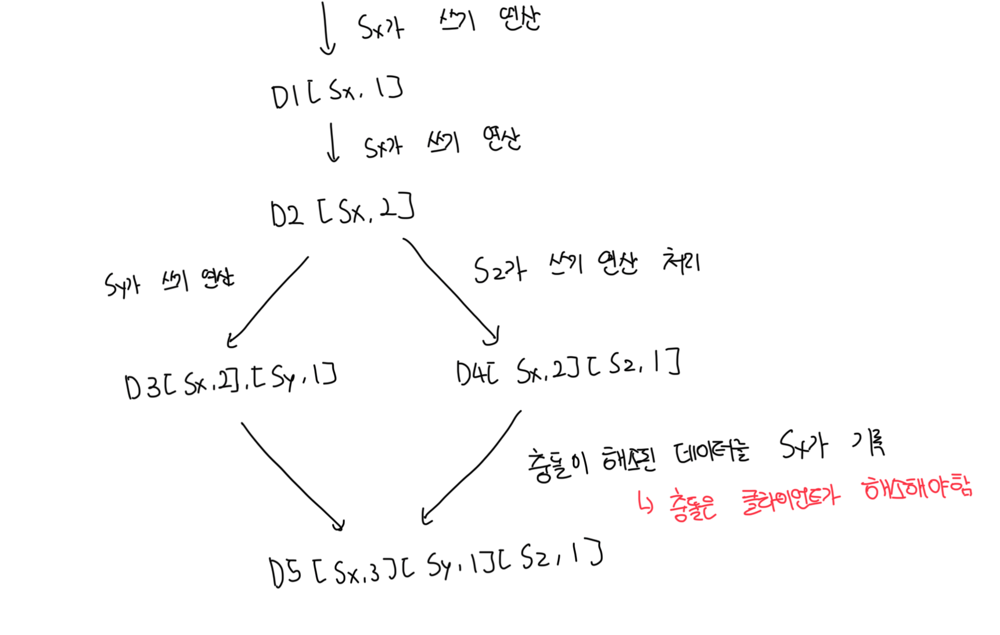
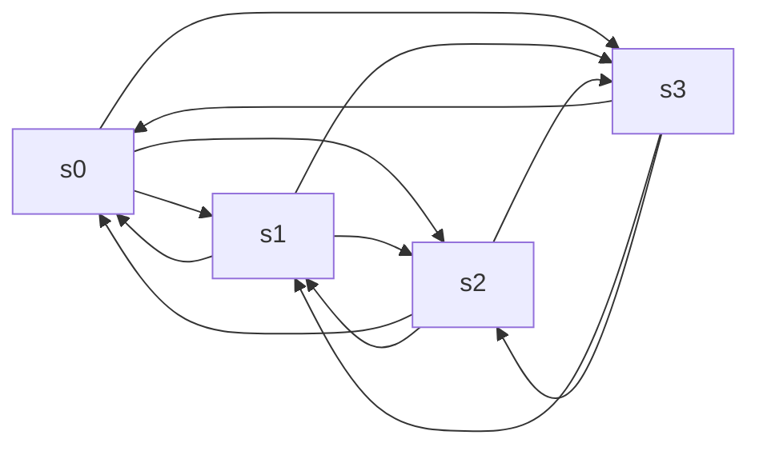
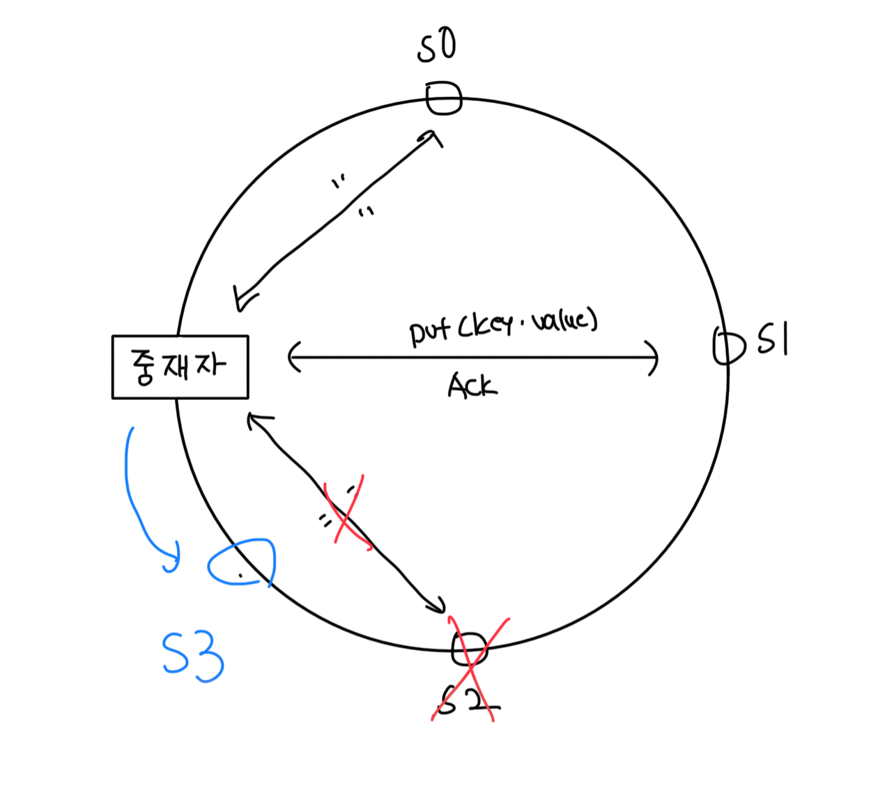

# 분산 키-값 저장소

- 키-값 쌍을 여러 서버에 분산시키므로 분산 해시테이블이라고도 부른다
- 분산 시스템을 설계할때는 CAP 정리를 이해해야한다

 

# CAP 정리

### Consistency(일관성)

- 분산 시스템에 접근하는 클라이언트는 언제나 같은 데이터를 봐야한다

 

### Availability(가용성)

- 분산 시스템에 접근하는 클라이언트는 일부 노드에 장애가 발생해도 항상 같은 응답을 받아야한다

 

### Partition Tolerance theorem(파티션 감내)

- 네트워크에 파티션이 생기더라도 시스템은 계속 동작해야한다
- 이 때 파티션은 두 노드 사이에 통신 장애가 발생한것을 의미한다

 

### CAP 시스템 도식화

 

#### CP 시스템

- 일관성과 파티션 감내를 지원하는 저장소
- 가용성을 희생한다

 

#### AP 시스템

- 가용성과 파티션 감내를 지원하는 저장소
- 데이터 일관성을 희생한다

 

#### CA 시스템

- 일관성과 가용성을 지원하는 저장소
- 분산 시스템은 반드시 파티션을 감내할 수 있도록 만들어야하지만 불가능하다
- 실세계에 CA 시스템은 존재하지 않는다

 

### 구체적인 사례

#### 이상적 상태

- 이상적인 환경이라면 네트워크 파티션이 발생하지 않을것이다
- n1에 기록된 데이터는 자동으로 n2, n3에도 복제된다

 

#### 실세계의 분산 시스템

- 분산 시스템은 파티션 문제를 피할 수 없다
- 파티션 문제가 발생하는 경우는 일관성 또는 가용성 사이에 하나를 선택해야된다

 

### 데이터 파티션

- 대규모 앱의 경우 모든 데이터를 하나의 서버에 저장하는것 불가능함
- 가장 단순한 해결책은 데이터를 작은 파티션으로 쪼개고 여러대로 저장하는것임

 

#### 고려사항

- 데이터를 여러개의 서버에 고르게 분산이 가능할까?
- 노드가 추가되거나 삭제될 때 데이터의 이동을 최소화 할 수 있을까?

 

#### 안정 해시

- 위 같은 상황에서 안정해시를 사용해서 데이터를 파티션하면 좋음
- 규모 확장 자동화 : 시스템 부하에 따라서 서버를 자동으로 추가/삭제가 가능
- 다양성 : 각 서버의 용량에 맞게 가상노드의 수를 조정할 수 있음
  - 고성능 서버는 더 많은 가상노드를 가지게됨

 

### 데이터 다중화

- 여러개의 노드에 다중화된 데이터는 적절히 동기화가 되어야함
- 이 때 `정족수 합의(Quorum Consensus)` 프로토콜을 사용함
  - 해당 프로토콜을 사용하면 읽기/쓰기 연산 모두 일관성 보장이 가능함

 

#### 정족수 프로토콜

- W, R, N의 값을 정하는건 응답 지연과 데이터 일관성 사이에 타협점을 찾는일임
- N : 사본 개수
- W : 쓰기 연산에 대한 정족수, 쓰기 연산이 성공됬다고 간주할려면 W개의 서버로 부터 성공응답을 받아야함
- R : 읽기 연산에 대한 정족수, 읽기 연산이 성공됬다고 간주할려면 R개의 서버로 부터 성공응답을 받아야함

 

#### W, R, N을 정하는 방법

- R = 1, W = N : 빠른 읽기 연산에 최적화된 시스템
- W = 1, R = N : 빠른 쓰기 연산에 최적화된 시스템
- W + R > N : 강한 일관성이 보장된, 보통 N = 3, W = R = 2로 설정
- W = R <= N : 강한 일관성이 보장되지 않음

 

### 일관성 모델

- 키값 저장소를 설계할 때 중요한 요소다
- 일관성 모델은 데이터 일관성의 수준을 결정하는데 종류가 다양함

 

#### 강한(strong) 일관성

- 모든 읽기 연산은 가장 최근에 갱신된 결과를 반환
- 클라이언트는 절대로 오래된 데이터를 못봄
- 일반적으로 모든 사본에 현재 쓰기 연산의 결과가 반영될 때 까지 읽기/쓰기를 금지함
- 이는 고가용성 시스템에는 적합하지 않음

 

#### 약한(weak) 일관성

- 읽기 연산은 가장 최근에 갱신된 결과를 반환하지 못할수도 있음

 

#### 결과적 (eventual) 일관성

- 갱신 결과가 결국에는 모든 사본에 동기화되는 모델

 

### 비 일관성 해소 기법 : 데이터버저닝

- 데이터를 다중화하면 가용성은 올라가지만 사본 간 일관성이 깨질수 있음
- 이를 위해서 버저닝(Versioning), 벡터 시계(Vector Clock) 같은 기법을 사용함

 

#### 버저닝(Versioning)

- 데이터를 변경할 때 마다 해당 데이터의 새로운 버전을 만드는걸 의미함
- 각 버전의 데이터는 변경이 불가능함, immutable
- 하지만 해당 방식은 원래 값을 무시하게 될수도 있음
- 이 때 벡터 시계를 통해서 이러한 문제 해결이 가능함

 

#### 벡터 시계(Vector Clock)

- `[서버, 버전]`의 순서쌍을 데이터에 매단 방식이다
- 어떤 버전이 선행인지, 후행인지, 다른 버전과 충돌이 있는지 판별하는데 사용함
- 형식이 `D[S1, v1], [S2, v2] ... [Sn, vn]` 처럼 표현된다고 가정한다
  - D : 데이터
  - vi : 버전 카운터
  - si : 서버 번호
- `[si, vi]`가 있으면 vi를 증가, 없다면 새로운 `[Si, 1]`을 만드는 방식으로 동작함

 

### 충돌 감지

- 충돌은 클라이언트에서 해결해야되는 문제임
- 단점은 클라이언트의 구현이 복잡해지고 `[서버:버전]` 순서쌍 개수가 엄청 빨리 늘어남
- 이를 해결할려면 그 길이에 임계치를 설정하고 길이가 길어지면 오래된 순서쌍을 백터 시계에서 제거해야함
  - 문제는 버전 간 선후관계가 정확하게 결정될 수 없어서 충돌 해소 과정 효율성이 낮아짐
- 아직까지 AWS DynamoDB에서 이러한 문제가 발생한적은 없어서 써도 괜찮을듯함

 

### 장애처리

- 장애를 어떻게 처리할건지는 매우 중요한 문제임
- 다양한 장애감지(failure detection) 기법과 장애 해소(failure resolution) 전략이 존재함

 

### 장애감지(failure detection)

- 일반적으로 그저 서버 한대가 죽었다고 해서 "서버 A가 죽음" 이라고 해서 바로 장애처리 하지 않음
- 보통 2대 이상의 서버가 독같이 서버 A가 죽었다고 판단하면 그 때 장애처리를 시작함

 

#### 멀티캐스팅 채널

- 모든 노드 사이에 멀티캐스팅 채널을 만들어서 서버가 죽었는지 살았는지 판단함
- 이는 가장 간단한 방법이지만 서버가 많을때는 효율적이지 않음

<!-- multicasting with s0~s3 diagram with mermaid please -->

 

#### 장애감지 솔루션

- 가십(gossip) 프로토콜같은 분산형 장애감지 솔루션을 채택하는게 더 좋음
- 각 노드는 멤버쉽 목록을 유지하고 해당 목록은 각 멤버 아이디랑 박동카운터 쌍의 목록임
- 각 노드는 주기적으로 자신의 박동카운터를 증가시킴
- 각 노드는 무작위로 선정된 노드들에게 자기 박동 카운터 목록을 보냄
- 다른 노드는 자신의 목록과 비교해서 새로운 정보가 있으면 업데이트함
- 만약 어떤 멤버의 박동 카운터가 지정된 시간동안 갱신되지 않으면 죽었다고 판단함

| 멤버아이디 | 박동카운터 | 시간                |
| ---------- | ---------- | ------------------- |
| s0         | 1          | 2021-01-01 00:00:00 |
| s1         | 2          | 2021-01-01 00:00:00 |
| s2         | 3          | 2021-01-01 00:00:00 |
| s3         | 4          | 2021-01-01 00:00:00 |

 

### 장애 해소

#### 일시적 장애 처리

- 가십 프로토콜로 장애를 감지한 시스템은 가용성 보장을 위해서 조치를 해야함
- 임시 위탁이라고 부르는 이 기법은 특정 노드에 장애가 발생하면 새로운 노드를 추가해서 해당 서버가 역할을 물려받음
- 기존 장애 노드가 복구되면 새로운 노드의 데이터는 다시 기존 노드로 인계됨

 

#### 영구적 장애 처리

- 영구적 장애 처리에는 반-엔드로피(anti-entropy) 프로토콜을 사용함
- 사본간에 일관성이 망가진 데이터를 관리하기 위해 머클(merkle) 트리를 사용함
- 1. 키 공간을 버킷을 기준으로 분류
- 2. 버킷에 포함된 각 키에 균등 분호 패시 함수를 적용해서 해시값을 계산
- 3. 버킷별로 해시값 계산 후 해당 해시 값을 레이블로 갖는 노드 생성
- 4. 자식 노드의 레이블로 부터 새로운 해시값을 계산하고, 이진 트리를 상향식으로 구성

 

### 데이터 센터 장애처리

- 실제 다른 데이터센터에 이중화가 필요함
