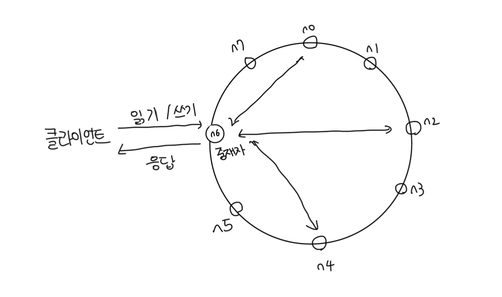

# 시스템 아키텍쳐 다이어그램

# 카산드라 DB의 동작방식

### 쓰기 경로

- 1. 쓰기 요청이 커밋로그에 기록
- 2. 데이터가 메모리 캐시에 기록
- 3. 메모리 캐시가 가득 차거나 사전에 정의된 임계치에 도달하면 디스크에 있는 `SSTable`에 기록
  - `SSTable(Sorted String Table)` : 키-값 쌍을 정렬된 순서로 저장하는 테이블

 

### 읽기 경로

#### 메모리에 캐싱된 데이터가 있는 경우

- 1. 읽기 요청이 오면 메모리 캐시에 데이터가 있는지 확인
- 2. 있다면 해당 캐시 데이터를 바로 반환

 

#### 메모리에 캐싱된 데이터가 없는 경우

1. 읽기 요청이 오면 캐시를 확인하고 없으니 블룸 필터를 검사
2. 블룸 필터를 통해서 어떤 SSTable에 key가 저장되어있는지 검사
3. SSTable에서 데이터를 가져와서 반환
