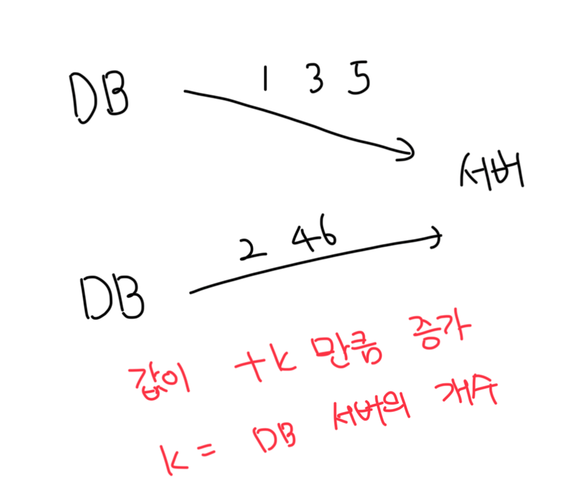

# 다중 마스터 복제

- 디비에서 제공하는 `auto_increment` 기능을 사용함
- 여러 데이터 센터에 걸쳐서 규모 확장이 힘듬
- ID의 유일성은 보장되겠지만, 그 값이 시간 흐름에 맞춰서 커지도록 보장이 불가능
- 서버를 추가/삭제할때도 잘 작동하게 만들기가 힘듬

 

# UUID

- 시스템에 저장되는 정보를 유일하게 식별하기 위한 128bit 수
- 사실상 충돌 가능성이 없다고 생각해도됨

 

### 장점

- UUID 생성은 매우 단숨함, 서버간 조율이 필요없어서 동기화 이슈도 없음
- 각 서버가 자기가 쓸 ID를 직접 만드는거라 규모 확장도 쉬움

 

### 단점

- 128bit로 구성되므로 길이가 김. 또한 현재 요구사항에 적합하지 않음
- ID를 시간순으로 정렬이 불가능함(이는 UUIDv7으로 해소됨)
- ID에 숫자가 아닌 영어, 특수문자가 포함될수있음

 

# 티켓 서버

- 유일성이 보장되는 아이디를 만들기 위한 흥미로운 방법
- 플리커는 분산 기본 키를 만들기 위해 해당 방식을 채택함

 

### 장점

- 유일성이 보장되고 오직 숫자로만 구성된 아이디를 만들기 쉬움
- 구현방법이 간단하고 중규모 앱에 적합함

 

### 단점

- 티켓 서버가 SPOF가 되어버림
- 해당 서버에 장애 발생시 의존적인 모든 서버에 영향을 미침
- 이중화를 하게되면 데이터 동기화 같은 새로운 문제가 발생함

 

# 트위터 스노우플레이크 접근법

- 해당 방법을 통해서 요구사항 만족이 가능함
- 아이디를 여러개의 절로 분할한다

 

### 각 필드의 역할

- 사인비트(1) : 음수/양수를 구별하기 위한 식별자
- 타임스탬프(41) : 41비트로 69년간의 시간을 표현함
  - 2^41 - 1 = 2199023255551ms = 69년
- IDC ID(5) : 데이터 센터 식별자
  - 2^5 = 32개의 데이터 센터를 표현할 수 있음
- Server ID(5) : 서버 식별자
  - 2^5 = 32개의 서버를 표현할 수 있음
- Serial(12) : 같은 서버에서 아이디 생성할 때 마다 1씩 증가
  - 2^12 = 4096개의 아이디를 생성할 수 있음

 

### 문제점

- 타임스탬프는 최대 69년까지 밖에 표현이 안됨, 이후에는 뭔가 다른 체계가 필요함
- 여러개의 물리적인 서버가 나눠졌을때 시간 동기화가 안될수도 있음
  - NTP(Network Time Protocol)를 사용해서 시간을 동기화하는 방법이 있음
