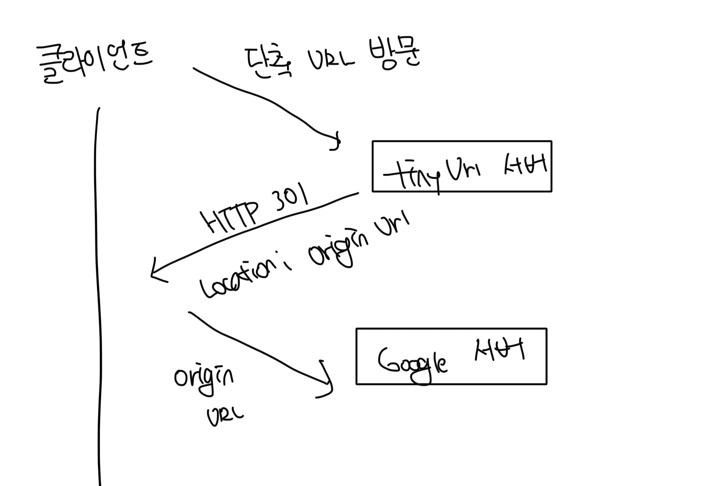

# API 엔드포인트

### 단축된 URL 생성

- Request
  - Method: POST
  - Path: /api/v1/data/shorten
  - Body: {"url": "https://www.google.com"}
- Response
  - Body: {"shortened_url": "http://localhost:8080/abcde"}

 

### 단축된 URL 리디렉션

- Request
  - Method: GET
  - Path: /abcde
  - Response
    - Status: 302
    - Header: Location: https://www.google.com

 

### HTTP 301 vs HTTP 302

#### HTTP 301 Permanent Redirect

- HTTP 요청 처리의 책임이 영구적으로 Location URL로 이전되었다는 응답
- 브라우저는 이 응답을 캐시해서 이후에는 tiny url서버로 요청을 보내지 않음
- 단순한 URL 줄이기를 위한 목적으로 권장

 

#### HTTP 302 Found

- 요청이 일시적으로 Location URL로 처리되야한다는 응답
- 언제나 단축된 URL로 접근시 tiny url 서버를 거쳐야한다는걸 의미함
- 사용자 데이터 분석이 필요할 때 권장
