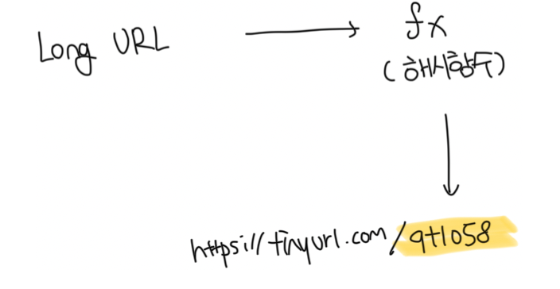
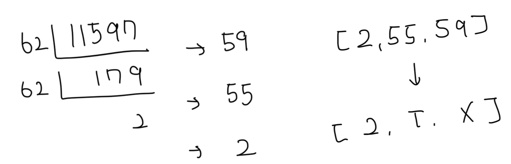
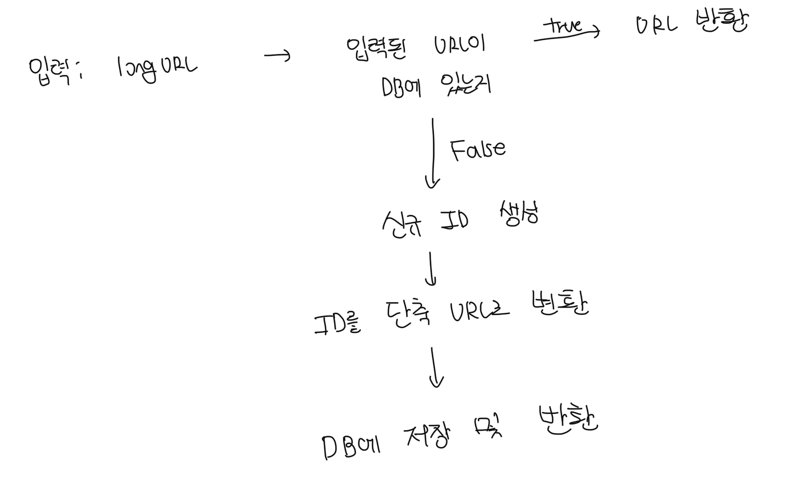
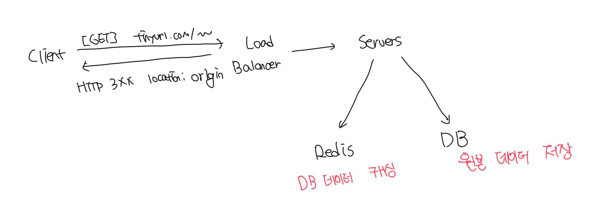

# 단축 방법 설계

- 결국 중요한건 긴 URL을 고유한 해시값으로 대응시킬 해시함수를 찾는것
- 입력으로 주어진 긴 URL이 다르면 해시값도 달라야함
- 계산된 해시 값은 원래 입력으로 주어졌던 긴 URL로 복원이 가능해야함

 

# 데이터모델

- 해시테이블은 초기 전략으론 괜찮지만 실제 시스템에 쓰기에는 곤란함
- 메모리는 유한하고 가격이 매우 비쌈
- 방법으로는 관계형 디비에 저장하는것임

| id  | original_url             | shortened_url            |
| --- | ------------------------ | ------------------------ |
| 1   | https://www.google.com   | http://tinyurl.com/abcde |
| 2   | https://www.facebook.com | http://tinyurl.com/abcdf |

 

# 해시 함수

- 아래 예시에서는 해시 함수가 계산하는 단축 URL 값을 hashValue라고 칭함

### 해시 값 길이

- hashValue는 `[0-9, a-z, A-Z]`로 구성되어 총 `10 + 26 + 26 = 62`개의 문자로 구성됨
- hashValue의 길이를 정하기 위해서는 62^n >= 3650억을 만족하는 n을 구해야함
- 위 공식에서는 n이 7인 경우 약 3.5조로 hashValue는 7을 사용함
- 해시값을 만들기 위한 방법은 `해시 후 충돌해소`와 `base-62`가 있음

 

### 해시 후 충돌해소

- 일반적으로 알려진 `CRC32`, `MD5` 등의 방법이 존재함
- 하지만 대부분의 방법은 위에서 지정한 hashValue보다 큰 값을 반환함
- 값을 `result.slice(0, hashValue)` 형식으로 자를순 있으나 중복 위험이 존재함
- 경우에 따라서 데이터베이스의 접근이 많아일수도 있음

 

### base-62 변환

- 진법 변환은 URL 단축키 구성시 흔하게 사용하는 방법중 하나
- 해당 기법은 수의 표현 방식이 다른 두 시스템이 같은 수를 공유하는 경우 유용함
- 62진법을 쓰는 이유는 hashValue에 사용할 수 있는 문자 개수가 62개라서임

 

#### base-62 변환 예시

- 총 62개의 문법을 사용하므로 마치 16진수처럼 숫자와 문자를 매핑함
  - 0 -> 0
  - 10 -> a
  - 35 -> z
  - 61 -> Z
- 아래 예시에서는 최종으로 `https://tinyurl.com/2TX`가 된다

 

### 두 방식의 차이점

| 해시 충돌 충돌 해소 전략                         | base-62 변환                                               |
| ------------------------------------------------ | ---------------------------------------------------------- |
| 단축 URL 길이 고정됨                             | 단축 URL 길이 가변적, ID가 크면 같이 커짐                  |
| 유일성이 보장되는 ID 생성기 불필요               | 유일성 보장 ID 생성기 필요                                 |
| 충돌이 가능해서 해소 전략이 필요함               | ID 유일성이 보장되야 가능한 전략으로 충돌은 아예 불가능    |
| ID로 부터 알아내는게 아니라서 다음 URL 추론 불가 | ID가 1씩 증가하는 값이라고 가정하면 다음에 쓸 값 예상 가능 |

 

# 단축키 상세 프로세스

| id     | shortURL                 | longURL                |
| ------ | ------------------------ | ---------------------- |
| 218310 | http://tinyurl.com/abcde | https://www.google.com |

 

# URL 리디렉션 설계

 

# 추가정보

- 처리율 제한 장치를 통해서 보안 예방하기
- 데이터 분석 솔루션을 통한 비즈니스 가치 극대화
- 등등
