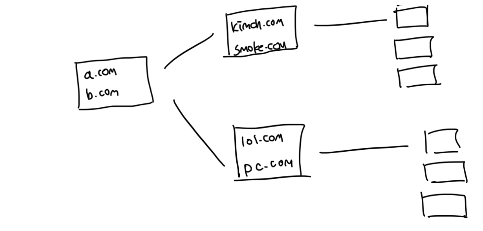

# 웹 크롤러

- 검색 엔진에서 널리 쓰는 기술로, 웹에 새로 올라오거나 갱신된 콘텐츠를 찾아내는게 주 목적임
- 콘텐츠는 웹페이지 부터 pdf, 이미지, 비디오 등 다양하다
- 단순 웹페이지 몇개부터 시작해서 그 내부에있는 웹사이트의 콘텐츠를 수집하게된다

 

# 크롤링의 과정

### 검색 엔진 인덱싱(Search Engine Indexing)

- 웹 페이지를 모아서 검색 엔진을 위한 로컬 인덱스를 생성
- Google Bot의 경우 구글 검색 엔진이 사용하는 웹 스크롤러임

 

### 웹 아카이빙(Web Archiving)

- 나중에 사용할 목적으로 장기보관하기 위해서 웹에서 정보를 모으는 행위
- 대표적으로 미국 국회 도서관의 웹 아카이브가 존재함

 

### 웹 마이닝(Web Mining)

- 웹 마이닝을 통해서 인터넷에서 유용한 지식을 도출해 낼 수 있다
- 유명 금융 기업들은 크롤러를 통해 주주총회 자료, 연차보고서 등 기업의 핵심 사업 방향을 알아내기도함

 

### 웹 모니터링(Web Monitoring)

- 인터넷에서 저작권이나 상표권이 침해되는 사례를 모니터링할 수 있음
- 디지마크사는 웹 크롤러를 통해 해적판 저작물을 찾아내서 보고해줌

 

# 크롤러의 큐모

- 데이터 규모에 따라 매우 달라짐
- 간단한건 한시간 정도면 끝날수도 있지만, 오래걸리는건 전문 개발팀이 필요하기도함
