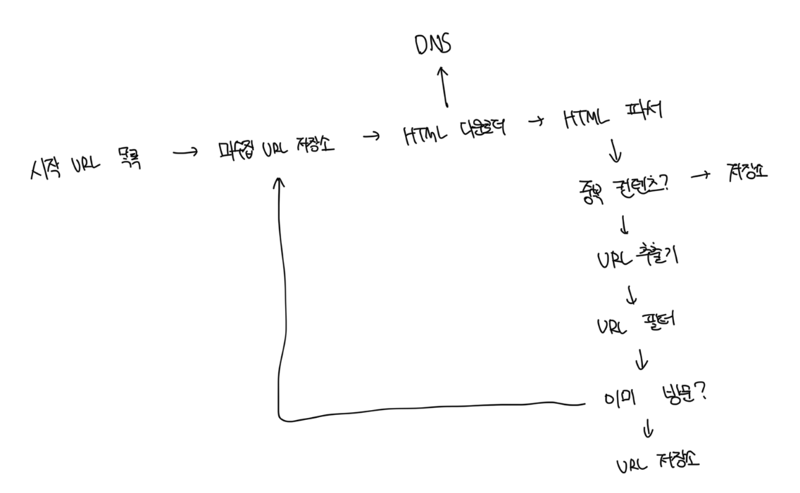

# 크롤러의 규모

- 매당 10억 개의 웹 페이지를 다운로드함
- QPS = 10억 / 30일 / 24시간 / 3600초 = 대략 초당 400개의 페이지 처리
- 최대 QPS = 2 \* QPS = 800개의 페이지 처리
- 웹 페이지의 크기 평균은 500k라고 가정함
- 10억 페이지 \* 500k = 500TB/월, 5년이라면 30PB의 공간이 필요함

<br>

# 개략적 설계안



<br>

### 시작 URL 집합

- 크롤링을 시작하는 출발점
- 예를 들면 어떤 대학 사이트로부터 찾아 나갈 수 있는 모든 웹 페이지를 크롤링하는 가장 직관적인 방법은 해당 대학의 도메인을 사용하는것임
- 가능하면 크롤러가 탐색을 많이할 수 있는 도메인을 고르는게 좋음
- 일반적으로 전체 URL 공간을 작은 부분집합으로 나누는 전략을 씀
  - 쇼핑, 스포츠, 건강 등

<br>

### HTML 다운로더

- 웹 페이지를 다운로드하는 컴포넌트
- 다운로드할 페이지의 URL은 미수집 URL 저장소가 제공함

<br>

### 도메인 이름 변환기

- URL을 IP주소로 변환하는 컴포넌트

<br>

### 콘텐츠 파서

- 웹 페이지를 다운로드하면 파싱과 검증 절차가 필요한데 해당 컴포넌트가 수행
- 크롤링 서버 내부에 구현하면 저장 공간만 낭비하므로 외부로 분리

<br>

### 중복 콘텐츠 여부

- 중복 콘텐츠 감별을 위한 자료구조를 도입하여 중복을 줄이고 데이터 처리에 소요되는 시간을 줄임
- 일반적인 문자열 비교의 경우 데이터가 많을수록 오래걸리는데 이 때 해시값을 비교하면 최적화가 가능함

<br>

### URL 추출기

- HTML 페이지를 파싱해서 그 내부에 존재하는 URL을 골라내는 역할을 담당함

#### HTML 파일

```html
<body>
  <a href="http://www.naver.com">Naver</a>
  <a href="http://www.daum.net">Daum</a>
</body>
```

<br>

#### 링크 목록

```html
[ "http://www.naver.com", "http://www.daum.net" ]
```

<br>

#### 링크 목록의 해시값

```html
[ "0x1f0a0d", "0x1f0a0e" ]
```

<br>

### URL 필터

- 특정 콘텐츠의 타입이나 파일 확장자를 갖는 URL, 접속시 오류가 발생하는 URL 등 접근제외목록에 포함된 URL을 크롤링 대상에서 제외하는 역할을 함

<br>

### 이미 방문한 URL?

- 이미 방문한적이 있는 URL을 제외함으로써 서버 부하를 줄이고 시스템이 무한루프에 빠지는걸 방지할 수 있음
- 해당 자료 구조로는 블룸 필터나 해시 테이블이 많이 쓰임

<br>

### URL 저장소

- 이미 방문한 URL을 보관하는 장소

<br>
