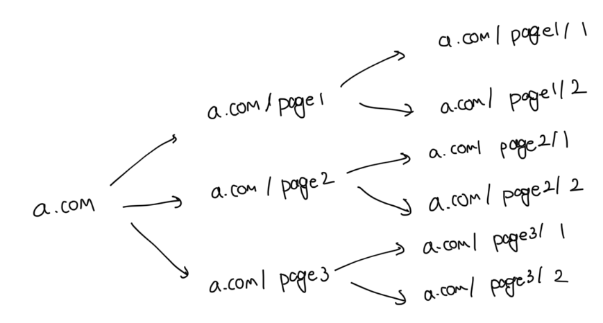
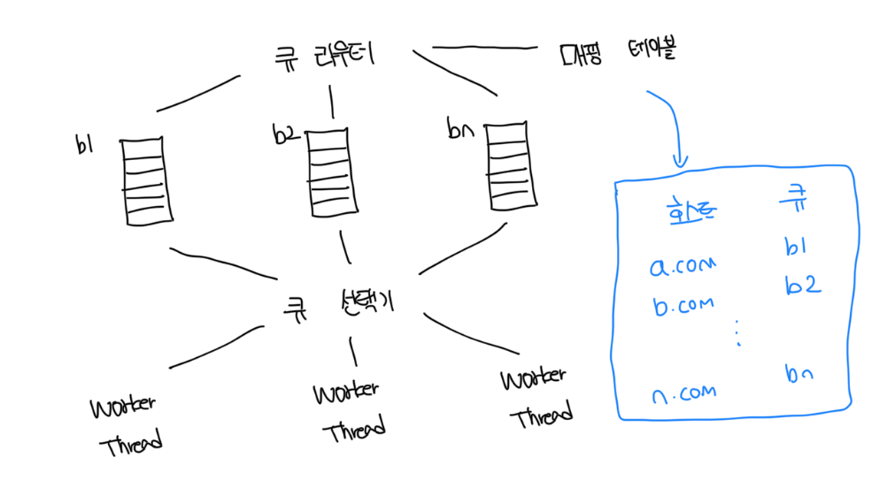
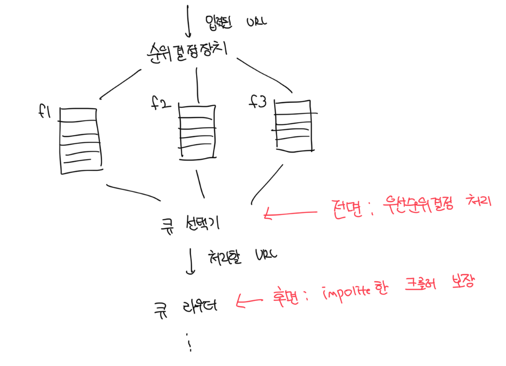
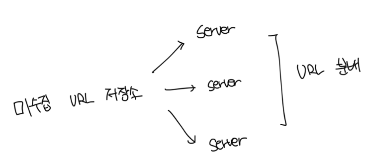
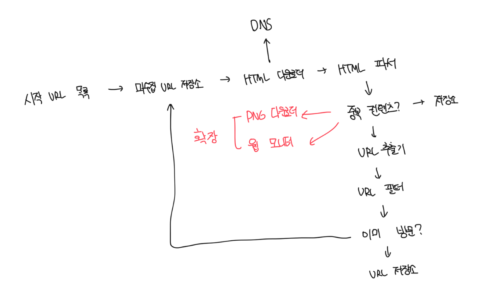

# 상세 설계

### DFS vs BFS

- 웹의 구조는 유향그래프와 같다. 페이지는 노드고 링크는 에지라고 생각하면된다
- DFS는 좋은 선택이 아닐 가능성이 높다
  - 그래프의 크기가 크면 어느 정도로 깊숙이 가게될지 가늠하기 어렵다
- 보통 웹 탐색이 경우 BFS로 탐색하는데 이는 큐를 사용하는 알고리즘이다
  - 따로 우선순위가 없고 처리 순서에 있어 모든 페이지를 공평하게 대우한다
- 하지만 정답은 없으며 페이지 순위, 트래픽 양, 업데이트 빈도 등 여러가지 척도에 비추어 우선순위 구별이 필요하다

<br>

### 예의없는(impolite) 크롤러

- 한 페이지에 나오는 링크의 상당수는 같은 서버로 되돌아감
- 만약 이런 경우 병렬처리를 하게되면 크롤링 대상은 엄청난 트래픽을 받게됨
- 이를 `예의없는 크롤러`라고 부름



<br>

### 미수집 URL 저장소

- URL 저장소는 다운로드 할 URL을 저장하는 저장소다
- 이를 잘 구현하면 `예의(politeness)를 갖춘 크롤러`, `URL 사이 우선순위와 신선도(freshness)`를 구별하는 크롤러 구현이 가능함

<br>

### 예의(politeness)

- 수집 대상 URL에 짧은 시간 안에 너무 많은 요청을 보내는걸 막아야한다
- 너무 많은 요청을 보내는건 `무례한(impolite)` 행위이며, 방어장치가 없는 사이트는 마비될수도 있다
- 예의바른 크롤러를 위해서 꼭 지켜야하는 원칙은 `동일 웹사이트에는 한번에 한 페이지만 요청하기`다
- 웹 사이트의 호스트명과, 다운로드를 수행하는 작업 스레드 사이 관계를 유지하면된다

<br>

# 예의를 갖춘 크롤러 설계



### 큐 라우터(Queue Router)

- 같은 호스트에 속한 URL을 항상 같은 큐로 가도록 보장하는 역할

<br>

### 매핑 테이블(Mapping Table)

- 호스트 이름과 큐 사이 관계를 보관하는 테이블

<br>

### FIFO 큐(b1 ~ bn)

- 같은 호스트에 속한 URL은 언제나 같은 URL에 보관됨

<br>

### 큐 선택기(Queue Selector)

- 큐들을 순회하면서 큐에서 URL을 꺼내 해당 큐에 나온 URL을 다운로드하도록 지정된 워커스레드에 전달하는 역할

<br>

### 작업 스레드(Worker Thread)

- 전달된 URL을 다운로드하는 작업을 수행
- 전달된 URL은 순차적으로 처리되며, 작업들 사이에는 일정한 지연시간 부여가 가능함

<br>

# 우선순위 정하기

- 유용성에 따라서 URL의 우선순위를 나눌 때는 페이지랭크, 트래픽 양, 갱신빈도 등 다양한 척도 사용이 가능함
- `순위결정장치(prioritizer)`는 URL의 우선순위를 정하는 컴포넌트다
- 

<br>

### 순위 결정 장치(prioritizer)

- URL을 입력받아서 우선순위를 계산함

<br>

### 큐(f1 ~ fn)

- 우선순위별로 큐가 하나씩 할당됨
- 우선순위가 높으면 선택될 확률도 올라감

<br>

### 큐 선택기

- 임의 큐에서 처리할 URL을 꺼내는 역할을 담당함
- 순위가 높은 큐에서 더 자주 꺼내도록 프로그래밍 되어있음

<br>

### 신선도(freshness)

- 이미 다운로드한 URL이라도 웹의 특성상 계속 변경되기 때문에 재수집할 필요가 있음
- 모든 URL을 재수집하는건 많은 시간과 자원이 필요한 작업임
- 웹 페이지 변경이력을 활용하거나, 우선순위를 통해 중요한 페이지는 좀 더 자주 수집하는 방법이 존재함

<br>

### 미수집 URL 저장소를 위한 지속성 저장장치

- 검색엔진을 위한 크롤러가 처리해야 하는 URL의 수는 수억, 수십억개에 다른다
- 모든걸 메모리에 저장한다면 용량이 부족하고, 디스크에 저장하자니 병목이 발생한다
- 좋은 방법은 메모리 버퍼에 큐를 둘어서, 주기적으로 디스크에 기록하는게 좋다

<br>

# HTML 다운로더

- HTTP 프로토콜을 통해서 웹 페이지를 내려받는다

<br>

### 로봇 제의 프로토콜(Robot Exclusion Protocol)

- Robots.txt는 웹사이트가 크롤러와 소통하는 표준적 방법임
- 해당 파일에는 크롤러가 수집을 허용하는 페이지가 나열되므로 항상 해당 파일을 먼저 확인해야한다

```
User-agent: *
Disallow: /creatorhub/*
Disallow: /rss/people/*/reviews
...
```

<br>

# HTML 다운로더의 성능 최적화

### 분산 크롤링

- 성능을 위해서 크롤링 작업을 여러개의 분산하는 방법
- 각 서버는 여러개의 스레드를 통해서 다운로드 작업을 처리함



<br>

### 도메인 이름 변환 결과 캐시

- DNS 요청은 동기방식으로 작동하는데, 응답을 받을때까지 다음 작업 진행이 불가능함
- 일반적으로 DNS 요청 처리에는 10ms ~ 200ms 정도가 소요됨
- DNS 조회 결과로 얻은 요청을 캐시하고, 배치를 통해서 주기적으로 갱신하도록 해두면 성능을 높일 수 있음

<br>

### 지역성

- 크롤링 작업을 수행하는 서버를 지역별로 분산하는 방법
- 크롤링 서버와 대상 URL의 서버가 가까울수록 페이지 다운로드 시간은 줄어듬
- 지역성 최적화는 크롤 서버, 캐시, 큐 등 대부분 컴포넌트에 적용 가능함

<br>

### 짧은 타임아웃

- 어떤 웹 서버는 응답이 매우 느리거나 아예 응답하지 않음
- 대기시간이 길어지면 좋지 않으므로 최대 얼마를 기다릴지 미리 정하는게 좋음
- 특정 시간동안 대상 서버가 응답하지 않으면 다음 대상으로 넘어감

<br>

# 안전성

- 최적화된 성능뿐 아니라 안정성도 고려해야함

<br>

### 분산해시(consistent hashing)

- 다운로더 서버들에 부하분산시 적용 가능한 기술
- 다운로더 서버를 쉽게 추가/삭제가 가능함

<br>

### 크롤링 상태 및 수집 데이터

- 장애가 발생해도 쉽게 복구가 가능하게 결과를 디스크에 기록하는게 좋음
- 저장된 데이터를 로딩하고나면 중단되었던 크롤링을 쉽게 재시작할 수 있음

<br>

### 예외처리

- 에러는 불가피할뿐 아니라 흔하게 벌어진다
- 예외가 발생해도 전체 시스템이 중단되지 않게 우아하게 이어나갈수 있어야함

<br>

### 데이터 검증

- 시스템 오류를 방지하기 위한 중요 수단

<br>

# 확장성

- 항상 설계시에는 새로운 형태의 콘텐츠를 쉽게 지원할 수 있게 신경써야함



<br>

# 문제 있는 콘텐츠 감지 및 회피

### 중복 콘텐츠

- 웹의 30% 가량은 중복된 컨텐츠들이다
- 해시나 체크섬을 통해서 중복 컨텐츠를 쉽게 탐지가 가능하다

<br>

### 거미 덫(Spider Trap)

- 크롤러를 무한루프에 빠트리도록 설계한 웹 페이지다
  - 예시: `example.com/foo/bar/foo/bar/foo/bar....`
- 보통 이런 덫이 설치된 웹사이트인지 알아내는건 어렵지 않은데, 기이할정도로 많은 페이지를 가지고있는 것이 일반적이라서다
- 이러한 덫을 탐지하는 알고리즘을 만들어내는건 매우 까다롭다
- 수작업으로 진행하는 경우는 덫을 확인하고 찾아낸 후 해당 사이트를 크롤러 대상에서 제외하거나 URL 필터 목록에 걸어두는것이다

<br>

### 데이터 노이즈

- 때로는 전혀 가치가 없는 컨텐츠도 존재한다
- 광고, 스크립트코드, 스팸 URL 같은 것이 이에 해당한다
- 가능하면 이러한 가치없는 컨텐츠는 제외하는게 좋다
