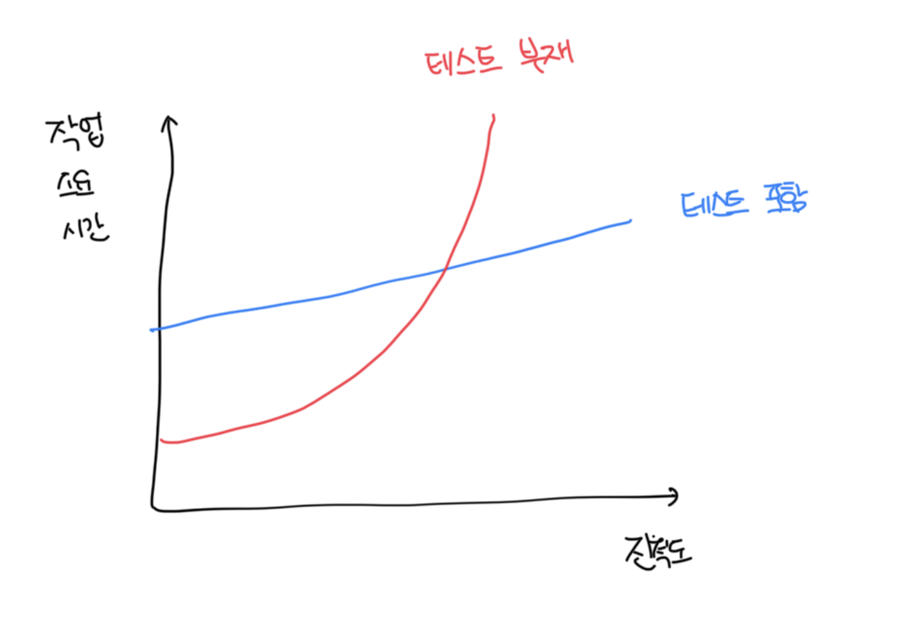
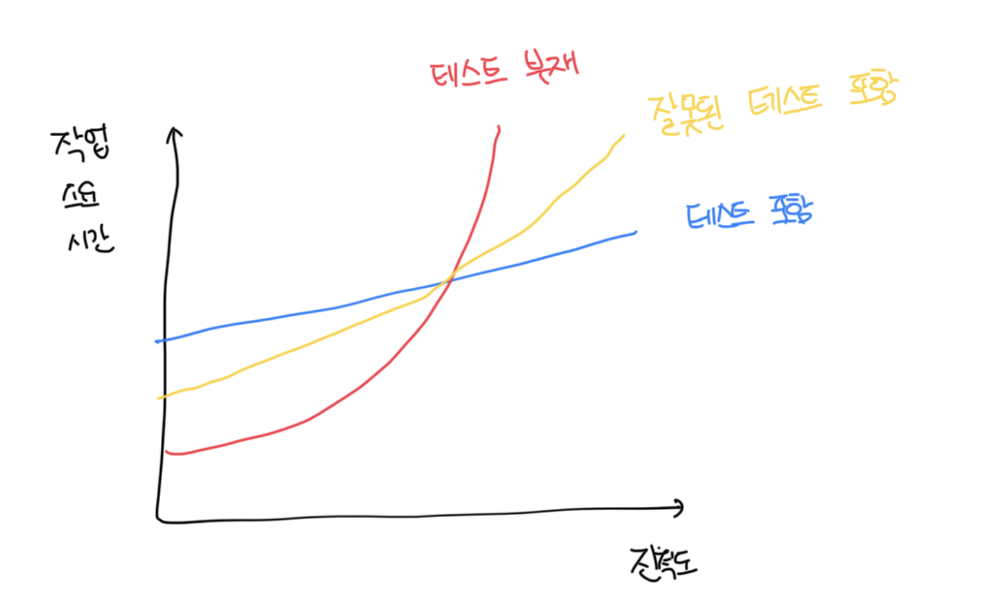

# 단위 테스트 목표

- 일반적으로 코드베이스에 대해서 단위 테스트 작성이 필요하면 일반적으로 더 나은 설계로 이어진다
  - 하지만 이게 단위 테스트에 주된 목표는 아니다. 좋은 설계는 단지 좋은 사이드 이펙트일 뿐이다
- 단위 테스트의 목표는 `소프트웨어 프로젝트의 지속 가능한 성장을 가능하게` 한다다
- 초기엔 테스트 작성으로 인해서 시간이 더 걸릴지라도 시간이 갈수록 더 좋은 효율이난다
- 결국 테스트는 `안정망 역할`을 하고, 대부분의 `회귀(Regression)`에 대한 보험을 제공하는 도구다
- 코드베이스를 지속적으로 검증하는 테스트 없이는 소프트웨어 개발이 쉽게 확장되지 않는다

 

### 좋은 테스트와 좋지 않은 테스트를 가르는 요인

- 테스트로 인해서 프로젝트 성장에 도움이 되는건 맞지만, 단순히 작성한다고해서 도움이 되는건 아니다
- 모든 테스트를 작성할 필요는 없다
- 항상 테스트를 작성할때는 가치와 유지비용을 모두 고려해야한다
  - 기반 코드를 리팩토링시 테스트도 리팩토링 하기
  - 각 코드 변경시 테스트 실행하기
  - 테스트가 잘못된 경고를 발생시키면 처리하기
  - 기반 코드가 어떻게 동작하는지 이해하려고 할때는 테스트를 읽는시간 투자하기
- 지속 가능한 프로젝트 성장을 위해서는 고품질 테스트에만 집중해야 한다

