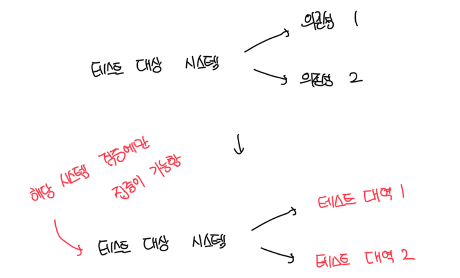
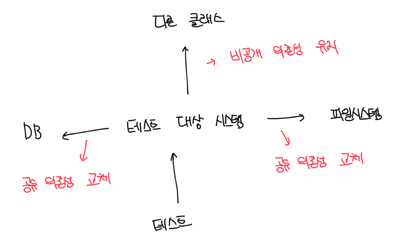

# 단위 테스트의 정의

### 정의

- 작은 코드 조각을 검증하고
- 빠르게 수행하고
- 격리된 방식으로 처리하는 자동화된 테스트

<br>

### 상반되는 의견

- 테스트 스위트의 실행 시간이 충분하다면 테스트가 충분히 빠르다는것임
- 세번째 속성에서 갈리는데 여기서 `고전파`와 `런던파`가 갈린다

<br>

# 고전파 예제

- `준비` 부분은 의존성과 테스트 대상 시스템을 모두 준비하는 부분
  - 테스트 대상 시스템(SUT)과 하나의 협력자를 준비함
  - 아래 예제의 경우 고객이 SUT에, 상점이 협력자에 해당함
- `실행` 단계는 검증하고자 하는 동작을 수행함
- `검증` 단계는 동작이 예상 결과로 이어지는지 확인함
- 해당 코드의 경우 Customer가 올바르게 작동해도, Store가 올바르지 않다면 검증에 실패한다. 즉 서로 격리돼 있지 않다

```ts
const Product = {
  Shampoo: "Shampoo",
  Book: "Book",
};

it("purchage_succeeds_when_enough_inventory", () => {
  // 준비
  const store = new Store();
  store.addInventory(Product.Shampoo, 10);

  // 실행
  const success = customer.purchase(store, Product.Shampoo, 5);

  // 검증
  expect(success).toBe(true);
  expect(store.getInventory(Product.Shampoo)).toBe(5);
});

it("purchase_fails_when_not_enough_inventory", () => {
  // 준비
  const store = new Store();
  store.addInventory(Product.Shampoo, 10);
  const customer = new Customer();

  // 실행
  const success = customer.purchase(store, Product.Shampoo, 15);

  // 검증
  expect(success).toBe(false);
  expect(store.getInventory(Product.Shampoo)).toBe(10);
});
```

<br>

# 런던파 예제

- 실제 `Store`의 인스턴스를 만들지 않고 `jest.fn()`을 사용해서 대체함
- 또한 대체한 Mock에 대해서 메소드의 반환값을 직접 명시함
- `toHaveBeenCalledWith`를 사용하여 실제 메소드 호출시 전달된 파라미터나 호출여부를 검증할수도 있음

```ts
const Product = {
  Shampoo: "Shampoo",
  Book: "Book",
};

it("purchage_succeeds_when_enough_inventory", () => {
  // 준비
  const storeMock = {
    hasEnoughInventory: jest.fn().mockReturnValue(true),
    removeInventory: jest.fn(),
  };
  const customer = new Customer();

  // 실행
  const success = customer.purchase(storeMock, Product.Shampoo, 5);

  // 검증
  expect(success).toBe(true);
  expect(storeMock.hasEnoughInventory).toHaveBeenCalledWith(Product.Shampoo, 5);
});

it("purchase_fails_when_not_enough_inventory", () => {
  // 준비
  const storeMock = {
    hasEnoughInventory: jest.fn().mockReturnValue(false),
    removeInventory: jest.fn(),
  };
  const customer = new Customer();

  // 실행
  const success = customer.purchase(storeMock, Product.Shampoo, 15);

  // 검증
  expect(success).toBe(false);
  expect(storeMock.removeInventory).toHaveBeenCalledTimes(0);
});
```

<br>

# 격리 문제에 대한 런던파의 접근

- 테스트 대상 시스템을 협력자에게서 격리하는걸 뜻함
- 하나의 클래스가 다른 클래스 또는 여러 클래스에 의존하면, 이 모든 의존성을 `테스트 대역(test double)`으로 대체해야함
- 테스트 대상 클래스에만 집중할 수 있게 함
- 의존성을 가진 코드베이스를 테스트하는건 테스트 대역 없이는 힘듬
  - 방법이 존재하긴 하지만 결국 의존성 그래프를 직접 모두 만들어줘야함, 이는 매우 힘든 작업임

<br>

### 테스트 대역



<br>

### 테스트 대상 클래스를 의존성에서 분리


<br>

# 격리 문제에 대한 고전파의 접근

- 런던 스타일은 테스트 대역으로 테스트 대상 코드 조각을 분리해서 격리 요구 사항에 다가감
- 각가의 모든 클래스를 격리해야된다면 테스트 대상 코드 조각을 당연히 단일 클래스나 해당 클래스의 메소드여야함
- 때에 따라서 여러개의 클래스를 동시에 테스트할수도 있지만, 가능하면 격리해야함
- 일반적으로 테스트 대역을 사용할수는 있지만, 보통 테스트 간 공유 상태를 일으키는 의존성에 대해서난 사용한다

<br>

# 공유/비공개/프로세스 외부 의존성

### 공유 의존성(Shared Dependency)

- 테스트 간 공유되고 서로의 결과에 영향을 미칠 수 있는 수단을 제공하는 의존성
- 전형적인 예시로는 `정적 가변 필드(Static Mutable Field)`다
- 이런 필드의 변경 사항을 동일한 프로세스 내에서 실행되는 모든 단위테스트에서 볼 수 있음
- 대표적인 예시로는 데이터베이스가 있다

<br>

### 비공개 의존성(Private Dependency)

- 공유하지 않는 의존성

<br>

### 프로세스 외부 의존성(Out-Of-Process Dependency)

- 앱 실행시 푸로세스 외부에서 실행되는 의존성, 아직 메모리에 없는 데이터에 대한 프록시
- 예를 들어서 디비는 프로세스 외부이면서 공유 의존성임
- 만약 디비를 도커 컨테이너로 실행하면 프로세스 외부이면서 공유 의존성이 아님
  - 이런 환경에서는 테스트가 데이터를 변경할 수 없으므로 결과에 서로 영향을 주지 않음

<br>

### 구조도

- 공유 의존성은 테스트 대상간이 아닌, 단위 테스트 간에 공유함
- 싱글턴 의존성은 각 테스트에서 새로운 인스턴스를 만들 수 있기만 하면 공유되지 않음



<br>

# 공유 / 휘발성 의존성

### 휘발성 의존성

- 개발자 머신에 설치된 환경 외 런타임 환경의 설정 및 구성을 요구
- 디비와 API 서비스가 대표적인 예시임, 추가 설정이 필요하고 시스템에 기본적으로 존재하지 않음
- `비결정적 동작(nondeterministic behavior)`을 포함함
  - 난수 생성이나 날짜를 반환하는 클래스가 존재함
  - 이런 의존성을 각 호출에 대해서 다른 결과를 제공해서 비결정적이라고 부름
- 결국 공유 의존성을 가진 테스트는 단위 테스트 영역에서 통합 테스트 영억으로 넘어가게됨
- 단위 테스트는 클래스에 국한될 필요가 없고, 공유 의존성이 없는 한 여러 클래스를 묶어서 단위 테스트가 가능함
