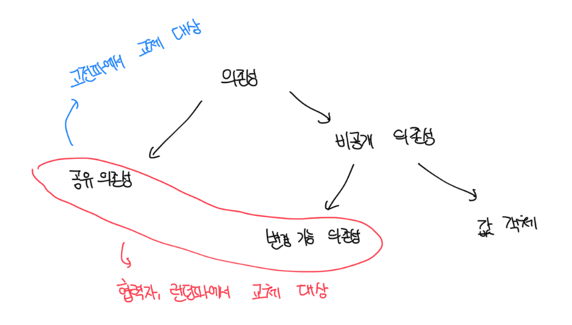
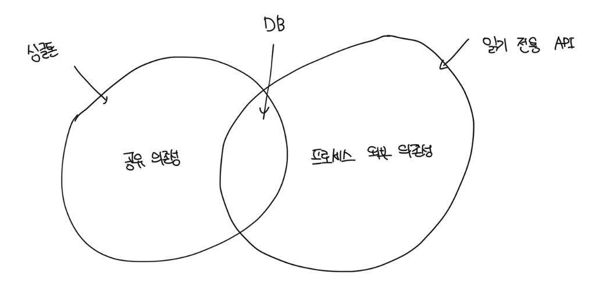

# 단위 테스트의 런던파와 고전파

- 런던파와 고전파로 나눠진 원인은 격리 특성에 있음
- 런던파는 테스트 대상 시스템에서 협력자를 격리하는 것으로 보지만, 고전파는 단위 테스트끼리 격리하는 것으로 봄
- 아래처럼 3가지 주요 주제에 대해 의견 차이가 존재함

| 분류   | 격리 주체   | 단위의 크기                  | 테스트 대역 사용 대상      |
| ------ | ----------- | ---------------------------- | -------------------------- |
| 런던파 | 단위        | 단일 클래스                  | 불변 의존성 외 모든 의존성 |
| 고전파 | 단위 테스트 | 단일 클래스 또는 클래스 세트 | 공유 의존성                |

 

# 고전파와 런던파가 의존성을 다루는 방법

- 절대 변하지 않는 객체, 즉 불변 객체는 교체하지 않아도 된다
  - 예를 들면 ENUM 같은 변하지 않는 값이 있다
  - 주요 특징은 각각의 정체성이 없고, 내용에 의해서만 식별된다는 점이다
- 결국 비공개 의존성은 변경 가능하거나 불변일수 있음
- 예를 들어 디비 의존성은 공유 의존성이고, 내부 상태는 모든 자동화된 테스트에서 공유함
- 이전 예제에서 `Store` 인스턴스는 변경 가능한 비공개 의존성이고, Product 인스턴스는 변경 가능한 비공개 의존성임
- 변경 가능한 의존성을 공유하려면 여러 테스트에서 재사용되야함

 

# 협력자 vs 의존성

- 협력자(Collaborator)는 공유하거나 변경이 가능한 의존성임
- 디비의 경우 공유 의존성이므로 디비 접근 권한을 제공하는 클래스는 협력자임
- 위 예제의 `Store`도 시간이 따라 상태가 변할수 있으므로 협력자임
- `Product`와 `숫자 5`의 경우 의존성이지만 협력자가 아님. `값`이나 `값 객체`로 분류됨
- 프로세스의 외부 의존성을 공유하렴 단위 테스트가 서로 통신할 수 있는 수단이 있어야함

 

### 예시

- 조직에서 판매하는 모든 제품에 대한 카탈로그를 반환하는 API가 있다고 가정한다
- API 카탈로그를 변경하는 기능을 노출하지 않는 이상 공유 의존성이 아님
- 의존성은 휘발성이고 앱 경계를 벗어나는게 사실이지만, 테스트가 반환하는 데이터에 영향을 미칠 수 없기때문에 공유가 아님
- 대부분의 경우 테스트 속도를 높이려면 테스트 대역으로 교체해야함
  - 다만 충분히 빠르고 연결이 안정적이라면 사용해도 괜찮음

