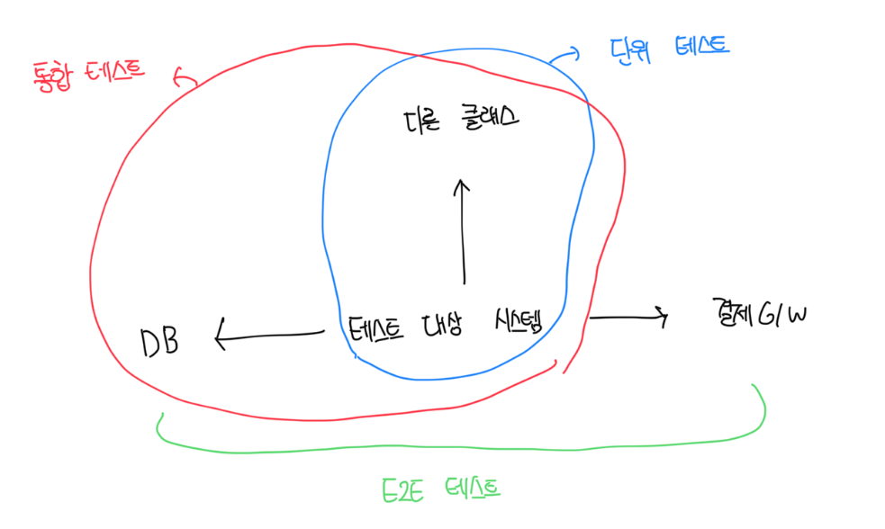

# 두 분파의 통합 테스트

- 런던파의 경우 실제 협력자 객체를 사용하는 모든 테스트를 통합 테스트로 간주함
- 통합테스트의 경우 단위 테스트의 특성을 만족하지 못한다

 

# 통합 테스트의 일부인 E2E 테스트

- 통합 테스트는 간단하게 공유 / 프로세스 외부 의존성뿐 아니라 조직 내 다른 팀이 개발한 코드 등도 통합해서 검증하는 테스트다
- 내부에는 E2E(end-to-end) 테스트라는 개념도 포함되며, E2E가 일반적으로 더 많은 의존성을 포함한다
- 결국 E2E는 모든 외부 앱을 포함하여 시스템을 최종 사용자의 관점에서 검증하는걸 의미함
- 일반적으로 DB나 파일 시스템같은 경우는 의존성에 포함하지만 결제같은 외부에 의존하는건 테스트 대역으로 대체함
- E2E는 모든 유지 보수 측면에서 가장 비용이 많이 들기 때문에 모든 단위 테스트와 통합 테스트를 통과한 뒤 빌드 프로세스 후반에 실행하는게 좋다

