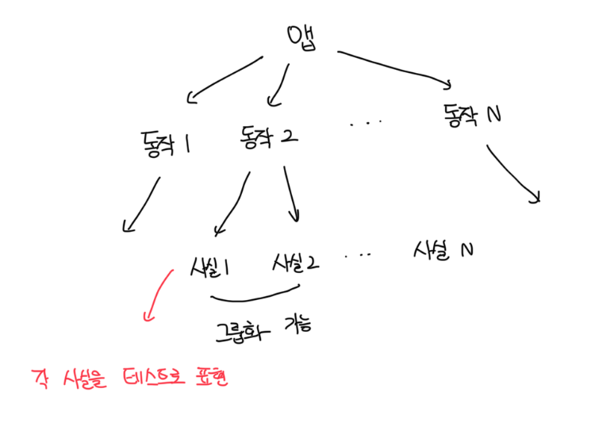

# 매개변수화된 테스트 리팩토링하기

- 보통 테스트 하나로는 동작 단위를 완전하게 설명하기에 충분하지 않음
- 이 동작 단위는 일반적으로 여러 구성 요소를 포함하고, 각 구성 요소는 자체 테스트로 캡쳐해야함
- 대부분 단위 테스트 프레임워크는 매개변수화된 테스트를 사용해서 유사한 테스트를 묶을수있게 해준다



<br>

### 사실을 검증하기 위해서 여러가지 항목 전달하기

- 가장 빠른 배송일이 오늘로부터 이틀 후가 되도록 작동하는 배송 기능이 있다고 가정함
- 이 경우 분명히 테스트 하나로는 충분하지 않고, 지난 배송이 외에도 오늘, 내일, 그 이후까지 체크가 필요함
- 메소드 예시
  - `delivery_for_today_is_invalid`
  - `delivery_for_tomorrow_is_invalid`
  - `the_soonest_delivery_date_is_two_days_from_now`
- 위 같은 경우는 테스트 코드의 양을 줄이고자 테스트를 하나로 묶는것임

<br>

### 매개변수화된 테스트 예제

```ts
describe("DeliveryServiceTests", () => {
  it.each([
    [-1, false],
    [0, false],
    [1, false],
    [2, false],
  ])("can_detect_an_invalid_devery_date", (daysFromNow, expected) => {
    const sut = new DeliveryService();
    const deliveryDate = new Date().setDate(new Date().getDate() + daysFromNow);
    const delivery = new Delivery(deliveryDate);

    const isValid = sut.IsDeliveryValid(delivery);

    expect(isValid).toBe(expected);
  });
});
```

<br>

### 매개변수화된 테스트 단점

- 테스트 코드 양을 크게 줄일 수 있지만, 비용이 발생한다
- 테스트 메서드가 나타내는 사실을 파악하기가 어려워지는데, 이는 매개변수가 많을수록 더 어려워진다
- 절충안으로 긍적적인 테스트 케이스는 공유한 테스트로 도출하고, 가장 중요한 부분을 잘 설명하는 이름을 쓰면 좋다
- 코드의 양과 가독성을 서로 상충된다
- 입력 매개변수만으로 테스트 케이스를 판단할 수 있다면 긍정적인 케이스와 부정적인 케이스 모두 하느의 메소드로 두는게 좋다
  - 만약 그렇지 않다면 긍정적인 케이스를 도출하는게 좋다
- 만약 동작이 너무 복잡하면 매개변수화된 테스트를 조금도 사용하지 않는게 좋다

```ts
describe("DeliveryServiceTests", () => {
  it.each([[-1], [0], [1]])("can_detect_an_invalid_devery_date", (daysFromNow) => {
    // ...
  });

  it("the_soonest_delivery_date_is_two_days_from_now", () => {
    // ...
  });
});
```
