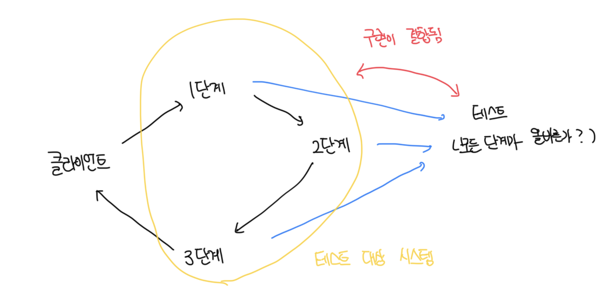
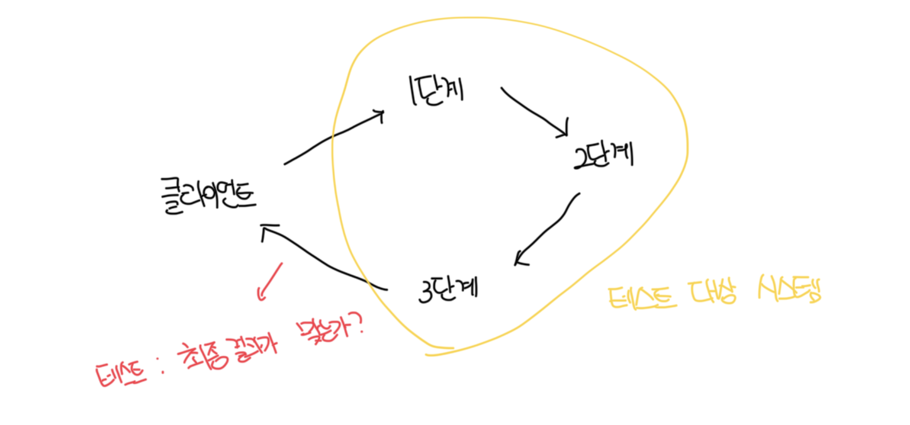

# 좋은 단위 테스트의 4대 요소

- 회귀 방지
- 리팩터링 내성
- 빠른 피드백
- 유지 보수성
- 위 4가지 특성으로 어떤 자동화된 테스트(단위, 통합, E2E 등)도 분석이 가능함

<br>

# 회귀 방지

- 회귀는 소프트웨어 버그로 코드를 수정한 후 기능이 의도한 대로 작동하지 않는 경우다
- 개발을 하는 삶에 있어서 불행한 사실은 코드가 자산이 아니라 책임이라는 점인데 코드베이스가 커질수록 잠재적인 버그에 더 많이 노출된다
- 테스트 코드는 비즈니스적으로 중요한 로직을 나타내는 코드에 유효하며, 단순한 코드를 테스트하는건 가치가 거의 없다
- 회귀 방지 지표를 극대화 할려면 테스트가 가능한 한 많은 코드를 실행하는것을 목표로 해야한다

<br>

# 리팩터링 내성

- 거짓 양성(false positive)은 허위 경보로 실제로 기능이 의도한대로 작동하지만 테스트가 실패하는걸 뜻한다
- 일반적으로 코드를 리팩터링할 때, 즉 구현을 수정하지만 식별할 수 있는 동작은 유지할 떄 발생한다
- 단위 테스트의 목표는 프로젝트 성장을 지속가능하게 하는것이며, 테스트가 지속 가능한 성장을 하게 하는 메커니즘은 회귀 없이 주기적으로 리팩토링 및 새로운 기능을 추가할 수 있는것이다

<br>

### 장점

- 기존 기능 고장시 테스트가 조기 경고를 제공하여 프로덕션에 배포하기 전 문제 해결이 가능함
- 코드 변경이 회귀로 이어지지 않을 것이라고 확신이 가능함. 확신이 없다면 리팩토링이 힘들고 코드가 무너짐

<br>

### 단점

- 테스트가 타당한 이유 없이 실패하는 경우는 코드 문제에 대응하는 능력과의지가 희석됨
- 점점 실패에 익숙해지고 타당한 실패도 무시하기 시작해서 운영 환경에 버그있는 코드가 들어가게됨
- 거짓 양성이 빈번한 경우는 테스트에 대한 신뢰도가 떨어지고 점점 하위 경보로 인식이 나빠짐
- 신뢰가 부족해지면 리팩토링이 줄어들고 회귀를 피하려고 코드 변경을 최소화 하게됨

<br>

# 거짓 양성의 원인

- 거짓 양성의 수는 테스트 구성 방식과 직접적인 관련이 있는데 테스트랑 테스트 대상 시스템의 구현 세부사항이 많이 결합될수록 허위 경보가 더 많이 생긴다
- 거짓 양성이 생길 가능성을 줄이는 방법은 해당 구현 세부 사항에서 테스트를 분리하는것 뿐임
- 테스트는 최종 사용자의 관점에서 SUT를 검증해야하고, 최종 사용자에게 의미 있는 결과만 확인해야함

<br>

### 예제

- 아래 코드에서 `MessageRenderer`를 테스트하는 방법은 클래스가 따르는 알고리즘 분석이 필요함

```ts
class Message {
  header: string;
  body: string;
  footer: string;

  constructor(header: string, body: string, footer: string) {
    this.header = header;
    this.body = body;
    this.footer = footer;
  }
}

interface IRenderer {
  render(message: Message): string;
}

/**
 * MessageRenderer는 여러개의 하위 렌더링 클래스를 가지고 있음
 */
class MessageRenderer implements IRenderer {
  readonly subRenderers: IRenderer[];

  constructor() {
    this.subRenderers = [
      new HeaderRenderer(),
      new BodyRenderer(),
      new FooterRenderer(),
    ];
  }

  render(message: Message): string {
    return this.subRenderers
      .map((renderer) => renderer.render(message))
      .join("\n");
  }
}
ㅕ;

/**
 * 하위 렌더링 클래스들
 */
class HeaderRenderer {
  // ...
}

class BodyRenderer {
  // ...
}

class FooterRenderer {
  // ...
}
```

<br>

### 테스트

- 하지만 문제는 하위 렌더링 클래스들의 순서를 바꾸면 동작은 잘 되더라도 테스트는 실패함
- 이유는 테스트가 구현 세부 사항에 관계가 되어있기 때문임
- SUT의 구현 세부 사항과 결합된 테스트는 리팩터링 내성이 없음

```ts
it("messageRenderer_uses_correct_sub_renders", () => {
  const sut = new MessageRenderer();

  const renderers = sut.subRenderers;

  expect(renderers).toHaveLength(3);
  expect(renderers[0]).toBeInstanceOf(HeaderRenderer);
  expect(renderers[1]).toBeInstanceOf(BodyRenderer);
  expect(renderers[2]).toBeInstanceOf(FooterRenderer);
});
```



<br>

# 구현 세부 사항 대신 최종 결과를 목표로 하기

- 테스트를 깨지지 않게 하고 리팩토링 내성을 높이는 방법은 SUT의 구현 세부 사항과 테스트 간 결헙도를 낮추는 것 뿐임
- 이전의 `MessageRenderer` 테스트를 리팩토링 하는데 기존에는 구현에 의존했지만, 동작에 신경쓰도록 변경한다

```ts
it("rendering_a_message", () => {
  const sut = new MessageRenderer();
  const message = new Message("h", "b", "f");

  const html = sut.render(message);

  expect(html).toBe("<header>h</header><article>b</article><footer>f</footer>");
});
```


