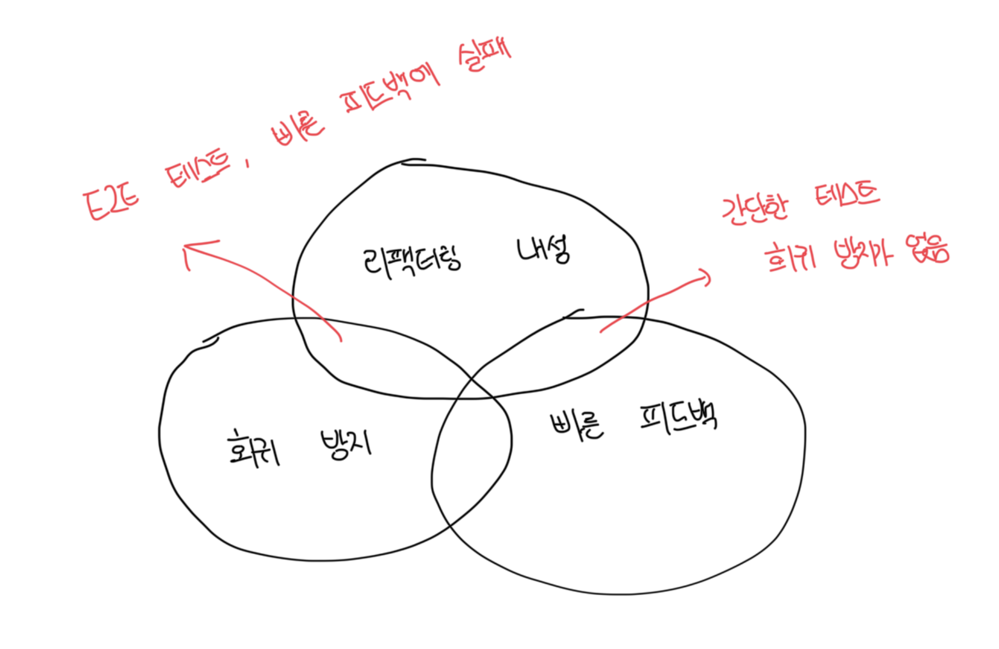

# 이상적인 테스트를 찾아서

- `[회귀 방지]`, `[리팩터링 내성]`, `[빠른 피드백]`, `[유지 보수성]`을 곱해서 가치 측정이 가능함
- 이 뜻은 4개중 하나라도 0이면 테스트의 가치가 없다는 뜻임
- 테스트 코드를 포함한 모든 코드는 책임이며, 최소 임계치를 높게 설정하고 이러한 임계치를 충족하는 테스트만 남기는게 좋음

<br>

# 이상적인 테스트를 만들 수 있는가

- 이상적인 테스트는 위 4가지 범주 모두에서 최대 점수를 받는 테스트지만, 현실적으로 불가능하다
- 위 설명처럼 4가지 범주 중 하나라도 0점을 받는 테스트는 가치가 없으므로 최대한 어느 것도 크게 줄지 않는 방식으로 해야함

<br>

# 극단ㄴ적인 사례 : E2E 테스트

- E2E는 모든 코드를 테스트하므로 회귀 방지를 휼룡하게 해냄
- 또한 거짓 양성에 면역이 돼 리팩터링 내성도 우수함
- 최종적으로 사용자 입장에서 기능이 어떻게 동작하는지만 볼 수 있으므로 구현 세부 사항을 최대한 제거함
- 하지만 테스트는 느리므로 모든 테스트를 E2E로 하는 시스템에서 빠른 피드백을 받는건 힘들고 이는 개발팀의 큰 걸림돌임


<br>

# 극단적인 사례 2 : 간단한 테스트

- 간단한 테스트는 E2E에 비해 빠르게 실행되고 빠른 피드백을 제공한다
- 또한 거짓 양성이 생길 가능성이 상당히 낮아서 리팩터링 내성도 우수하다
- 하지만 워낙 간단해서 기반 코드에 실수할 여지가 없이때문에 간단한 테스트는 회귀를 나타내지 않는다
- 간단한 테스트는 이름만 바꿀 뿐 `동어 반복 테스트`를 불러온다
- 항상 테스트가 통과되거나 검증이 무의미하다

```ts
class User {
  constructor(private name: string) {}

  getName(): string {
    return this.name;
  }
}

it("User", () => {
  const name = "name";

  const sut = new User("name");

  expect(sut.getName()).toBe(name);
});
```



<br>

# 극단적인 사례 3 : 깨지기 쉬운 테스트

- 실행이 빠르고 거짓 회귀를 잡을 가능성이 높지만 거짓 양성이 많은 테스트를 작성하기 쉬운데, 이를 `깨지기 쉬운 테스트` 라고 부름
- 리팩터링을 견디지 못하고, 해당 기능이 고장났는지 여부와 관계없이 빨간색으로 바뀜

```ts
class UserRepository {
  private lastExecutedSqlStatement: string;

  getById(id: number) {
    // ...
  }

  getLastExecutedSqlStatement() {
    return this.lastExecutedSqlStatement;
  }

  setLastExecutedSqlStatement(sql: string) {
    this.lastExecutedSqlStatement = sql;
  }
}

it("getById_executes_corrent_SQL_code", () => {
  const sut = new UserRepository();

  const user = sut.getById(5);

  expect(sut.getLastExecutedSqlStatement()).toBe(
    "SELECT * dbo.[User] WHERE UserID = 5"
  );
});
```

<br>

### 문제점

- 위 테스트 코드에서 쿼리문을 바꿔도 동일한 결과를 가져올 수 있음
  - SELECT \* dbo.[User] WHERE UserID = 5
  - SELECT \* dbo.User WHERE UserID = 5
  - SELECT UserId, Name, Email dbo.User WHERE UserID = 5
  - ...
- 테스트 코드가 SUT의 구현 세부사항에 결합되는 예시로 더 이상의 리팩터링을 막고있음
- 이러한 테스트는 빠르게 실행되고 회귀 방지를 휼룡히 해내지만 리팩터링 내성은 거의 없음


<br>

# 결론

- 3개의 특성중 2개를 만족하는 테스트는 만들기 쉽지만, 나머지 1개를 희생해야 가능함
- 4번째 특징인 유지보수성은 앞의 3개랑 전혀 연관이없다
- E2E 테스트는 외부 프로세스 의존성을 계속해서 운영해야하므로 추가적인 노력이 더 들게된다
  - E2E는 유지비 측면에서 더 비싼 경향이 있다
- E2E 테스트만 사용하거나, 테스트가 상당히 빠르지 않는 한은 리팩터링 내성을 최대한 많이 챙기는게 좋다
- 리팩터링 내성과 유지보수성을 챙기면서 회귀방지 또는 빠른 피드백 2개중 하나를 선택하는게 최고의 방법이다
