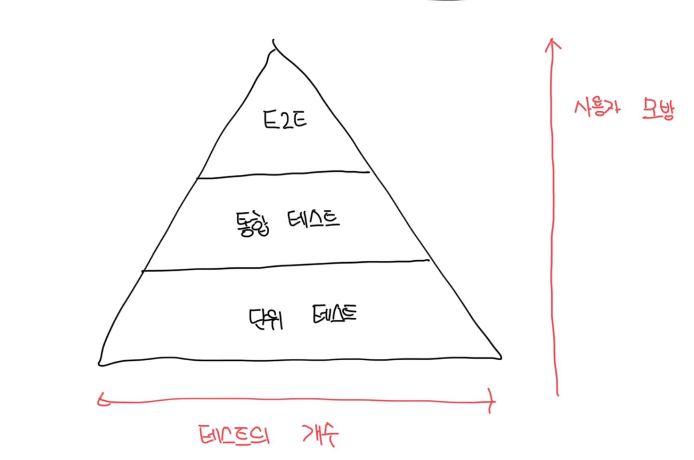

# 테스트 피라미드 분해

- 테스트 스위트에서 테스트 유형 간 일정한 비율을 일컫는 개념
- 가로가 길수록 많은 수의 테스트가 존재한다는걸 의미한다
- 세로가 길수록 실제 유저를 모방하는 정도가 높다는걸 의미한다
- 상단의 테스트는 회귀 방지에 유리한 반면, 하단의 테스트는 실행 속도를 강조한다

 

# 항상 지켜지는 리팩터링 내성

- 어느 계층도 리팩터링 내성을 포기하지는 않음
- 모든 테스트는 거짓 양성을 최소화하는걸 목표로 하고, 심지어 제품 코드로 직접 작업할 때도 ㄱ래야한다
- 테스트의 개수로는 E2E < 통합 < 단위순으로 많아야한다
- E2E 테스트는 가장 중요한 기능에 적용할때랑 단위/통합과 동일한 수준으로 보호할때만 적용하는게 좋다

 

### 앱의 수준별 테스트 개수의 차이

- 단순 CRUD만 존재하는 간단한 앱의 경우는 통합과 단위 테스트 개수가 거의 똑같을것이다
- 단위 테스트는 알고리즘이나 비즈니스 복잡도가 없는 환경에서는 유용하지 않으니 간단한 테스트 수준까지 빠르게 내려간다
- 또 다른 예외로는 외부 의존성(디비 등) 하나만 두는 API인데, 이런 경우는 유저 인터페이스가 없으므로 유지비가 크지도 않아서 E2E를 더 많이 두는게 적합할수도 있다

 

# 블랙박스 / 화이트박스 테스트 선택하기

- 일반적으로 모든 테스트는 `리팩터링 내성`을 가져야 하므로 기본적으로 블랙박스 선택을 권장함
- 모든 테스트가 시스템을 블랙박스로 바라보고 동작을 검증하도록 하는게 좋다
-

### 블랙박스 테스트

- 시스템 내부 구조를 몰라도 시스템 기능을 검증할 수 있는 소프트웨어 테스트 방법
- 앱이 어떻게 해야하는지가 아닌, 무엇을 해야 하는지를 중심으로 구축됨

 

### 화이트박스 테스트

- 블랙박스와 정 반대로 앱의 내부 작업을 검증하는 방법이다
- 테스트는 요구사항이나 명세가 아닌 소스 코드에서 파생된다
- 소스코드 분석을 통해 외부 명세에만 의존할 때 놓칠 수 있는 많은 오류 발견이 가능하지만, SUT이 특성 구현과 결합되어 테스트가 깨지기 쉬움

| 종류       | 회귀 방지 | 리팩터링 내성 |
| ---------- | --------- | ------------- |
| 화이트박스 | 좋음      | 나쁨          |
| 블랙박스   | 나쁨      | 좋음          |
