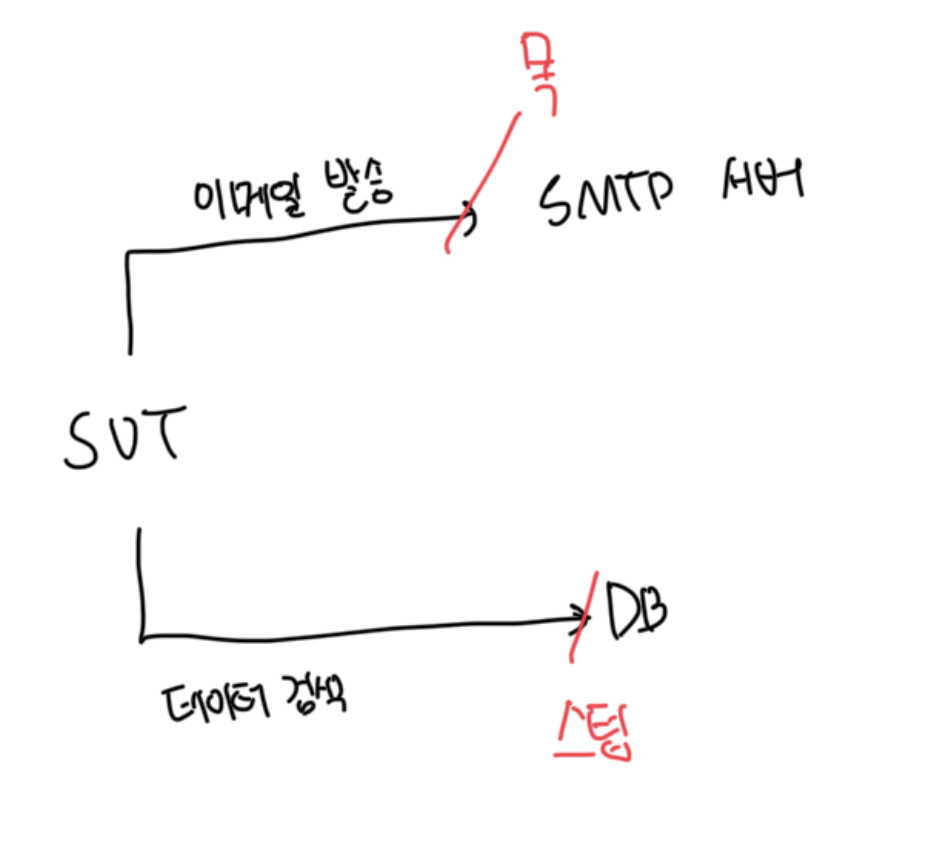

# 테스트 대역 유형

- 테스트 대역은 모든 유형의 비운영용 까자 의존성을 설명하는 포괄적인 용어
- 테스트 대역은 크게는 `목(Mock)`, `스텁(Stub)` 2가지로 나눌 수 있다
- 목은 SUT와 관련 의존성 간 상호작용을 모방하고 검사하지만, 스텁은 모방만 한다



<br>

### 목(Mock)

- 외부로 나가는 상호작용을 모방하고 검사하는데 도움이 됨
- 상호작용은 SUT가 상태를 변경하기 위한 의존성을 호출하는것에 해당됨
- 상세 종류는 `목`, `스파이`가 있음
- 목은 일반적으로 전용 프레임워크의 도음을 받아서 생성되지만, 스파이는 직접 작성함

<br>

### 스텁(Stub)

- 내부로 들어오는 상호 작용을 모방하는 데 도움이 됨
- 상호작용은 SUT가 입력 데이터를 얻기 위한 의존성을 호출하는 것에 해당됨
- 상세 종류는 `스텁`, `더미`, `페이크`가 있음
- 더미는 null 같은 가짜 문자열과 같이 단순하고 하드코딩된 값임
- 페이크는 보통 아직 존재하지 않는 의존성을 대체하고자 구현함

<br>

# 도구로서의 목과 테스트 대역으로서의 목

- 목도 결국은 테스트 대역의 일부일 뿐이다
- 그러나 목이라는 용어는 또 다른 의미가 있는데, `목 라이브러리`의 클래스도 목이라고 참고할 수 있다
  - 이 클래스는 실제 목을 만드는 데 도움이 되지만, 그 자체로 목이 아니다
- 도구로서의 목과 테스트 대역으로서의 목을 혼동하지 않는게 중요하다

<br>

### 예제 1 : 목 도구로 목 생성하기

```ts
interface IEmailGateway {
  sendGreetingsEmail(email: string): void;
}

it("sending_a_greetings_email", () => {
  /**
   * mock 도구로 목 생성
   *
   * jest.Mocked<IEmailGateway>는 도구로서의 목이다
   *
   * mock 변수는 테스트 대역으로서의 목이다
   */
  const mock: jest.Mocked<IEmailGateway> = {
    sendGreetingsEmail: jest.fn(),
  };
  const email = "user@gmail.com";

  const sut = new Controller(mock);

  sut.greetUser(email);

  expect(mock.sendGreetingsEmail).toHaveBeenCalledWith(email);
  expect(mock.sendGreetingsEmail).toHaveBeenCalledTimes(1);
});
```

<br>

### 예제 2 : 목 도구로 스텁 생성하기

```ts
interface IDatabase {
  getNumberOfUsers(): number;
}

it("creating_a_report", () => {
  /**
   * SUT에 입력 데이터를 제공하는 호출을 모방함
   *
   * IDatabase 인터페이스에 대해서 getNumberOfUsers 메소드가 10을 반환한다고 미리 설정함
   */
  const stub: jest.Mocked<IDatabase> = {
    getNumberOfUsers: jest.fn().mockReturnValue(10),
  };
  const sut = new ReportGenerator(stub);

  const report = sut.createReport();

  expect(report.numberOfUsers).toBe(10);
});
```

<br>

# 스텁으로 상호작용을 검증하지 말라

- 목은 SUT에서 관련 의존성으로 나가는 상호 작용을 모방하고 검사함
- 스텁은 내부로 들어오는 상호 작용만 모방하고 검사하지 않는다
- 스텁으로 상호작용을 검증하는 것은 취약한 테스트를 야기하는 안티 패턴이다
- 최종 결과가 아닌 사항을 검증하는 이러한 관행을 과잉 명세라고 부른다

```ts
interface IDatabase {
  getNumberOfUsers(): number;
}

it("creating_a_report", () => {
  const stub: jest.Mocked<IDatabase> = {
    getNumberOfUsers: jest.fn().mockReturnValue(10),
  };
  const sut = new ReportGenerator(stub);

  const report = sut.createReport();

  expect(report.numberOfUsers).toBe(10);

  /**
   * 안티패턴 : 스텁으로 관련 의존성 간 상호작용을 검증
   */
  expect(stub.getNumberOfUsers).toHaveBeenCalledTimes(1);
});
```

<br>

# 목과 스텁 함께 쓰기

- 목과 스텁을 같이 쓰는 경우는 보통 목이라고 칭함
  - 이는 목이라는 사실이 스텁이라는 사실보다 더 중요하기 때문임
- 스텁을 통해서 준비된 응답을 반환하고, 목을 통해서 행위를 검증함
  - 이는 서로 다른 메소드이므로 스텁과 상호작용을 검증하지 말라는 원칙을 깨지 않음

```ts
it("purchase_fails_when_not_enough_inventory", () => {
  /**
   * 스텁을 통해서 기존에 정의된 응답을 설정함
   */
  const storeMock: jest.Mocked<IStore> = {
    hasEnoughInventory: jest
      .fn()
      .mockImplementation((product: typeof Product, quanity: number) => false),
  };
  const sut = new Customer();

  const success = sut.purchase(storeMock, Product.Shampoo, 5);

  expect(success).toBe(false);

  /**
   * 목을 통해서 sut에서 수행한 호출을 검사함
   */
  expect(storeMock.removeInventory(Product.Shampoo, 5)).toHaveBeenCalledTimes(
    0
  );
});
```

<br>

# 목과 스텁은 명령과 조회에 어떻게 관련돼 있는가?

- 목과 스텁의 개념은 `명령 조회 분리(CQS, Command Query Separation)` 원칙과 관련이 있다
- 모든 메소드는 명령이거나 조회여야 하고, 이 둘을 혼용해서는 안된다는 의미다
- 명령(= 목)은 사이드 이펙트를 발생시키고, 아무런 값도 반환하지 않는 메소드다
- 쿼리(= 스텁)은 사이드 이펙트가 존재하지 않고, 값을 반환하는 메소드다

```ts
// 목, 즉 명령에 해당하는 메소드
const mock: jest.Mocked<IEmailGateway> = {
  sendGreetingsEmail: jest.fn(),
};
expect(mock.sendGreetingsEmail).toHaveBeenCalledWith("some@email.com");

// 스텁, 즉 조회에 해당하는 메소드
const stub: jest.Mocked<IDatabase> = {
  getNumberOfUsers: jest.fn().mockReturnValue(10),
};
expect(stub.getNumberOfUsers()).toBe(10);
```
