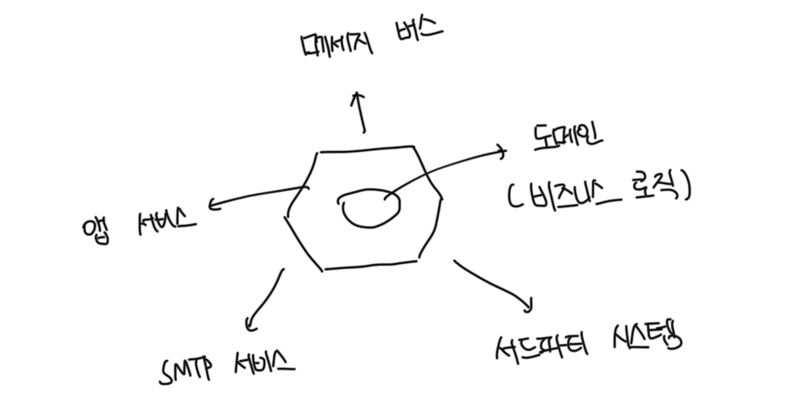
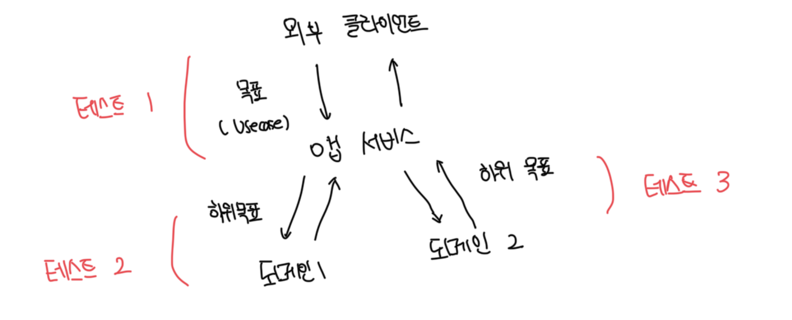

# 육각형 아키텍쳐 정의

- 전형적인 앱은 도메인과 앱 서비스라는 두 계층으로 구성된다
- 도메인 계층 상위에 앱 서비스 계층이 존재하며 외부 환경과 통신을 조정하게된다



<br>

### 중요한 지침

#### 도메인 계층과 앱 서비스 계층 간 관심사 분리

- 도메인 계층은 해당 비즈니스 로직에 대해서만 책임을 져야함
- 앱 서비스에는 어떠한 비즈니스 로직도 존재하면 안됨

<br>

#### 앱 내부 통신

- 앱 서비스 계층 -> 도메인 계층으로 흐르는 단방향 의존성 흐름을 규정함
- 이는 앱 계층이 도메인에 대해서는 알지만, 반대는 알면 안됨
- 도메인 계층은 외부 환경에서 완전히 격리되어야함

<br>

#### 앱 간의 통신

- 외부 앱은 앱 서비스 계층에 존재하는 공통 인터페이스를 통해서 해당 앱에 연결됨
- 아무도 도메인 게층에 직접 접근이 불가능함

<br>

# 프랙탈(Fractal) 특성

- API를 잘 설계하면 테스트도 프렉탈 구조를 가지기 시작하는데, 즉 달성하는 목표는 같지만 서로 다른 수준에서 동작을 검증함
- 어떤 테스트도 비즈니스 요구 사항으로 거슬러 올라갈 수 있어야함
- 각 테스트는 도메인 전문가에게 의미 있는 이야기를 전달해야함



<br>

# 시스템 내부 통신과 시스템 간 통신

- 시스템 내부 통신 : 앱 내 클래스 간의 통신
- 시스템 간 통신 : 앱이 다른 앱과 통신하는것
- 이 때 시스템 내부 통신은 구현 세부사항이고, 시스템 간 통신은 그렇지않음
- 시스템 내부 통신은 구현 세부사항 이므로 협력과 결합하면 테스트가 취약해짐
- 테스트에서 목을 사용하면 시스템과 외부 앱 간 통신 패턴을 확인할 때 좋음

<br>

# 시스템 내부 통신과 시스템 간 통신의 예

```ts
class CustomerController {
  // ...

  purchase(customerId: number, productId: number, quantity: number) {
    /**
     * 시스템 간 통신 : 데이터베이스와의 통신
     */
    const customer = this.customerRepository.getById(customerId);
    const product = this.productRepository.getById(productId);

    /**
     * 내부 통신 : Customer, Store 클래스 간 통신
     */
    const isSuccess = customer.purchase(this.mainStore, product, quantity);

    /**
     * 시스템 간 통신 : 이메일 발송을 위한 SMTP 서버와의 통신
     */
    if (isSuccess) {
      customer.sendReceipt(customer.email, product.name, quantity);
    }

    return isSuccess;
  }
}
```

<br>

# 취약한 테스트로 이어지지 않은 목 사용하기

- SMTP 서버와 통신에 대해서 목으로 대체하는 경우 리펙토링을 하더라도 통신 유형이 그대로 유지되기 때문에 테스트 취약성을 야기하지 않음

```ts
interface IEmailGategway {
  sendReceipt(email: string, productName: string, quantity: number): void;
}

it("successful_purchase", () => {
  const mock: jest.Mocked<IEmailGategway> = {
    sendReceipt: jest.fn(),
  };
  const sut = new CustomerController(mock);

  const isSuccess = sut.purchase(1, 2, 3);

  expect(isSuccess).toBe(true);

  /**
   * 시스템에서 구매에 대한 이메일 발송여부 검증
   */
  expect(mock.sendReceipt).toHaveBeenCalledWith([
    "customer@email.com",
    "Shampoo",
    5,
  ]);
  expect(mock.sendReceipt).toHaveBeenCalledTimes(1);
});
```

<br>

# 취약한 테스트로 이어지는 목 사용

```ts
it("purchase_succeeds_when_enough_inventory", () => {
  const storeMock: jest.Mocked<IStore> = {
    hasEnoughInventory: jest
      .fn()
      .mockImplementation((product: Product, quantity: number) => {
        if (product.name === "Shampoo" && quantity === 5) {
          return true;
        }

        return false;
      }),
  };

  const customer = new Customer();

  const success = customer.purchase(storeMock, Product.Shampoo, 5);

  expect(success).toBe(true);
  expect(storeMock.removeInventory).toHaveBeenCalledWith(Product.Shampoo, 5);

  /**
   * 실제 유용한 메소드는 customer.purchase(), storeMock.hasEnoughInventory(), storeMock.removeInventory() 이다.
   * 하지만 removeInventory() 메소드는 고객의 중간단계, 즉 세부 구현 사항이므로 테스트와 결합되어버린다
   */
  expect(storeMock.removeInventory).toHaveBeenCalledTimes(1);
});
```
