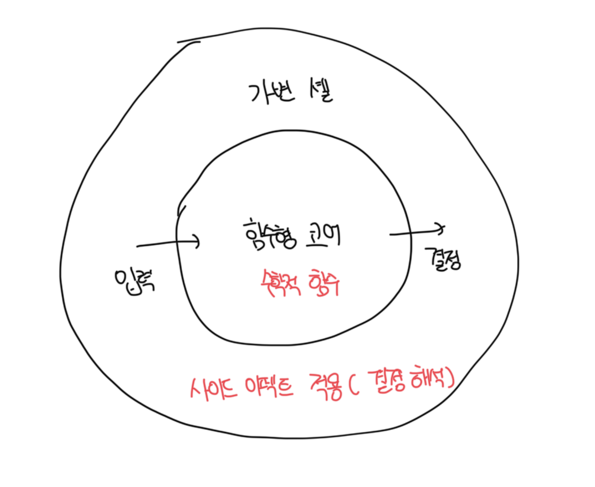

# 함수형 프로그래밍이란

- 수학적 함수를 사용하는 프로그래밍이며, 수학적 함수란 숨은 입출력이 없는 함수다
- 수학적 함수의 모든 입출력은 메소드명, 이름, 인수, 반환 타입으로 구성된 메소드 시그니쳐에 명시해야한다
- 이러한 함수는 테스트가 매우 쉽고, 출력 기반 테스트를 적용할 수 있는 메소드(함수)는 수학적 함수뿐임

```ts
/**
 * 출력 : number
 * 이름 : calculateDiscount
 * 입력 : Product[]
 * 메소드 시그니처 : calculateDiscount(products: Product[]): number
 */
const calculateDiscount = (products: Product[]): number => {
  const discount = products.length * 0.01;
  return Math.min(discount, 0.02);
};
```

<br>

# 숨은 입출력 유형

- 메소드가 수학적 함수인지 판별하는 가장 좋은 방법은 프로그램 동작을 변경하지 않고, 해당 메소드에 대한 호출을 반환 값으로 대체할 수 있는지 확인하는것임
- 이러한 메소드 호출을 해당 값으로 바꾸는 것은 참조 투명성 이라고 부름

<br>

### 사이드 이펙트

- 메소드 시그니처에 포함되지 않은 출력, 따라서 숨어있음
- 연산은 상태를 변경하고 디스크의 파일을 업데이트 하는 등 사이드 이펙트를 발생시킴

<br>

### 예외

- 메소드가 예외를 던지면 프로그램 흐름에 메소드 시그니처에 설정된 계약을 우회하는 경로를 만듬
- 호출된 예외는 호출 스택의 어느 곳에서도 발생할 수 있으므로 메소드 시그니처가 전달하지 않는 출력을 추가함

<br>

### 내외부 상태에 대한 참조

- DateTime.Now 처럼 정적 속성을 사용해 현재 날자와 시간을 가져오는 메소드가 있을수도 있음
- 디비에서 데이터를 질의하거나, 비공개 변경 가능 필드를 참조할수도 있음
- 이런건 모두 메소드 시그니처에 없는 실행 흐름에 대한 입력이며 숨어있음

<br>

# 사이드 이펙트 예시

- 사이드 이펙트는 숨은 출력의 가장 일반적인 유형임
- 아래 코드는 출력값이 `댓글` 이지만 상태를 변경하는 사이드 이펙트가 존재함

```ts
class Article {
  addComment(text: string): Comment {
    const comment = new Comment(text);
    this.comments.add(comment); // 사이드 이펙트
    return comment;
  }
}
```

<br>

# 함수형 아키텍쳐란?

- 비즈니스 로직을 처리하는 코드와 사이드 이펙트를 일으키는 코드를 분리하는것
- 사이드 이펙트를 비즈니스 연산 끝으로 몰아서 비즈니스 로직을 사이드 이펙트와 분리시킨다

  <br>

### 비즈니스 로직과 사이드 이펙트 분리시키기

- 결정을 내리는 코드
  - 이 코드는 사이드 이펙트가 필요 없기때문에 수학적 함수를 사용해서 작성함
  - 이런 코드를 `함수형 코어`나 `불변 코어`라고 부름
- 해당 결정에 따라 작용하는 코드
  - 수학적 함수에 의해 이뤄진 모든 결정을 디비 변경이나 메세지 버스로 전송된 메시지와 같이 가시적인 부분으로 변경함
  - 이런 코드르를 `가변 셸` 이라고 부름



<br>

### 함수형 코어와 가변 셸의 협력

- 가별 셸은 모든 입력을 수집함
- 함수형 코어는 결정을 생성함
- 셸은 결정을 사이드 이펙트로 변환함
- 가변 셸은 아무런 말도 하지 않아야 계층이 잘 분리된것임
- 목표는 출력 기반 테스트로 함수형 코어를 두루 다루고, 가변 셸을 훨씬 더 적은 수의 통합 테스트에 맞기는것임

<br>

# 함수형과 육각형 비교

- 비슷한점이 많은데 둘 다 관심사 분리라는 아이디어를 기반으로 함
- 또한 의존성에 대한 흐름도 단방향으로 비슷함
- 차이점은 사이드 이펙트에 대한 처리에 존재함
  - 함수형은 모든 사이드 이펙트를 가변 셀로 밀어냄
  - 육각형은 도메인 계층에 제한하는 한 도메인 계층으로 인한 사이드 이펙트도 문제없음
  -
