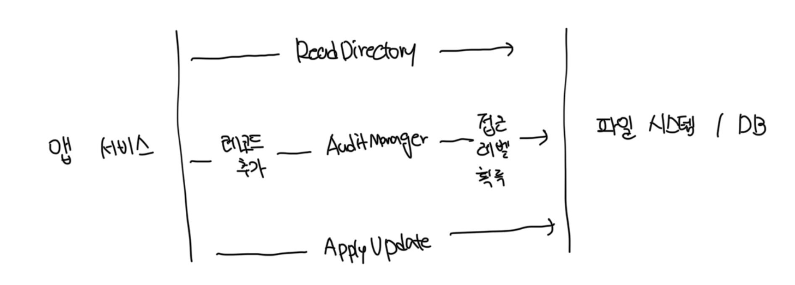

# 함수형 아키텍쳐 적용 가능성

- 감사 시스템은 결정으 내리기 전 입력을 모두 미리 수집이 가능해서 함수형 아키텍쳐가 잘 작동함
- 하지만 종종 실행 흐름이 간단하지 않은데 의사 결정 절차 중간 결과에 따라서 프로세스 외부 의전송에서 추가 데이터를 질의할수도 있음
- 이런 경우는 중간에 숨은 입력이 생겨서 더이상 수학적 함수가 될 수 없음

 

### 해결 방법

- 앱 서비스 전면에서 폴더 내용과 더불어 방문자 접근 레벨 수집
- AuditManager 내부에서 `IsAccessLevelCheckRequired` 메소드 추가

 

### 문제점

- 첫번째 방법은 접근 레벨이 필요하지도 않은데 매번 디비에 질의가 필요해 성능이 저하된다
- 두번째 방법은 성능 향상을 위해서 분리를 다소 완화한다
  - 디비를 호출할지에 대한 결정을 앱 서비스로 넘어가게된다
- 함수형 코어의 클래스는 협력자로 작동하면 안되고, 작업의 결과인 값으로 작동해야한다

 

# 성능 단점

- 시스템 전체에 영향을 미치는 성능은 함수형 아키텍쳐의 흔한 논쟁이다
- 문제가 되는건 테스트의 성능이 아니라 앱의 성능이다
- 함수형과 전통적인 아키텍쳐 사이의 선택은 성능과 코드 유지보수성간의 절충이다
- 성능 영향이 그다지 눈에 띄지 않은 일부 시스템에선 함수형 아키텍쳐를 사용해서 유지 보수성을 향상시키는게 낫다
- 결국 두루 적용되는 해결책은 존재하지 않는다

 

# 코드베이스 크기 증가

- 함수형 아키텍쳐는 함수형 코어와 가변 셸 사이를 명확하게 분리해야한다
- 궁금적으로 코드 복잡도가 낮아지고 유지 보수성이 향상되지만, 초기에 보일러플레이트 코드가 더 필요하게된다
- 만약 함수형 방식에서 순수성에 많은 비용이 든다면 순성을 따르지 않는게 좋다
- 대부분 프로젝트는 모든 도메인 모델을 불변으로 두는게 불가능하기에 출력 기반 테스트에만 의존은 불가능하다
- 결국 모든 테스트를 출력 기반 스타일로 전환하는게 아닌 가능한 한 많은 테스트를 전환하는걸 목표로 해야한다
