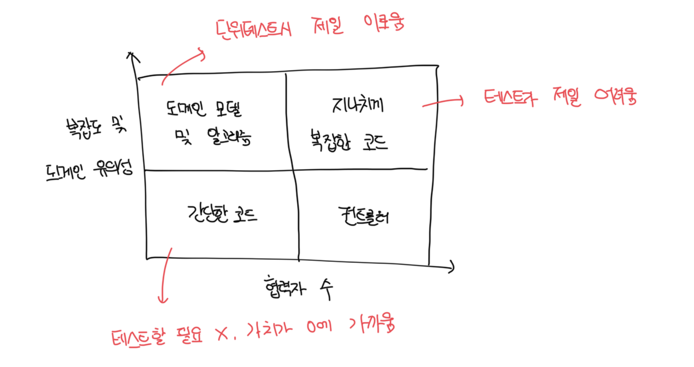
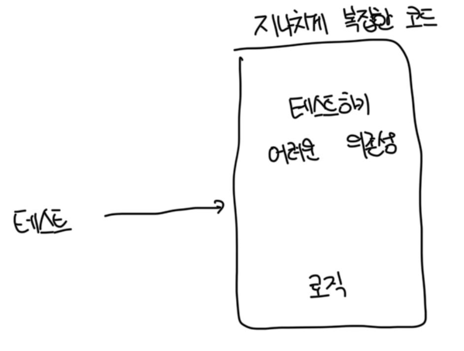
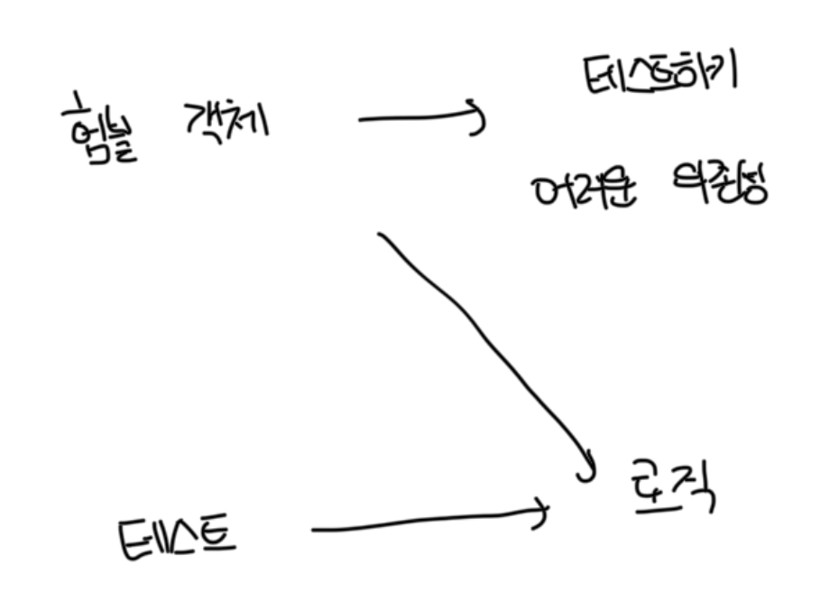

# 코드의 4가지 유형

- 모든 제품 코드는 2차원으로 분류가 가능하다
- 복잡도 또는 도메인 유의성
- 협력자 수

 

### 복잡도(Code Complexity)

- 복잡도는 코드 내 의사 결정(분기) 지점 수로 정의하는데, 이게 클수록 더 높다
- 순환 복잡도는 `1 + <분기점수>`로 계산한다

 

### 도메인 유의성(Domain Significance)

- 코드가 프로젝트 문제 도메인에 대해 얼마나 의미 있는지를 나타냄
- 일반적으로 도메인 계층의 모든 코드는 최종 유저의 목표와 직접적인 연관이 있어서 도메인 유의성이 높다
- 복잡한 코드와 도메인 유의성을 가지는 코드가 단위 테스트에서 제일 이롭다

 

### 협력자 수

- 여기서 협력자란 가변 의존성이거나 프로세스 외부 의존성 또는 둘 다를 뜻한다
- 테스트 크기에 따라 달라지는 유지 보수상 지표때문에 협력자가 많은 코드는 테스트 비용이 많이 발생한다
- 이 때 협력자의 유형도 중요한데, 도메인 모델이라면 프로세스 외부 협력자를 사용하면 안된다
- 또한 리팩토링 내성을 잘 지키려면 아주 신중하게 목을 사용해야 하는데, 앱 경계를 넘는 상호 작용을 검증하는데만 사용해야한다
  - 따라서 프로세스 외부 의존성을 가지는 모든 통신은 도메인 계층 외부 클래스에 위임하는게 좋다

 

# 4가지 코드 유형

- 코드가 더 중요해지거나 복잡해질수록 협력자는 더 적어야함
- 지나치게 복잡한 코드를 피하고 모데인 모델과 알고리즘만 테스트 하는게 매우 가치있고 유지 보수가 쉬운 테스트 스위트로 가는 길임
- 지나치게 복잡한 코드는 `도메인 모델 및 알고리즘`과 `컨트롤러`로 나눠서 리팩토링하면 좋음

 

# 험블 객체 패턴으로 복잡한 코드 분할

- 지나치게 복잡한 코드를 쪼개기 위해서는 `험블 객체(Humble Object)` 패턴을 써야함

 

### 복잡한 코드

- 복잡한 코드의 예시로는 `비동기 또는 멀티스레드 실행`, `유저 인터페이스`, `프로세스 외부 의존성과의 통신` 등이 존재함

 

### 험블 객체를 사용하기

- 테스트가 가능한 부분을 추출해야, 대상 코드의 로직 테스트가 가능함
- 결과적으로 코드는 테스트 가능한 부분을 둘러싼 `얇은 험블 래퍼`가 됨
- 이러한 `험블 래퍼`가 테스트하기 어려운 의존성과 새로 추출된 구성 요소를 붙이지만, 자체적인 로직이 거의 없거나 전혀 없어서 테스트할 필요가 없음

