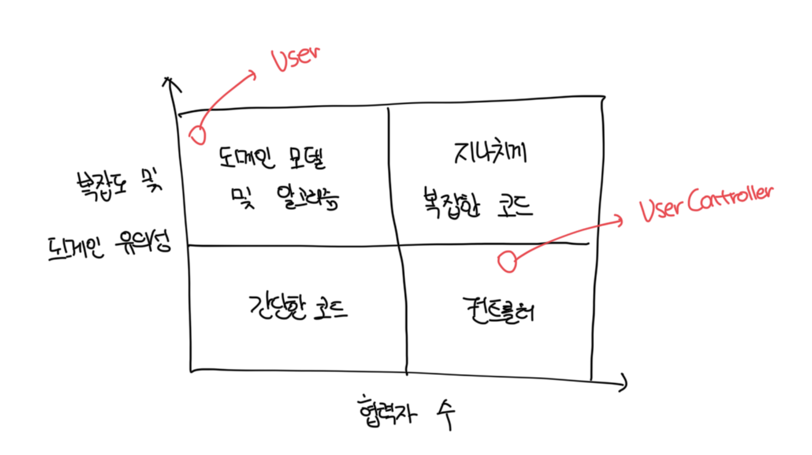
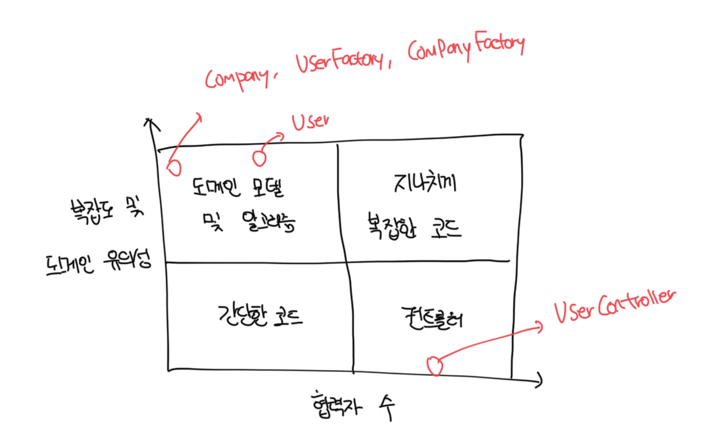

# 고객 관리 시스템 소개

- CRM으로 모든 사용자가 디비에 저장된다
- 현재 시스템은 `유저 이메일 변경`이라는 단 하나의 유스케이스만 지원한다
- 현재 코드는 지나치게 복잡한 코드에 속함
- 암시적 의존성은 `Database`, `MessageBus`가 있고 명시적 의존성은 `userId`, `newEmail` 변수임
- 도메인 클래스가 스스로 디비를 검색하고 다시 저장하는 패턴을 `Active Record` 패턴이라고 한다
  - 이러한 패턴은 초기에는 좋지만 확장이 힘든 이유가 비즈니스 로직과 프로세스 외부 의존성과의 통신 사이에 분리가 없기 때문임

```ts
enum UserType {
  CUSTOMER,
  EMPLOYEE,
}

class User {
  userId: number;
  email: string;
  type: UserType;

  chagenEmail(userId: number, newEmail: string) {
    /**
     * 디비에서 사용자 검색
     */
    const data = Database.getUserById(userId);
    this.userId = userId;
    this.email = data[1];
    this.type = data[2];

    if (this.email === newEmail) {
      return;
    }

    /**
     * 조직의 도메인명과 사원수 검색
     */
    const companyData = Database.getCompany();
    const companyDomainName = companyData[0];
    const numberOfEmployees = companyData[1];

    /**
     * 새로운 이메일의 도메인 이름에 따라서 사용자 유형을 설정함
     */
    const emailDomain = newEmail.split("@")[1];
    const isEmailCoporate = emailDomain === companyDomainName;
    const newType = isEmailCoporate ? UserType.EMPLOYEE : UserType.CUSTOMER;

    /**
     * 필요한 경우 조직원 수를 업데이트함
     */
    if (this.type !== newType) {
      const delta = newType === UserType.EMPLOYEE ? 1 : -1;
      const newNumber = numberOfEmployees + delta;
      Database.saveCompany(newNumber);
    }

    this.email = newEmail;
    this.type = newType;

    Database.saveUser(this); // 유저 저장
    MessageBus.sendEmailChangedMessage(userId, newEmail); // 메세지 발급
  }
}
```

<br>

# 1단계 : 암시적 의존성을 명시적으로 만들기

- 테스트 용이성을 개선하는 일반적인 방법은 암시적 의존성을 명시적으로 변경하는것임
- `Database`, `MessageBus`를 명시적으로 만들어서 `User` 클래스의 생성자에 주입하고 테스트에선 목으로 처리함

<br>

# 2단계 : 앱 서비스 계층 도입

- 도메인 모델이 외부 시스템과 직접 통신하는 문제를 극복하려면 다른 클래스인 `험블 컨트롤러`로 책임을 옮겨야함

<br>

### 변경한 컨트롤러 코드

```ts
class UserController {
  private readonly database: Database = new Database();
  private readonly messageBus: MessageBus = new MessageBus();

  changeEmail(userId: number, newEmail: string) {
    const data = this.database.getById(userId);
    const email = data[1];
    const type = data[2];
    const user = new User(userId, email, type);

    const companyData = this.database.getCompany();
    const companyDomainName = companyData[0];
    const numberOfEmployees = companyData[1];

    const newNumberOfEmployees = user.changeEmail(
      newEmail,
      companyDomainName,
      numberOfEmployees
    );

    this.database.saveCompany(newNumberOfEmployees);
    this.database.saveUser(user);
    this.messageBus.sendEmailChangedMessage(userId, newEmail);
  }
}
```

<br>

### 문제점

- 프로세스 외부 의존성이 주입되지 않고 직접 인스턴스화 한다
  - 이는 클래스를 위해서 작성할 통합테스트에 문제가 발생함
- 컨트롤러는 디비에서 받은 원시 데이터를 `User` 인스턴스로 재구성한다
  - 이는 복잡한 로직으로 앱 서비스에 속하면 안된다
  - 앱 서비스의 역할은 복잡도나 도메인 유의성 로직이 아닌 오케스트레이션만 해당한다
- 회사 데이터도 마찬가지로 회사 직원 수는 특정 사용자와 전혀 관련이 없다
  - 해당 책임은 다른곳에 있어야한다
- 컨트롤러는 새로운 이메일이 다른지 확인하지 않고 무조건 데이터를 수정하고 메세지를 발행하고있다

<br>

### 변경한 유저 클래스

- 이제 더이상 프로세스 외부 의존성과 통신할 필요가 없어짐
- 실제로 프로세스 외부/내부에 아무런 협력자가 존재하지 않음

```ts
enum UserType {
  CUSTOMER,
  EMPLOYEE,
}

class User {
  userId: number;
  email: string;
  type: UserType;

  changeEmail(
    newEmail: string,
    companyDomainName: string,
    numberOfEmployees: number
  ) {
    if (this.email === newEmail) {
      return numberOfEmployees;
    }

    const emailDomain = newEmail.split("@")[1];
    const isEmailCorporate = emailDomain === companyDomainName;
    const newType = isEmailCorporate ? UserType.EMPLOYEE : UserType.CUSTOMER;

    if (this.type !== newType) {
      const delta = newType === UserType.EMPLOYEE ? 1 : -1;
      const newNumber = numberOfEmployees + delta;
      numberOfEmployees = newNumber;
    }

    this.email = newEmail;
    this.type = newType;

    return numberOfEmployees;
  }
}
```

### 개선된 사분면



<br>

# 3단계: 앱 서비스 복잡도 낮추기

- 기존에 컨트롤러에서 담당하는 원시데이터 -> 인스턴스 재구성 로직을 추출해야 컨트롤러 사분면에 확실히 위치할 수 있음
- 이를 위해서 보통 `ORM`을 사용하지만, 만약 불가능하다면 `팩토리 클래스/메소드/함수`를 만들면된다

```ts
export const createUser = (data: object[]) => {
  const id = data[0];
  const email = data[1];
  const type = data[2];

  return new User(id, email, type);
};
```

<br>

# 4단계: 새로운 `Company` 클래스

- 기존 `User` 클래스에 존재하는 업데이트된 직원 수를 반환하는 부분이 이상하다
- 이는 책임을 잘못 뒀다는 신호이자, 추상화가 없다는 신호다
- 문제를 해결하기 위해서는 회사 관련 로직과 데이터를 함께 묶는 또 다른 도메인 클래스인 Company를 만들어야한다

```ts
class Company {
  domainName: string;
  numberOfEmployees: number;

  changeNumberOfEmployees(delta: number) {
    if (this.numberOfEmployees + delta <= 0) {
      throw new Error("Invalid number of employees");
    }

    this.numberOfEmployees += delta;
  }

  isEmailCorporate(email: string) {
    const emailDomain = email.split("@")[1];
    return emailDomain === this.domainName;
  }
}
```

<br>

### 리팩터링 후 컨트롤러

```ts
import { createUser } from "./__test__/7-3.js";

class UserController {
  private readonly database: Database = new Database();
  private readonly messageBus: MessageBus = new MessageBus();

  changeEmail(userId: number, newEmail: string) {
    const userData = this.database.getUserById(userId);
    const user = createUser(userData);

    const companyData = this.database.getCompany();
    const company = createCompany(companyData);

    user.changeEmail(company, newEmail);

    this.database.saveCompany(company);
    this.database.saveUser(user);
    this.messageBus.sendEmailChangedMessage(userId, newEmail);
  }
}
```

<br>

### 리팩터링 후 User

- 기존에는 유저에서 직접 회사 데이터를 처리했지만 이젠 Company 인스턴스를 받아서 책임을 위임했다
- 하지만 테스트가 좀 더 어려워지긴 했지만 많이 어려워지진 않았다

```ts
enum UserType {
  CUSTOMER,
  EMPLOYEE,
}

class User {
  userId: number;
  email: string;
  type: UserType;

  changeEmail(newEmail: string, company: Company) {
    if (this.email === newEmail) {
      return;
    }

    const newType = company.isEmailCorporate(newEmail)
      ? UserType.EMPLOYEE
      : UserType.CUSTOMER;

    if (this.type !== newType) {
      const delta = newType === UserType.EMPLOYEE ? 1 : -1;
      company.changeNumberOfEmployees(delta);
    }

    this.email = newEmail;
    this.type = newType;
  }
}
```

<br>

### 변경된 사분면


