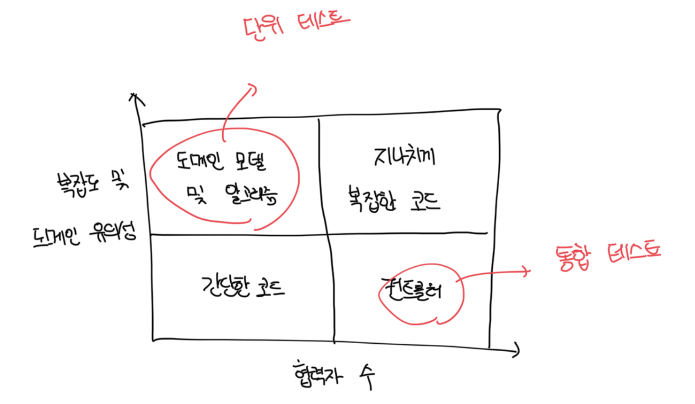

# 통합 테스트를 하는 이유

- 단위 테스트에만 전적으로 의존하면 시스템이 전체적으로 잘 작동하는지 확신하기 힘듬
- 각 부분이 디비나 메세지버스 등 외부 시스템과 어떻게 통합되는지 확인이 필요함

 

# 통합 테스트는 뭘까

- 통합 테스트는 단위 테스트와 다르게 프로세스 외부 의존성과 도메인 모델을 연결하는 코드를 확인한다
- 컨트롤러의 사분면에서 의존성을 모두 목으로 대체하면 단위테스트로 가능하기도 하다
- 하지만 모든 의존성을 대체하는건 불가능하다
- 또한 아래 사분면에서 의미하는건 간단한 코드는 테스트 할 필요가 없고, 지나치게 복잡한 코드는 도메인/알고리즘과 컨트롤러로 리팩터링 하라는걸 의미한다
  - 결국 모든 테스트는 도메인 모델과 컨트롤러 사분면에만 초점을 둬야한다

 

# 다시 보는 테스트 피라미드

- 단위와 통합 테스트 간 비율을 유지하는게 중요하다
- 통합 테스트는 더 많은 코드를 거치므로 회귀 방지가 단위보다 우수하다
- 또한 결합도도 낮기때문에 리팩터링 내성도 높다
- 단위 테스트로는 가능한 한 많이 비즈니스 시나리오와 예외를 확인한다
- 통합 테스트로는 주요 흐름과 단위 테스트가 다루지 못하는 기타 예외상황을 다룬다

 

# 통합 테스트와 빠른 실패

- 통합 테스트에서 프로세스 외부 의존성과의 상호 작용을 모두 확인하려면 가장 긴 주요 흐름을 선택하는게 좋다
- 만약 모든 흐름을 확인하는 플로우가 없다면 모두 확인하는데 필요한만큼 통합 테스트를 추가로 작성하는게 좋다
- 빠른 실패 원칙은 버그를 빨리 나타나게하는 원칙이며 통합 테스트에서 할 수 있는 대안이다

 

# 빠른 실패 원칙

- 예기치 않은 오류가 발생하자마자 현재 연산을 중단하는것을 의미함
- 일반적으로 예외를 던져서 현재 연산을 중단함

 

### 피드백 루프 단축

- 버그를 빨리 발견할수록 더 쉽게 해결이 가능함
- 이미 운영 환경으로 넘어온 버그는 개발 중에 발견된 버그보다 수정 비용이 훨씬 큼

 

### 지속성 상태 보호

- 버그는 앱의 상태를 손상시킴
- 손상된 상태가 디비로 들어가면 고치기가 훨씬 어려워짐
