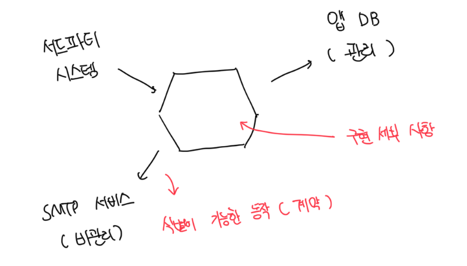

# 프로세스 외부 의존성의 두 가지 유형

- 관리 의존성은 실제 인스턴스를 사용하고, 비관리 의존성은 목으로 대체하는게 좋음
- 관리 의존성의 실제 인스턴스를 사용하면 외부 클라이언트 관점에서 최종 상태 확인이 가능함
- 또한 컬럼 이름 변경 등 디비를 이관하는 등 디비 리팩터링에도 도움이됨

 

### 관리 의존성

- 앱을 통해서만 접근이 가능하고, 의존성과의 상호 작용은 외부 환경에서 볼 수 없음
- 대표적인 예로 디비가 존재하고, 외부 시스템은 보통 디비에 직접 접근하지 않고 앱에서 제공하는 API를 통해 접근함

 

### 비관리 의존성

- 해당 의존성과 상호작용을 외부에서 볼 수 있음
- 예를 들면 SMTP 서버, 메세지 버스 등이 존재하고 다른 앱에서 볼 수 있는 사이드 이펙트를 발생시킴

 

## 관리 의존성이면서 비관리 의존성인 프로세스 외부 의존성 다루기

- 대표적인 예시로는 디비가 존재하는데 해당 디비가 다른 앱에서도 사용되는 경우다
- 시스템 간 통합을 구현하는데 디비를 사용하면 시스템이 서로 결합되고 추가 개발을 복잡하게 만들어서 좋지 않다
  - 가능하면 API나 메세지 버스를 사용하는게 좋다
- 만약 불가능한 경우는 다른 앱에서 볼 수 있는 테이블을 비관리 의존성으로 취급하는게 좋다
- 꼭 필요한 경우가 아니라면 시스템이 해당 테이블과 상호 작용하는 방식을 변경하지 않는게 좋다

 

# 통합 테스트에서 실제 디비를 사용하지 못하는 경우

- 만약 디비를 테스트할 수 없다면 통합 테스트를 아예 하지말고 도메인 모델 단위 테스트에만 집중하는게 좋다
- 디비를 모킹하는 경우는 결국 컨트롤러의 메소드를 호출하는 정도밖에 안되므로 의미가 없다
