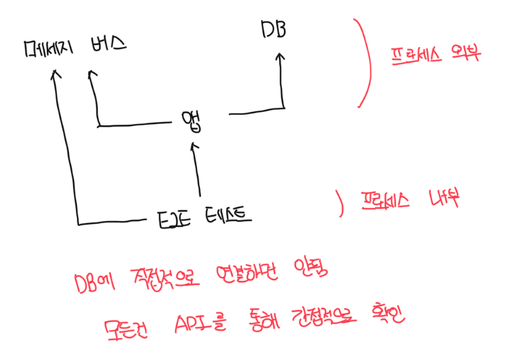
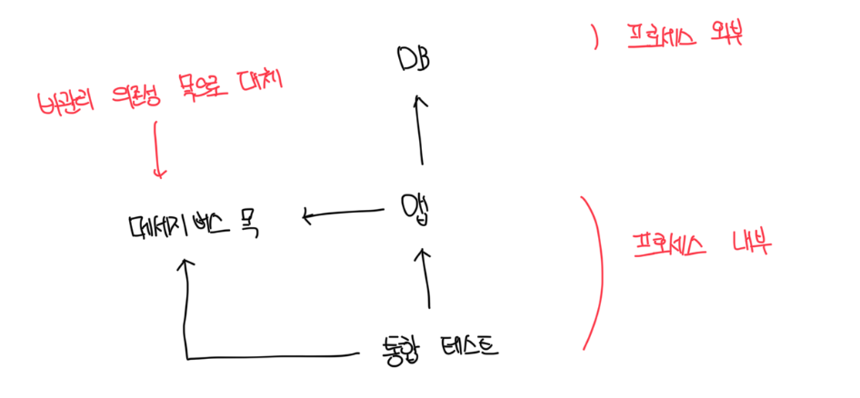

# 테스트 대상 코드

```ts
import { createUser } from "./7-3.js";

class UserController {
  private readonly database: Database = new Database();
  private readonly messageBus: MessageBus = new MessageBus();

  changeEmail(userId: number, newEmail: string) {
    const userData = this.database.getUserById(userId);
    const user = UserFactory.create(userData);

    const error = user.canChangeEmail();
    if (error !== null) {
      return error;
    }

    const companyData = this.database.getCompany();
    const company = CompanyFactory.create(companyData);

    user.changeEmail(company, newEmail);

    this.database.saveCompany(company);
    this.database.saveUser(user);
    user.emailChangedEvents.forEach((event) => {
      this.messageBus.sendEmailChangedMessage(event.userId, event.newEmail);
    });

    return "ok";
  }
}
```

<br>

# 테스트 할 시나리오

- 통합 테스트에 대한 일반적인 지침은 가장 긴 주요 흐름과 단위 테스트로는 수행할 수 없는 모든 예외 상황을 다루는것임
- 가장 긴 주요 흐름은 모든 프로세스 외부 의존성을 거치는것임
- 위 예제에서 가장 긴 흐름은 기업 이메일 -> 일반 이메일 변경하는것임
  - 디비에서 유저와 회사가 모두 업데이트됨. 즉 사용자는 유형, 이메일을 변경하고, 회사는 직원 수를 변경함
  - 메세지 버스로 메세지를 보냄

<br>

# 디비와 메세지 버스 분류하기

- 디비는 다른 앱에서 접근이 불가능 하므로 관리 의존성이다. 따라서 실제 인스턴스를 사용해야한다
- 메세지 버스는 다른 시스템과의 통신을 위한 수단으로 비관리 의존성이다

<br>

# E2E 테스트는 어떤가

- 일반적으로 통합 테스트에서 비관릐 의존성을 목으로 대체하는것을 제외하면 서로 거의 유사하다
- E2E는 어떤 프로세스 외부 의존성도 목으로 대체하지 않는다
- 테스트가 가장 긴 주요 흐름을 거치게 해서 앱이 모든 프로세스 외부 의존성과 올바르게 통신하는지 확인하는 정도는 좋다

<br>

### E2E 테스트 도식화



<br>

### 통합 테스트 도식화



<br>

# 1차 시도

```ts
it("changing_email_from_corporate_to_non_corporate", () => {
  // 준비
  const db = new Database();
  const user = createUser("user@mycorp.com", UserType.EMPLOYEE, db); // 유저 생성 헬퍼메소드
  createCompany("mycorp.com", 1, db); // 회사 생성 헬퍼메소드

  const messageBusMock: jest.Mocked<IMessageBus> = {};
  const sut = new UserController(db, messageBusMock);

  // 실행
  const result = sut.changeEmail(user.userId, "new@gmail.com");

  // 검증
  expect(result).toBe("ok");

  // 유저 상태 검증
  const userData = db.getUserById(user.userId);
  const userFromDb = UserFactory.create(userData);
  expect("new@gmail.com").toBe(userFromDb.email);
  expect(userFromDb.type).toBe(UserType.CUSTOMER);

  // 회사 상태 검증
  const companyData = db.getCompanyById(user.companyId);
  const companyFromDb = CompanyFactory.create(companyData);
  expect(companyFromDb.employeeCount).toBe(0);

  // 목 상호작용 확인
  expect(messageBusMock.sendMessage).toHaveBeenCalledWith(user.userId, "new@gmail.com");
  expect(messageBusMock.sendMessage).toHaveBeenCalledTimes(1);
});
```
