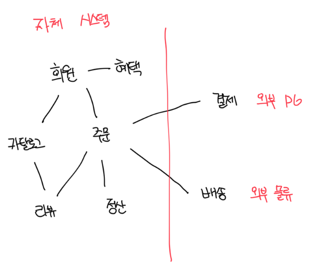

# 도메인이란?

- 소프트웨어로 해결하고자 하는 문제 영역이 도메인에 해당되고 한 도메인은 다시 하위 도메인으로 나눌 수 있다
- 예를 들면 고객이 물건을 구매하면 주문, 결제, 배송, 헤텍 하위 도메인의 기능이 엮인다
- 특정 도메인을 위한 소프트웨어라고 해서 모든걸 구현하는건 아니며 배송, 결제 등 외부에 의존하는 부분도 존재한다
- 하위 도메인을 어떻게 구성할지 여부는 상황에 따라 달라진다

