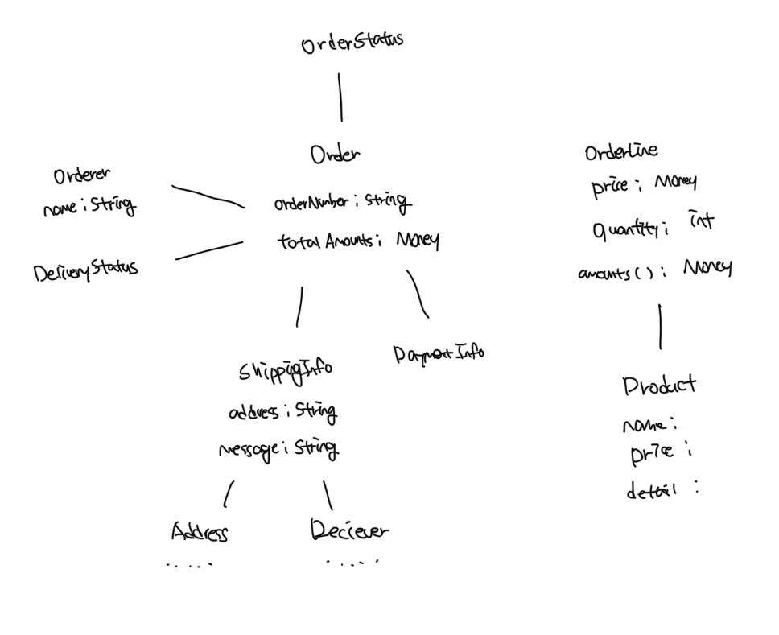
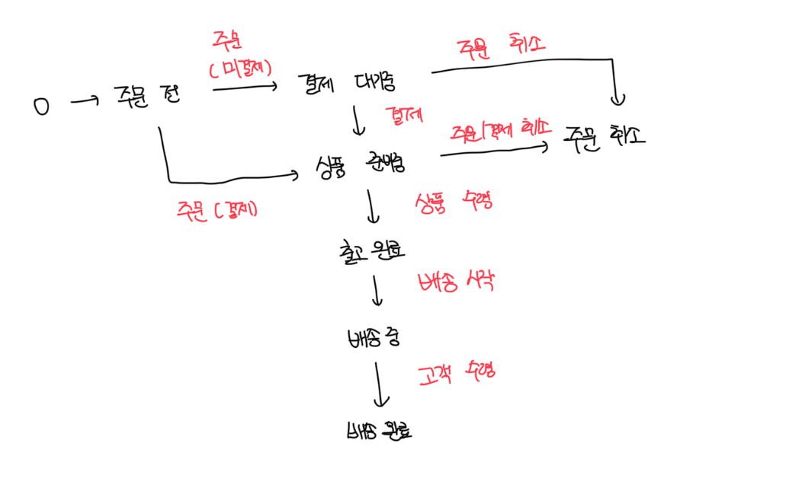

# 도메인 모델

- 도메인 모델은 특정 도메인을 개념으로 표현한 것을 뜻한다

 

# 쇼핑몰 주문 관련 도메인 모델

 

# 설명

- 도메인을 이해하기 위해서는 도메인이 제공하는 기능과 주요 데이터 구성 파악이 필요함
- 이런 면에서 객체 모델은 기능과 데이터를 함께 보여주는데 이는 도메인을 모델링하기 적합함
- 또한 다이어그램을 통해서도 도메인 모델링이 가능함
- 여기서 중요한건 도메인을 이해하는데 도움이 된다면 표현 방법이 무엇인지는 중요하지않음

