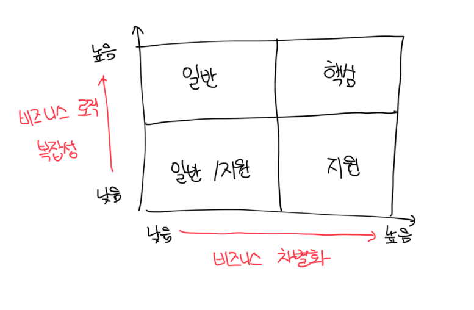

# 하위 도메인이란

- 비즈니스 도메인의 목표를 달성하기 위해서 기업은 여러가지 `하위 도메인`을 운영해야함
- 모든 회사의 하위 도메인은 고객에게 제공하는 서비스 단위로 비즈니스 도메인을 만들게된다
- 모든 하위도메인은 전체 시스템에서 하나의 구성요소일 뿐이며 비즈니스 도메인에서 목표를 달성하기 위해 서로 상호작용한다

 

# 하위 도메인의 유형

- 소프트웨어 시스템은 다양한 구성요소(디비, 프론트엔드, 백엔드 등)로 구성되어있다
- 이 처럼 하위 도메인은 `핵심`, `일반`, `지원` 세 가지 유형으로 구분한다

 

# 핵심 하위 도메인

- 회사가 경쟁업체와 다르게 수행하고 있는것을 말한다
- 새로운 제품/서비스를 발명하거나 기존 프로세스 최적화를 통해 비용을 줄이는것이 예시다

 

### 예시: 우버이츠

- 처음 우버는 새로운 방식의 운송 수단인 승차 공유 서비스를 제공했다
- 경쟁업체가 따라잡으면 그에 대응해서 핵심 비즈니스를 최적화하고 발전시킬 방법을 찾았다
- 같은 방향으로 가는 손님을 매칭해서 비용을 절감할 수 있는데 이는 고객에게 더 좋은 서비스를 제공하고 수익성을 극대화하는 전략이다

 

### 예시: 구글

- 구글은 광고 플랫폼이 구글 수익의 대부분을 차지한다
- Google Ads는 하위 도메인이 아닌 하위 도메인이 있는 별도의 비즈니스 도메인이다
- 구글의 검색 엔진은 구글 애즈를 위한 가장 큰 플랫폼으로, 이는 우수한 검색결과를 제공해서 트래픽을 유도한다
- 만약 검색 알고리즘에 버그가 있다면 광고 비즈니스 수익에도 타격이 생기는데, 구글의 경우 순위 알고리즘이 핵심 도메인이다

 

### 복잡성

- 구현하기 쉬운 핵심 하위 도메인은 일시적인 경쟁 우위만을 제공할 수 있다
- 따라서 핵심 하위도메인은 자연스럽게 복잡해지기 마련이다
- 회사의 핵심 비즈니스는 높은 진입장벽이 있어야 한다

 

### 경쟁 우위의 원천

- 핵심 하위 도메인에는 반드시 기술이 들어가야 하는것은 아니다
- 보석상이 온라인 쇼핑몰을 한다고 하면 기술이 들어가는게 아닌 `보석 가공`이 핵심이며 디자인은 고객들이 브랜드를 기억하는 이유다

 

# 일반 하위 도메인

- 모든 회사가 같은 방식으로 수행하는 비즈니스 활동을 말한다
- 일반 하위 도메인은 회사에 경쟁력을 제공하지는 않는다. 이미 널리 알려진 솔루션으로 대체가 가능하다
- 온라인에서 보석을 판매하는 업체의 경우는 온라인 쇼핑몰이 `일반 하위 도메인`이며 보석 가공이 `핵심 하위 도메인`이다

 

# 지원 하위 도메인

- 회사의 비즈니스를 지원하는 활동을 말하며 어떠한 경쟁 우위도 제공하지 않는다
- 지원 하위 도메인의 차별되는 특징은 솔루션의 비즈니스 복잡성이다
- 소위 말하는 CRUD 인터페이스를 뜻하며 이는 회사에 어떠한 경쟁 우위도 제공하지 않는다

 

# 하위 도메인 비교

### 경쟁 우위

- `핵심 하위 도메인`만이 회사에 경쟁 우위를 제공한다
- `일반 하위 도메인`은 경쟁 우위의 원천이 될 수 없다. 다른 회사와 동일한 솔루션을 사용할 수 있다
- `지원 하위 도메인`은 진입장벽이 낮고 경쟁 우위도 제공할 수 없다. 마찬가지로 경쟁사에서 카피해도 상관하지 않는다

 

### 복잡성

- 기술적인 관점에서는 하위 도메인의 유형에 따라서 복잡성의 수준이 다르기 때문에 조직의 하위 도메인을 식별하는게 중요하다
- 비즈니스 요구사항과 복잡성을 수용가능한 도구와 기술의 선택이 필요한데, 그러므로 하위 도메인을 식별하는 것은 반드시 필요하다

 

### 변동성

- `핵심 하위 도메인`은 자주 변경될 수 있다
- 경쟁사보다 앞서기 위해서는 핵심 하위 도메인의 지속적인 진화를 필수적이다
- `지원 하위 도메인`은 자주 변경되지 않는데 이는 핵심 하위 도메인에 투자한 동일한 노력에 비해서 아주 적은 가치만 제공한다

 

### 솔루션 전략

#### 핵심 하위 도메인

- 사내에서 구축되어야 한다. 외부에 외주를 주거나 솔루션 도입이 불가능하다
- 비즈니스 복잡성과 차별화가 높기때문에 조직에서 가장 숙련된 인재에게 할당되어야 한다
- 지속적으로 변경될 것으로 예상하고 솔루션은 유지보수가 쉽게 만들어야한다. 가장 진보된 엔지니어링이 필요하다

 

#### 일반 하위 도메인

- 어렵지만 이미 해결된 문제이므로 사내에서 구현하는것 보다는 솔루션 구입이나 오픈소스 도입이 비용 면에서 효율적이다

 

#### 지원 하위 도메인

- 경쟁 우위가 없이 때문에 사내에서 구현하지 않는게 합리적이다
- 일반 하위 도메인과 다르게 솔루션이 없는경우가 종종 있는데 이런 경우는 직접 만들어야한다
- 하지만 비즈니스 로직이 단순하고 변경의 빈도가 적어서 원칙을 생략하고 적당히 진행하기 쉽다

 

# 하위 도메인 경계 식별

- 하위 도메인과 해당 유형 식별 시 소프트웨어 솔루션을 구축할 떄 설계와 관련된 의사결정에 상당한 도움이 됨
- 하위 도메인과 그 유형은 기업의 비즈니스 전략에 따라 정의되고, 동일한 분야에서 다른 회사와 경쟁하기 위한 방법이다

 

# 하위 도메인 정제

- 크게 나눈 하위 도메인은 좋은 출발점이지만 문제는 세부사항에 존재함
- 비즈니스 기능의 복잡한 내용에 숨겨진 중요한 정보를 놓치지 말아야 함

 

### 예시: 고객 서비스 부서

- 고객 서비스 부서에서는 HD 시스템, 전화, 교대관리 등 다양한 기능이 존재한다
- 이 때 유연한 상담을 위해서 기존 데이터 분석을 통해 특정 상담을 자주 상담한 고객사에게 라우팅을 시켜줄 수 있다
- 이로써 고객은 더 좋은 상담경험을 얻는데 이런 경우는 `상담 사례 라우팅` 알고리즘이 핵심 하위 도메인이 된다

 

# 응집된 유즈케이스를 하위 도메인으로

- 기술적인 관점에서 하위 도메인은 상호 연관되고 응집된 유스케이스의 집합과 유사하다
- 세분화된 하위 도메인을 찾는 것을 중단하는 시점을 결정하기 위해 `응집된 유스케이스의 집합 하위 도메인`이라는 정의를 사용할 수 있다
- 핵심 하위 도메인을 식별하기 위해서는 반드시 노력이 필요하다
- 이러한 핵심 하위 도메인은 가장 중요하고, 변동성이 있고, 복잡하다
- 하위 도메인을 식별할 때 고려해야 할 또 다른 중요한 질문은 `하위 도메인이 모두 필요한지` 여부다

 

# 핵심에 집중

- 하위 도메인을 찾을 때는 소프트웨어와 관련되지 않은 비즈니스 기능을 식별해야한다
- 그 자체로 인정하며 작업중인 소프트웨어 시스템과 관련된 비즈니스에 집중하는것이 중요하다
