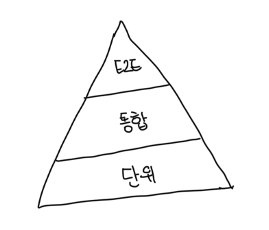
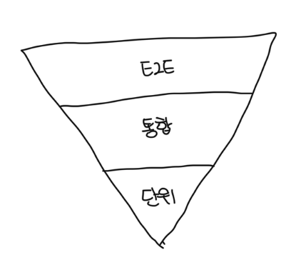
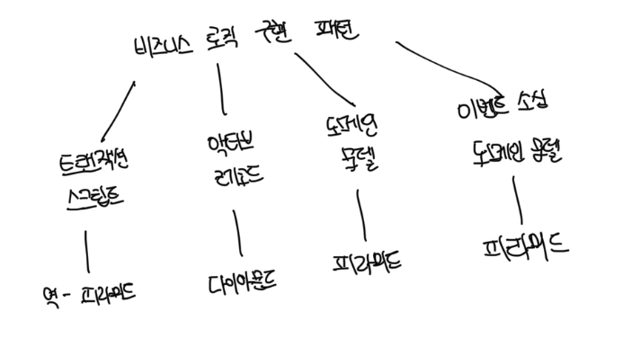

# 피라미드형 테스트

- 단위 테스트를 강조하는 테스트 전략이다
- 피라미드형 테스트는 DDD의 애그리게이트와 밸류 오브젝트 도메인 모델 패턴을 모두 잘 지원한다
- 두 도메인 모델 패턴은 사실상 비즈니스 로직을 테스트하는 완벽한 단위다

 

# 다이아몬드형 테스트

- 통합 테스트에 가장 집중하는 유형이다
- 액티브 레코드 패턴이 사용되면 시스템의 비즈니스 로직은 서비스 계층과 비즈니스 로직 계층에 흩어져서 두 계층 연동에 중점을 둘 때 사용하면 좋다

 

# 역전된 피라미드형 테스트

- E2E 테스트에 가장 집중하는 전략으로 처음부터 끝까지 앱의 워크플로를 검증한다
- 트랜잭션 스크립트 패턴을 구현한 코드베이스에 가장 잘 어울린다
- 비즈니스 로직이 간단하고 계층의 수가 적어서 이 전략이 E2E 흐름을 검증하는데 효과적이다

 

# 의사결정 트리

