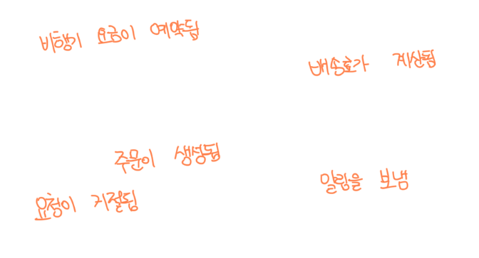
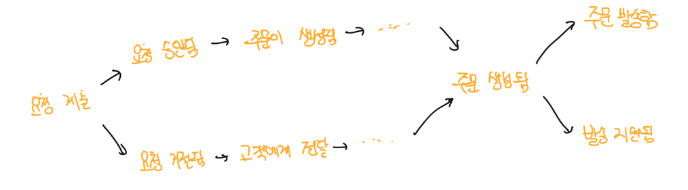
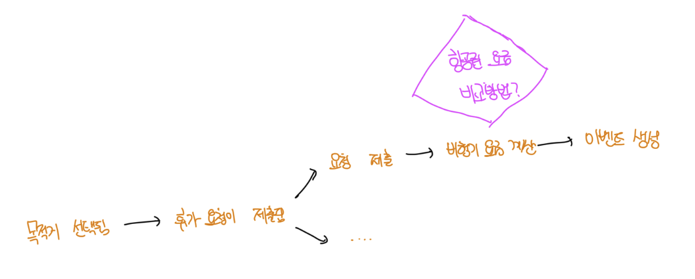
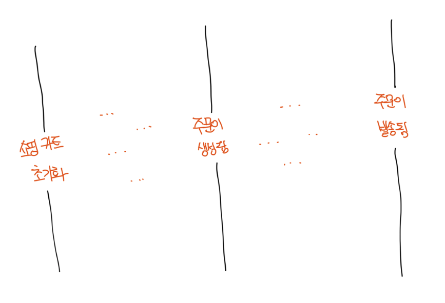
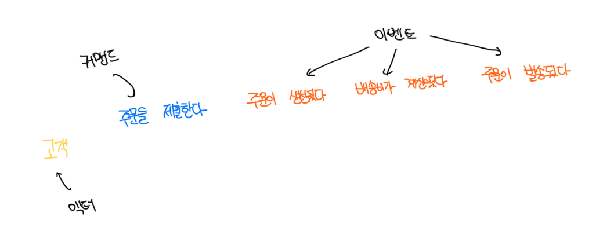
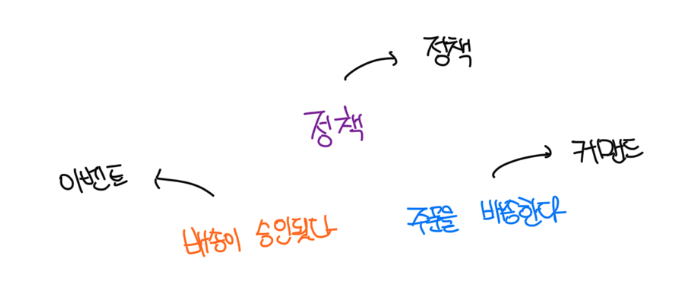
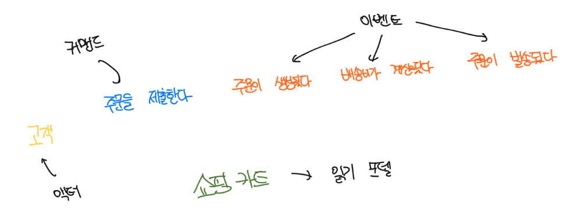
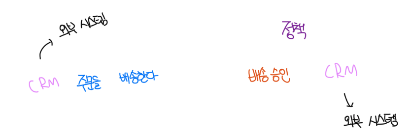
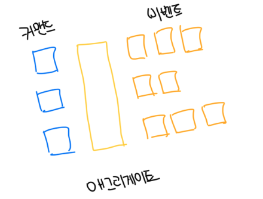
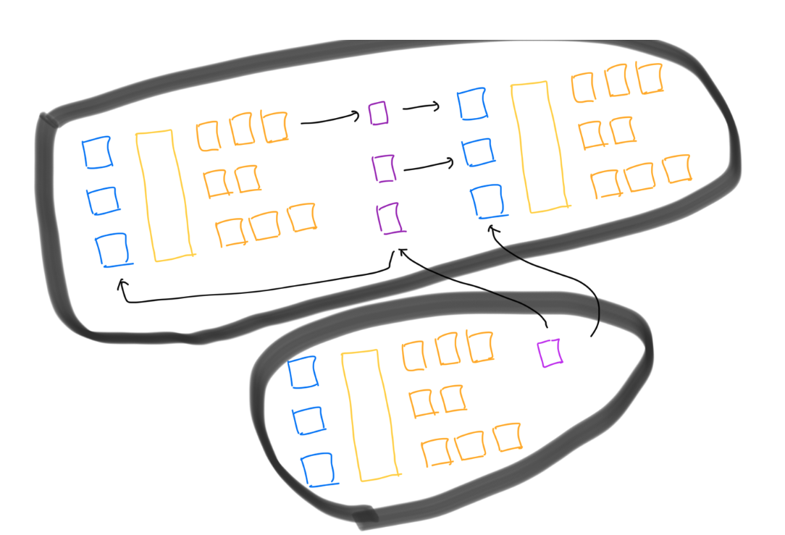

# 1단계: 자유로운 탐색

- 시작으로는 비즈니스 도메인에 관련된 `도메인 이벤트`를 브레인스토밍 하는것으로 시작한다
- 이미 발생한 일을 설명하므로 `과거형`으로 작성하는게 중요하다
- 이런 단계에서 모든 참가자는 `오랜지 색` 호스트잇에 무엇이든 떠오르는 도메인 이벤트를 적어서 모델링 공간에 붙힌다
- 이벤트의 순서나 중복을 상관하지 않고 이벤트를 추가하는 속도가 느려질 때 까지 계속해서 도메인 이벤트를 생성한다

 

# 2단계: 타임라인

- 생성된 도메인 이벤트를 읽어보고 그것을 비즈니스 도메인에서 발생하는 순서대로 정리한다
- 우선은 성공적인 비즈니스 시나리오인 `정상 시나리오`부터 작성한다
- 에러가 발생하는 경로나 다른 비즈니스 의사결정을 내린 경우가 이에 해당됨

 

# 3단계: 고충점

- 전체 구성을 보고 프로세스에서 주목할 만한 포인트를 식별함
- 병목 구간, 자동화가 필요한 수작업 단계 등이 이런 경우다
- 이런 포인트로 쉽게 돌아오거나 나주엥 다시 다룰 수 있도록 비효과적인 것을 명확하게 표시하는게 중요하다
- 핑크색 포스트잇을 돌려서 다이아몬드 형태로 표시한다
- 고충점을 추적하는건 아니며 단순하게 전 과정에서 참가자의 코멘트에 주목하고 이슈나 관심사는 고충점으로 기록한다

 

# 4단계: 중요 이벤트

- 고충점을 기록했다면 컨텍스트나 국면이 바뀌는 것을 나타내는 중대한 비즈니스 이벤트를 찾아야함
- 이를 `중요 이벤트`라고 하며 이 이벤트 전/후로 세로줄을 긋는다

 

# 5단계: 커맨드

- 커맨드는 무엇이 이벤트 또는 이벤트의 흐름을 시작하게 하는지 설명한다
- 이는 시스템의 오퍼레이션을 설명하고 도메인 이벤트와 다르게 명령으로 작성한다
  - 캠페인을 게시한다, 트랜잭션을 롤백한다 등
- 파란색 포스트잇에 작성해서 커맨드가 생성하는 이벤트 앞에 붙이게된다
- 특정 역할을 담당하는 액터가 특정 커맨드를 실행하면 그 액터 정보를 작은 노란색 포스트잇에 적어서 붙인다
  - 액터: 고객, 관리자 등 처럼 비즈니스 도메인 내의 사용자 페르소나를 나타낸다

 

# 6단계: 정책

- 대부분의 경우 커맨드에는 관련된 액터가 없는데 이 단게에서는 커맨드를 실행할 수도 있는 자동화 정책을 찾는다
- 이벤트가 커맨드의 실행을 시작하는 시나리오로 특정 도메인 이벤트가 발생하면 자동으로 실행된다
- 보라색 포스트잇으로 표현해서 이벤트와 커맨드를 연결하게된다

 

# 7단계: 읽기 모델

- 도메인에서 액터가 커맨드를 실행하는 의사결정을 내릴 떄 사용하는 시각적 데이터
- 시스템의 스크린, 리포트, 알림 등이 될 수 있음

 

# 8단계: 외부 시스템

- 외부 시스템 연동 정보를 보강한다. 탐색 중인 도메인에 포함되지 않는 모든 시스템은 외부 시스템으로 분류한다
- 핑크색 포스트잇으로 표시한다

 

# 9단계: 애그리게이트

- 모든 이벤트와 커맨드가 표현되면 참가자는 애그리게이트의 개념을 포함해서 모델을 구성함
- 애그리게이트는 커맨드를 받고 이벤트를 생성하게됨
- 노란색 포스트잇으로 표편하고 왼쪽에 커맨드, 오른쪽에 이벤트를 배치함

 

# 10단계: 바운디드 컨텍스트

- 마지막 단계에서는 서로 연관된 애그리게이트를 찾는다
- 기능이 밀접하게 연관되거나 정책을 통해 연관될 수 있다
- 애그리게이트의 그룹은 바운디드 컨텍스트 걍게의 자연스러운 후보가 된다

