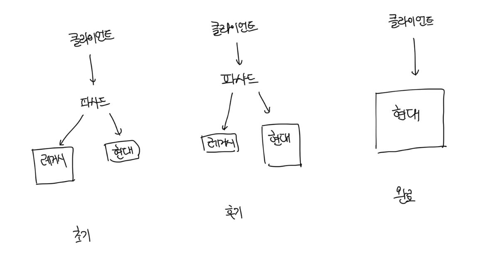

# 현대화 전략

- 엔지니어가 시스템을 처음부터 다시 작성하려고 하는 `대대적인 재작성` 노력은 거의 성공하지 못함
- 기존 시스템의 설계를 개선하기 위한 좀 더 안전한 접근 방식은 크게 생각하되 작게 생각하는게 좋다
- 모든 대규모 시스템이 잘 설계된것은 아니며 현대화를 위한 노력의 관점에서 어디에 투자할 지 전략적인 결정이 필요하다
- 전제조건은 시스템의 하위 도메인의 경계를 찾는 것이며 물리적으로 나눌 필요는 없다
- 시스템의 모듈을 조정하는 것인 비교적 안전한 형태의 리팩토링이다

 

# 전략적 현대화

- 시스템을 초기부터 가능한 한 작은 바운디드 컨텍스트로 분해하는건 위험할 수 있다
- 여러 팀이 동일한 코드베이스에 작업하고 있다면 각 팀에 대한 바운디드 컨텍스트를 정의해서 개발 수명주기를 분리하자
- 서로 다른 컴포넌트에서 충돌하는 모델을 사용한다면 충돌하는 모델을 별도의 바운디드 컨텍스트로 재배치하자

 

# 전술적 현대화

- 전술적인 관점에서 비즈니스 가치와 구현 전략에서 가장 `고통스러운` 부조화를 찾아야한다
- 대표적으로는 트랜잭션 스크립트 패턴이나 액티브 레코드처럼 모델의 복잡성에 부합하지 않는 패턴을 구현하는 핵심 하위 도메인이다

 

# 유비쿼터스 언어 육성

- DDD에서 유비쿼터스 언어는 지식을 획득하고 효과적인 솔루션 모델을 만드는 데 반드시 필요하다
- 이벤트스토밍을 통해서 도메인 전문가와 함께 유비쿼터스 언어를 구축하고 레거시 코드를 탐색하자
- 기능과 ㄹ관련된 모든 사람을 모아서 비즈니스 도메인을 탐색하자. 이 때 이벤트스토밍은 환상적인 도구다

 

### 스트랭글러 패턴

- 성장 동력을 기반으로 하는 패턴으로 새로운 바운디드 컨텍스트인 스트랭글러를 생성한다
- 생성한 스트랭글러를 사용해서 새로운 요구사항을 구현하고 점차적으로 레거시 컨텍스트의 기능을 해당 컨텍스트로 마이그레이션한다
- 동시에 `핫픽스` 같은 긴급 상황을 제외하고는 레거시 바운디드 컨텍스트의 개선과 개발이 중지되게된다
- 일반적으로 `파사드 패턴`과 께 사용하는데 마이그레이션이 끝났다면 더이상 파사드는 필요하지 않으므로 제거한다

 

### 전술적 설계 의사결정 리팩토링

#### 작은 점진적인 조치가 대규모 재작성보다 안전하다

- 트랜잭션 스크립트나 액티브 레코드를 이벤트 소싱 도메인 모델로 직접 리팩토링 하지 말라
- 상태 기반 애그리게이트를 설계한 중단 단계를 진행하다
- 효과적인 애그리게이트 경계를 찾는 데 노력을 투자하자

 

#### 도메인 모델로 리팩토링이 한번에 이뤄질 필요가 없다

- 가능한 밸류 오브젝트를 찾는 것 부터 시작하자
- 레거시 코드의 현대화에 완전하게 도메인 모델을 적용하지 않아도 불변 객체를 사용해서 솔루션의 복잡성을 크게 줄일 수 있다
