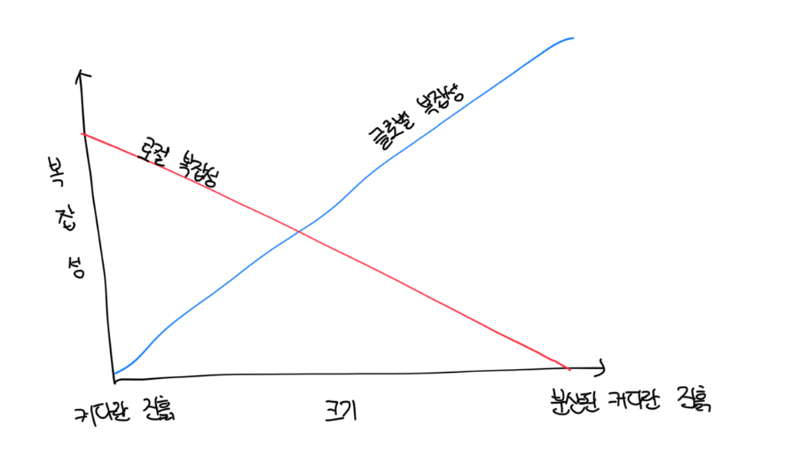

# 서비스란?

- 미리 정의된 인터페이스를 사용해서 하나 이상의 역량에 접근하기 위한 매커니즘
- `미리 정의된 인터페이스`는 서비스로부터 데이터를 넣고 빼는 모든 메커니즘을 뜻함
- 서비스의 퍼블릭 인터페이스는 서비스 자체, 즉 서비스가 노출하는 기능을 정의함

 

# 마이크로 서비스란

- 마이크로서비스는 자신의 마이크로 인터페이스, 즉 마이크로 프론터 도어에 의해서 정의되는 서비스다
- 마이크로 퍼블릭 인터페이스가 있다면 단일 서비스의 기능과 그 서비스가 연동하는 다른 시스템 구성요소 모두를 쉽게 이해할 수 있음
- 서비스의 기능을 줄이면 변경될 이유가 줄어들고, 개발 / 관리 / 확장을 자율적으로 할 수 있음
- 또한 이는 마이크로서비스가 자신의 디비를 노출하지 않는 관행도 같이 설명함

 

# 서비스형 메소드: 완벽한 마이크로서비스?

- 마이크로서비스가 마이크로 퍼블릭 인터페이스라고 말하는 것은 매우 간단하다
- 하지만 실제로 적용하면 수많은 구조가 생기게된다
- 서비스의 외부 노출 시스템 영역은 최소화되지만, 전체적인 시스템의 기능을 구현하기 위해 각 서비스에 `어드민만 출입이 가능`한 많은 출입구를 추가해야한다

 

# 설계 목표

- 서비스는 서로 협력이 필요해서 연동에 관련된 퍼블릭 메소드를 가진 퍼블릭 인터페이스를 만들어야한다
  - 이러면 각 서비스가 단일 메소드만 갖도록 분해하는 간단한 휴리스틱을 적용하는건 불가능하다
- 마이크로서비스 아키텍처의 목표는 유연한 시스템을 만드는 것이다
- 시스템을 독립적인 컴포넌트로 구축될 없다. 그러나 적절히 분리된 마이크로서비스 기반 서비스는 여전히 서로 연동하고 통신한다

 

# 시스템의 복잡성

- `로컬 복잡성`은 각 개별 마이크로서비스의 복잡성을 의미하고, `글로벌 복잡성`은 전체 시스템의 복잡성을 말한다
- 적절한 마이크로서비스 기반 시스템 설계를 위해서는 로컬와 글로벌 복잡성 모두를 최적화 해야한다

 

# 깊은 서비스로서의 마이크로서비스

- `함수`는 모듈이 해야할 일(비지니스 기능)을 말하고, `로직`은 비즈니스 로직(모듈이 자신의 비즈니스 기능)을 구현하는 방법이다
- 효과적인 모듈은 내포하는 깊이가 깊고 복잡성이 높지만, 효과적이지 않은 모듈은 내포하는 깊이가 얕고 복잡성이 낮다
- 즉 깊이가 얕은 모듈의 퍼블릭 인터페이스는 깊은 모듈보다 훨씬 낮은 복잡성을 내포한다

 

# 깊은 모듈로서의 마이크로서비스

- 마이크로서비스는 엄밀히 물리적인 경계를 나타내지만, 모듈은 논리적 경계와 물리적 경계를 모두 나타낼 수 있다
- 깊은 모듈은 시스템의 글로벌 복잡성을 줄여주지만, 얕은 모듈은 로컬 복잡성을 감싸지 않는 구성요소를 도입해야 해서 글로벌 복잡성이 증가한다
- 얕은 서비스는 수많은 마이크로서비스 지향 프로젝트가 실패하는 원인이다
- 서비스 하나에 X행 이상의 코드를 제한하거나 아키텍처의 가장 중요한 관점인 `시스템`을 고려하지 않은 채 개별 서비스에 집중하면 안된다
- 시스템을 마이크로서비스로 분해할 때 임계치는 시스템의 일부로 사용하려고 하는 유스케이스에 의해서 정의된다
- 하지만 임게치를 지나 계속 분해하면 깊은 서비스가 얕은 서비스로 변하는데 인터페이스가 많아지며 점점 분산된 커다란 진흙 덩어리로 변한다

