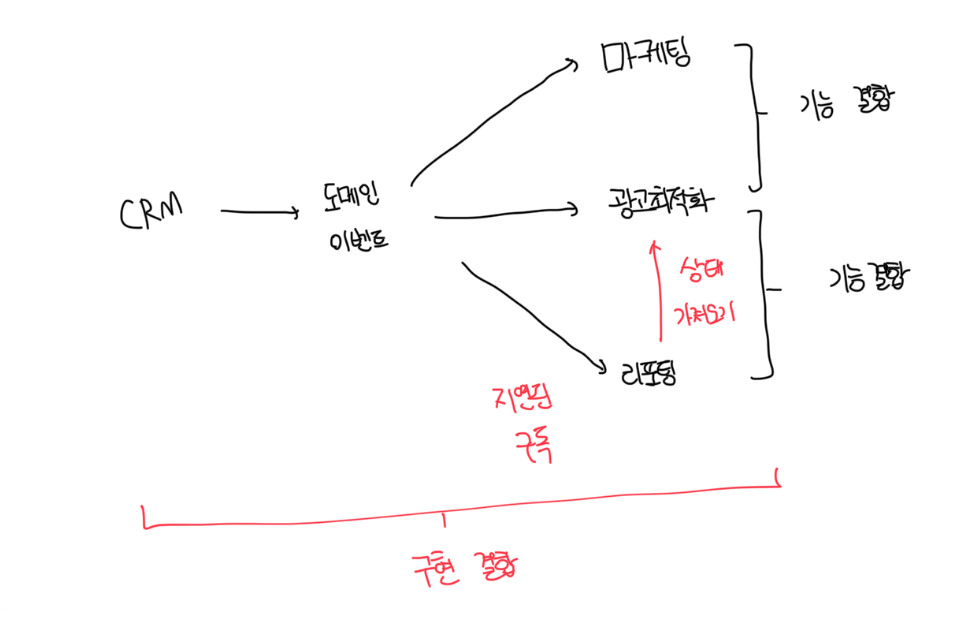
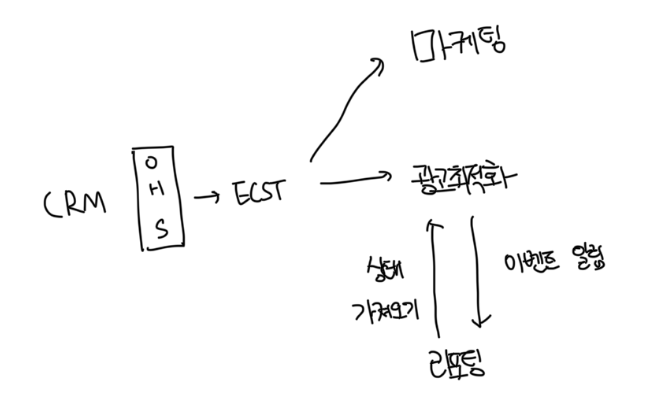

# 이벤트 주도 연동 설계

- 소프트웨어 설계는 주로 경계에 관한 것으로 기본적으로 컴포넌트가 서로 연동되는 방식을 정의한다
- EDA 기반 시스템에서 이벤트는 컴포넌트가 연동하는 방식과 경계 자체에 모두 영향을 주는 가장 중요한 설계요소다
- 올바른 유형의 이벤트 메시지를 선택하는건 분산 시스템을 제대로 만들거나 망가뜨린다

 

# 분산된 커다란 진흙덩어리

 

### 시간 결합

- 광고최적화와 리포팅 바운디드 컨텍스트는 시간적으로 결합하여 엄격한 실행 순서에 따라 달라짐
- 광고최적화 컴포넌트는 리모팅 모듈이 트리거되지 전에 처리를 완료해야하는데 순서가 역전되면 리포팅 시스템에 일관성이 없는 데이터가 생성됨
- 필요한 실행 순서대로 처리를 위해서 리포팅 시스템에 처리 프로세스를 지연시켰는데 이러면 필요한 계산이 가능하지만 명백하게 잘못된 순서를 막진 못함

 

### 기능 결합

- 마케팅과 광고최적화 바운디드 컨텍스트는 모두 CRM의 도메인 이벤트를 구독하고 결국 동일하게 고 객 데이터를 프로젝션한다
- 도메인 이벤트를 상태 기반 표현 방식으로 변환하는 비즈니스 로직을 양쪽 바운디드 컨텍스트에 모두 복제했고 변경 이유도 같다
- 컴포넌트 중 하나에서 프로젝션이 변경된 경우 두 번째 바운디드 컨텍스트에서 변경사항 복제가 필요하다
- 이것은 기능 결합의 에시로 비즈니스 기능을 구현하는 여러 컴포넌트가 있을 떄 변경이 생기면 양쪽 컴포넌트에 동시에 반영이 필요하다

 

### 구현 결합

- 마케팅과 광괴최적화는 CRM의 이벤트 소실 모델로 생성된 모든 도메인 이벤트를 구독하게된다
- 새로운 도메인 이벤트가 추가되거나 기존 이벤트의 스키마를 변경하는 것과 같이 CRM 구현의 변경사항이 발생하면 구독하는 양쪽에서 모두 반영해야한다
- 반년 CRM 모델에 새로운 도메인 이벤트가 추가되면 추출된 모델에 잠재적으로 영향을 줘서 일관성 없는 상태를 가져오게된다

 

### 이벤트 주도 연동의 리팩토링

- 시스템에 이벤트를 맹목적으로 적용하게되면 시스템 결합도가 낮아지지도 회복력이 향상되지도 않는다
- CRM 데이터 모델을 구성하는 모든 도메인 이벤트를 노출하면 구독자가 제공자의 구현 상테에 결합된다
- 구현 결합은 훨씬 더 제한된 이벤트 집합이나 다른 유형의 이벤트를 노출해서 해결이 가능하다

 

# 이벤트 주도 설계 휴리스틱

### 최악의 상황 가정하기

- 메세지를 안정적으로 발송하기 위해서 아웃박스 패턴을 사용하기
- 메세지를 발송할 때 구독자가 메세지 중복을 제거하고 순서가 잘못된 메세지를 식별하고 재정렬할 수 있게 하기
- 보상 조치를 실행해야 하는 교차 바운디드 컨텍스트 프로세스를 조율할 때 사가 패턴과 프로세스 관리자 패턴 사용하기

 

### 퍼블릭 이벤트와 프라이빗 이벤트 사용하기

- 이벤트 소싱 애그리게이트에서 도메인 이벤트를 발송할 때 세부 정보를 노출하지 않도록 주의하자
- OHS 패턴을 구현할 떄 이벤트가 바운디드 컨텍스트의 공표된 언어에 반영되게 하자
- 이벤트를 통한 상태 전송 메세지를 구현 모델을 사용자가 필요로 하는 정보만 전달하는 더욱 간결한 모델로 압축하자
- 외부 바운디드 컨텍스트와 통신을 위한 도메인 이벤트는 최소화해서 사용하자. 전용 퍼블릭 도메인 이벤트를 설계하는 것을 고려하자

 

### 일관성 요구사항을 평가하라

- 컴포넌트가 궁극적으로 일관된 데이터를 처리할 수 있는 경우 이벤트를 통한 상태 전송 메세지를 활용하자
- 사용자가 제공자의 마지막으로 변경된 상태를 읽어야된다면, 최신 상태를 가져오는 후속 질의와 함께 이벤트를 발행한다
