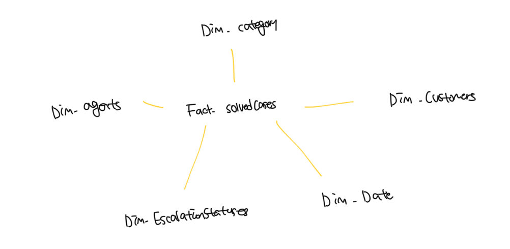
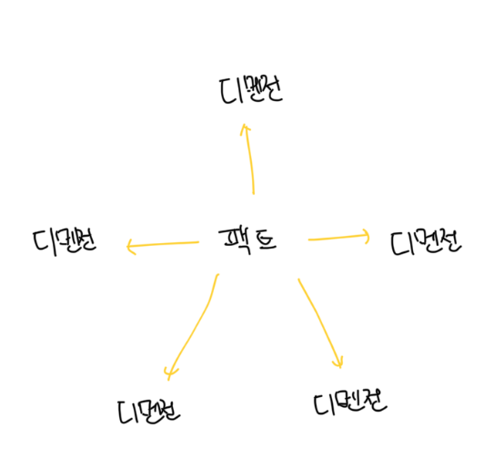
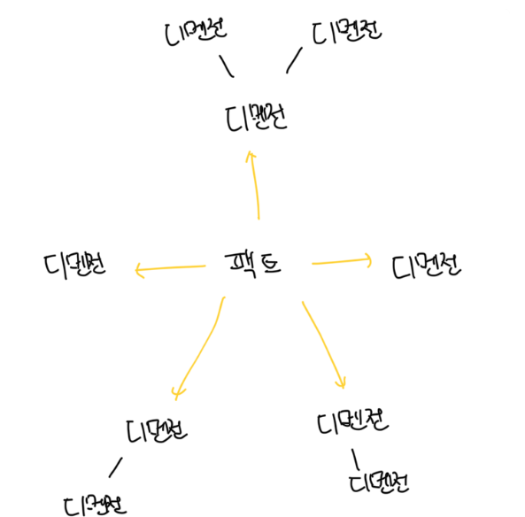

# 분석 데이터 모델과 트랜잭션 데이터 모델 비교

- `데이터 분석 모델(OLAP)`과 `실시간 데이터 모델(OLTP)`는 서로 다른 유형의 사용자를 지원하고 다른 유즈케이스를 구현한다. 즉 다른 설계 원칙을 따른다
- OLTP는 시스템의 비즌니스 도메인에 속한 다양한 엔티티를 중심으로 구축되고 이들의 수명주기를 구현해서 상호작용한다
- OLAP는 실시간 트랜잭션을 구현하는 대신 비즈니 활동의 성과에 대한 통찰을 제공하는것을 목표로 한다
- OLAP 모델은 개별 비즈니스 엔티티를 무시하는 대신 팩트 테이블과 디멘전 테이블 모델링을 통해서 비즈니스 활동에 집중한다
- 세분화 정도에도 차이가 있는데 OLTP의 경우는 비즈니스 트랜잭션을 위해 정밀한 데이터가 필요하지만 OLAP의 경우 데이터를 취합하는게 다양한 유스케이스에 더 효과적이다

 

# 팩트 테이블

- `팩트`는 이미 발생한 비즈니스 활동을 나타내며 과거에 대한것을 설명한다
- 도메인 이벤트와 겨님이 비슷하지만 과거 시제의 동사로 팩트를 명명하도록 요구하지 않는다
- 팩트 레코드는 절대로 삭제되거나 수정되지 않으며 추가만 가능하다
- 모델을 다루는 데이터 분석가는 그들의 요구사항에 어떤 수준의 크기가 적합한지 결정하는데, 변경될 때 마다 팩트 레코드를 생성하는건 경우에 따라서 낭비일수도 있고 기술적으로 불가능 할수도 있다

### Fact-SolvedCases 테이블

| 구분 | 컬럼명             |
| ---- | ------------------ |
| PK   | case_id            |
| FK   | agent_key          |
| FK   | category_key       |
| FK   | opened_on_date_key |

 

# 디멘전 테이블

- `팩트`가 비즈니스 절차나 동작을 표현한다면 `디멘전`은 팩트를 묘사한다
- 팩트의 속성을 설명하도록 고안되어 팩트 테이블에 있는 외부 키로 디멘전 테이블을 참조하게된다
- 디멘전으로 모델링된 속성은 다양한 팩트 레코드를 넘나들며 반복되는 모든 측정 또는 데이터이므로 단일 컬럼에는 맞지 않는다
- 고도로 정규화된 이유는 분석시스템에서 유연한 질의를 지원해야하는 이유다
- 정규화를 통한 동적인 질의 및 필터링을 지원하고 다양한 디멘전에 걸친 팩트 데이터에 대한 그룹화를 지원하게된다

 

# 분석 모델

### 스타 스키마

- 팩트와 디멘전의 관계가 `1:n`인 경우다
- 각 디멘전 레코드는 여러개의 팩트에서 사용되고 단일 팩트의 외부 키들은 각기 하나의 디멘전 레코드를 가르키게된다

 

### 스노플레이크 스키마

- 동일하게 팩트와 디멘전으로 구성되는데 여기서의 스키마는 여러 수준으로 구성된다. 예를 들면 더 작은 세밇한 디멘전으로 정규화된다
- 추가적인 정규화로 인해서 더 작은 공간에 디멘전 데이터 저장이 가능하고 유지보수가 더 쉽다
- 하지만 팩트의 데이터를 조회할 때 더 많은 테이블 조인이 필요해서 더 많은 컴퓨팅 자원이 필요하게된다

