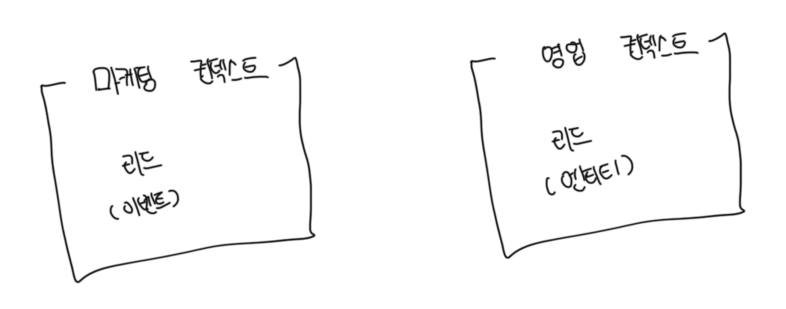
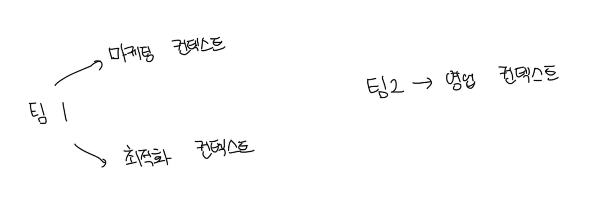

# 일관성 없는 모델

### 문제상황

- 마케팅 부서는 온라인 광고를 통해 리드를 생성한다
- 영업부서는 잠재고객이 제품이나 서비스를 구매하도록 유도하는 역할을 한다
- `리드`라는 용어는 마케팅과 영업 부서에서 다르게 사용된다
  - 마케팅 부서 : 리드는 누군가가 젶품 중 하나에 관심이 있다는 알람을 나타냄
  - 영업 부서 : 리드는 영업 프로세스의 전체 수명주기를 나타냄

 

### 해결법 1 : 모든 종류 문제에 사용할 수 있는 단일 모델 설계

- 이러한 모델은 흔히 말하는 ERD를 를 생성하게된다
- 이러한 모델은 모든 것에 적합해야 하지만 결국에는 아무 소용이 없다
- 관련 없는 세부사항을 필터링 하는 등 무엇을 하든지 항상 복잡성에 부딪힌다

 

### 해결법 2 : 문맥상 정의에 문제가 있는 용어 앞에 접두사 사용

- `마케팅 리드`, `영업 리드` 처럼 접두사를 추가하는 방식이다
- 하지만 이러한 방법은 인지부조화를 유발하고 모델의 구현이 유비쿼터스 언어와 일치하지 않는다
- 이러한 문제를 해결하기 위해서 DDD에서는 `바운디드 컨텍스트`라는 개념이 존재한다

 

# 바운디드 컨텍스트란?

- 위 예제에서는 2개의 바운디드 컨텍스트를 식별할 수 있다
  - 바운디드 컨텍스트 : 마케팅 컨텍스트, 영업 컨텍스트
- 리드라는 용어는 2개의 컨텍스트에 모두 존재하지만, 각 바운디드 컨텍스트가 단일 의미를 가지면 도메인 전문가의 멘탈 모델을 따를 수 있다

 

### 모델 경계

- 하나의 바운디드 컨텍스트의 유비쿼터스 언어는 다른 바운디드 컨텍스트의 범위에는 완전히 관련이 없다
- 바운디드 컨텍스트는 유비쿼터스 언어의 일관성이 유지되는 경계다
- 유비쿼터스 언어의 용어, 원칙, 비즈니스 규칙은 해당 바운디드 컨텍스트에서만 일관성이 존재한다

 

### 정제된 유비쿼터스 언어

- 유비쿼터스 언어는 바운디드 컨텍스트 경계 안에서만 보편적으로 적용된다
- 유비쿼터스 언어는 바운디드 컨텍스트에 포함된 모델을 설명하는데만 집중하게된다
- 즉 명시적으로 적용 가능한 컨텍스트 없이는 유비쿼터스 언어를 정의하거나 사용할 수 없다

 

### 바운디드 컨텍스트의 범위

- 바운디드 컨텍스트를 정의하는 것은 전략적인 설계 의사결정이다
- 비즈니스 도메인의 고유한 컨텍스트에 따라서 넓힐수도 있고, 더 세분화해서 좁힐 수도 있다
- 크기 자체는 의사결정 요소가 아니며 모델 크기에는 정답이 없다
- 크기에 대한 결정은 도메인에 따라서 달라진다
- 가능하면 모델을 유용하게 유지하고, 바운디드 컨텍스트의 크기를 비즈니스 요구사항과 조직의 제약사항에 맞추는게 좋다

 

# 바운디드 컨텍스트 vs 하위 도메인

### 하위 도메인

- 기업의 비즈니스 전략을 이해하기 위해서는 비즈니스 도메인 분석이 필요함
- 유스케이스는 비즈니스 도메인과 시스템 요구사항에 따라서 정의된다
- 소프트웨어 엔지니어는 요구사항 분석이 아닌 하위 도메인 식별을 위해서 비즈니스 도메인을 분석하게된다

 

### 바운디드 컨텍스트

- 바운디드 컨텍스트는 소프트웨어 엔지니어에 의해서 설계된다
- 모델의 경계를 선택하는것은 전략적 설계의 의사결정이다
- 비즈니스 도메인을 더 작고 관리 가능한 문제 도메인으로 어떻게 나눌지 정하게된다

 

### 바운디드 컨텍스트와 하위 도메인의 상호작용

- 하위 도메인은 발견하는 것이며, 바운디드 컨텍스트는 설계한다는 점이다
- 하위 도메인은 비즈니스 전략에 의해 정의되고, 이러한 제약 조건 해결을 위해서 술루션과 바운디드 컨텍스트를 설계하게된다
- 도메인에 따라서 바운디드 컨텍스트는 모놀리틱, 유비쿼터스로 구분, 하위 도메인 경계에 맞추기 등 다양하게 설계된다

 

# 경계

### 물리적 경계

- 각 바운디드 컨텍스트는 개별 서비스 또는 프로젝트로 구성되어야한다
- 구현, 진화, 버전관리를 각각의 다른 바운디드 컨텍스트와 독립으로 해야한다는 점이다
- 물리적 경계를 통해서 각 바운디드 컨텍스트를 요구사항에 가장 적합한 기술 스택으로 구현이 가능하다
- 바운디드 컨텍스트는 여러개의 하위 도메인을 포함할 수 있는데 이때 바운디드 컨텍스트는 `물리`, 하위 도메인은 `논리`적 경게가 된다

 

### 소유권 경계

- 하나의 바운디드 컨텍스트는 한 팀에서만 구현, 발전, 유지보수를 해야한다
- 서로 상호작용을 위해서 바운디드 컨텍스트로 분리된 모델과 시스템을 명시적으로 연동하기 위한 `통신 프로토콜` 정의가 필요하다
- 하지만 한 팀에서 여러개의 바운디드 컨텍스트 소유는 가능하다

 

# 실생활의 바운디드 컨텍스트

- 실제로 비즈니스 도메인과 하위 도메인처럼 분명하지는 않지만, 도메인 전문가의 멘탈 모델이 있는것처럼 존재하게된다
- 소프트웨어 엔지니어는 도메인 전문가가 다양한 비즈니스 엔티티와 프로세스에 대해서 어떻게 생각하는지 의식이 필요하다

 

### 시멘틱 도메인

- 의미 영역과 해당 의미를 전달하기 위해서 사용하는 단어 영역으로 구분한다
- 모니터, 포트, 프로세서라는 단어는 소프트웨어/하드웨어 엔지니어링 시멘틱 도메인에서 서로 다른 의미를 가지게된다
- 식물학에서 토마토는 과일이고, 요리학에서는 채소인게 예시다
