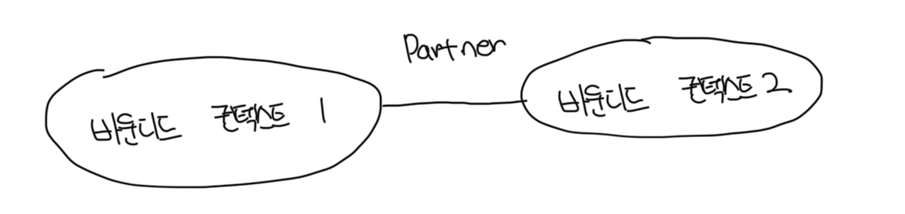
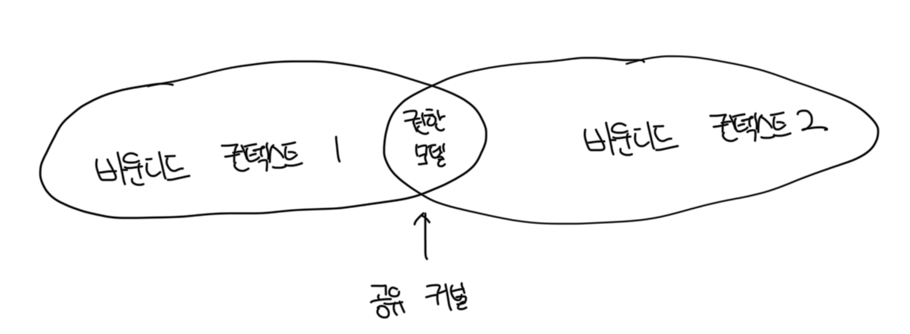
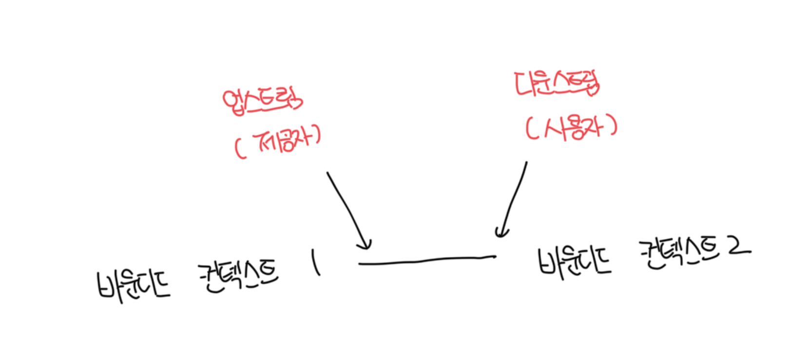
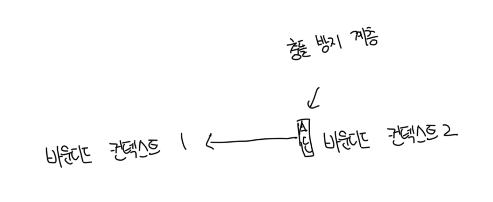
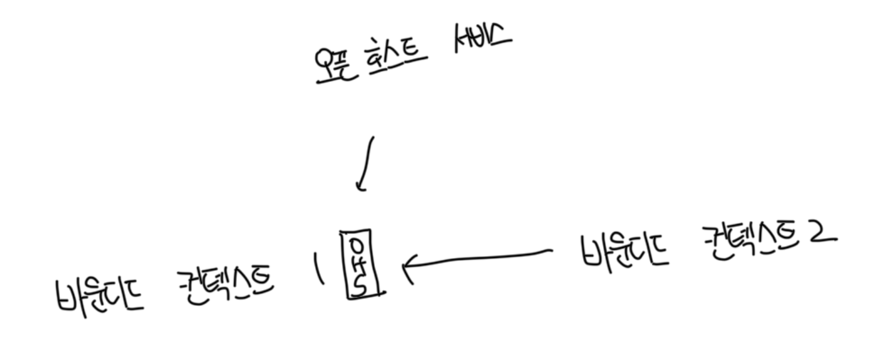
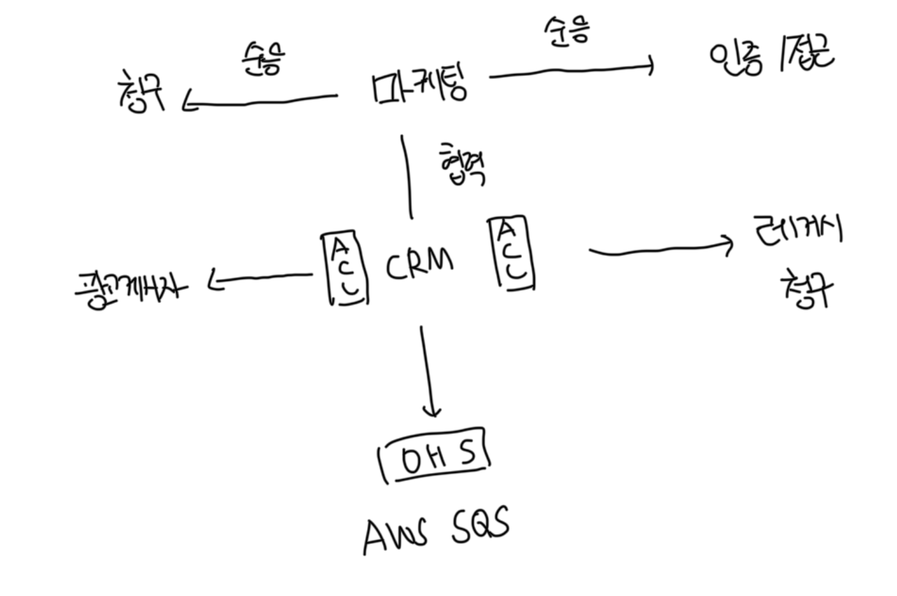

# 바운디드 컨텍스트 연동

- 바운디드 컨텍스트는 서로 독립적인 발전은 가능하지만 상호작용이 필요하다
- 이 때 연동을 위해 접점이 존재하는데 이를 `컨트랙트`라고 부른다
- 각 컨트랙트는 하나 이상의 당사자에 영향을 끼치므로 서로 조율해서 정의해야한다

 

# 협력형 패턴 그룹

- 소통이 잘 되는 팀에서 구현된 바운디드 컨텍스트와 관련이 있다
- 간단한 예시는 단일 팀에 의해 구성된 바운디드 컨텍스트다
- 또한 한팀의 성공이 다른 팀의 성공에 달려있고, 그 반대도 마찬가지인 의존적 목표가 있는 팀에 해당된다

 

### 파트너쉽 패턴

- 파트너쉽 모델에서 바운디드 컨텍스트간 연동은 `애드혹` 방식으로 조정한다
- 한 팀은 다른 팀에게 API의 변경을 알리고, 다른 팀은 충돌없이 이를 받아들인다
- 연동의 조정은 양방향에서 진행하며 서로 방해하지 않는다
- 연동의 피드백 경로를 최소화하기 위해서 적용한 변경사항의 지속적인 통합이 필요하다

 

### 공유 커널 패턴

- 바운디드 컨텍스트가 모델의 경계임에도 불구하고 여전히 하위 도메인의 동일 모델이나 그 일부가 여러 다른 바운디드 컨텍스트에서 구현되는 경우가 존재한다
- `공유 커널`과 같은 공유 모델은 모든 바운디드 컨텍스트의 필요에 따라서 설계된다는 점을 강조한다
- 공유 모델은 이를 사용하는 모든 바운디드 컨텍스트에 걸쳐서 `일관성` 유지가 필요하다
- 대표적으로는 사용자의 권한을 관리하는 모델이 존재한다

 

#### 공유 범위

- 겹치는 형태의 모델은 해당 되는 바운디드 컨텍스트의 수명주기도 서로 엮이게한다
- 공유 모델의 변경은 다른 모든 바운디드 컨텍스트에 즉시 영향을 주게된다
- 양쪽의 겹치는 모델을 제한해서 바운디드 컨텍스트에서 공통으로 구현돼야 하는 모델의 일부분만 노출되도록 하는게 좋다
- 공유 커널은 바운디드 컨텍스트 간 제공될 의도가 있는 연동 관련 컨트랙트와 자료구조만으로 구성하는게 이상적이다

 

#### 구현

- 공유 커널의 소스코드 변경은 이를 사용하는 모든 바운디드 컨텍스트에 즉시 반영되도록 구현됨
- 공유 커널은 여러 바운디드 컨텍스트에 속하기 때문에 변경은 지속적으로 통합되어야함
- 공유 커널의 변경사항을 지속적으로 알리지 않는다면 모델의 일관성이 깨지게됨

 

#### 공유 커널을 사용하는 경우

- 공유 커널 패턴 적용 여부를 결정하는 가장 중요한 기준은 중복 비용과 조율 비용의 비율임
- 통합 비용과 중복 비용의 차이는 모델의 변동성에 달렸는데, 변경에 찾을수록 통합 비용은 높아지게됨
- 겹치는 형태의 모델의 경우는 사실상 여러 팀이 함께 개발하게됨
- 통합의 문제를 빠르게 발견하는 방법은 공유 커널의 범위를 최소화해서 연쇄적인 변경의 범위를 줄이고, 매번 변경할 때마다 통합 테스트를 돌리는것이 좋음
- 결국 공유 커널은 동일 팀에서 소유하고 구현한 바운디드 컨텍스트를 연동하는 경우에 잘 맞는다

 

# 사용자 - 제공자 패턴 그룹

- 제공자는 사용자에게 서비스를 제공한다
- 제공자는 `업스트림`으로 부르고 고객이나 사용자는 `다운스트림`으로 불린다
- 협력 그룹의 경우와는 다르게 양 팀은 서로 독립적으로 성공이 가능해진다
- 하지만 대부분의 경우는 업스트림 또는 다운스트림 팀이 연동 컨트랙트를 주도하는 권력의 불균형이 존재하게된다

 

### 순응주의자 패턴

- 다운스트림 팀이 업스트림 팀의 모델을 받아들이는 관계를 뜻한다
- 이는 보통 외부 서비스 제공자와 연동하는 경우나 단순히 조직의 정치적 이유에서 발생할 수 있다
- 업스트림에서 노출한 컨트랙트가 산업 표준이거나 잘 구축된 모델 또는 다운스트림 팀의 요건에 충분하다면 다운스트림 팀이 자율성의 일부를 포기하는 결정은 정당화가 가능하다

 

### 충돌 방지 계층 패턴

- 힘의 균형은 업스트림 서비스에 치우쳐 있는다
- 하지만 다운스트림에서 순응하지 않는 경우는 `충돌 방지 게층`을 통해서 업스트림의 모델을 스스로의 필요에 맞게 가공이 가능하다
- 일반적으로 업스트림 팀의 모델을 따르는걸 원치 않거나, 순응에 필요한 노력이 가치가 없을 경우 다루게된다

 

#### 충돌 방지 계층 패턴을 사용하는 경우

- 다운스트림이 핵심 하위 도메인을 표현하는 경우
  - 핵심 하위 도메인은 각별한 주의가 필요한데, 제공자의 모델이 자칫 문제 도메인에 대한 모델링을 방해할 수 있음
- 업스트림 모델이 사용자에 요건에 비효율적이거나 불편한 경우
  - 바운디드 컨텍스트가 혼란에 순응하면 그 자체로 위험에 빠지게됨
  - 이런 경우는 레거시 시스템과 연동할때 종종 발생함
- 제공자가 컨트랙트를 자주 변경하는 경우
  - 사용자는 잦은 변경으로부터 모델을 보호하기를 원함
  - 충돌 방지 계층이 있다면 제공 모델의 변경은 변환 장치에만 영향을 주게됨

 

### 오픈 호스트 서비스 패턴

- 힘이 사용자측에 있을 경우를 처리한다
- 제공자는 사용자를 보호하고 가능한 최고의 서비스를 제공하는데 관심이 있다
- 구현 모델의 변경으로부터 사용자를 보호하기 위해서 업스트림 제공자는 퍼블릭 인터페이스와 구현 모델을 분리하게됨
  - 퍼블릭 인터페이스의 경우 `연동 지향 언어`를 통해 유저에게 더 편리한 프로토콜을 노출시킬려고한다
- 충돌 방지 계층 패턴의 반대로 사용자가 대신 제공자의 내부 모델 변역을 구축함

 

# 분리형 노선

- 전혀 협력하지 않는것들로 팀에 협업 의지가 없거나 협업이 불가한 경우다

 

### 커뮤니케이션 이슈

- 협업을 회피하는 일반적인 이유는 조직의 규모와 내부 정치 요인으로 인한 커뮤니케이션 어려움 때문임
- 커뮤니케이션에 어려움을 겪고 있다면 여러 바운디드 컨텍스트 내에서 기능을 중복해서 가져가고 각자의 길을 가는게 더 효율적이다

 

### 일반 하위 도메인

- 중복된 하위 도메인의 특성도 협업 없이 분리된 길을 가야 하는 이유가 될 수 있음
- 만약 하위 도메인이 일반 솔루션과 연동하는 것이 더 쉽다면 각 바운디드 컨텍스트 내에서 각자 연결하는게 효율적일수도 있음
- 대표적으로 로깅 프레임워크가 존재함

 

### 모델의 차이

- 바운디드 컨텍스트 간 모델의 차이점도 협업 없이 분리된 길을 가야하는 이유가됨
- 모델이 너무 달라서 순응주의 관계나 충돌방지게층이 불가능하다면 팀이 각자의 길을 가는게 더 비용 효과적임

 

# 컨텍스트 맵

- 시스템의 바운디드 컨텍스트와의 연동을 시각적으로 표현함

 

### 유지보수

- 프로젝트 초기부터 도입해서 새로운 바운디드 컨텍스트와 기존 요소에 대한 수정을 반영하는게 이상적임
- 여러 팀이 작업한 정보를 담기 때문에 다 함께 유지보수하는게 좋음
- 각 팀은 자신이 담당하는 외부 바운디드 컨텍스트 연동에 대해서 갱신한다
- 대표적인 도구로는 `컨텍스트 매퍼`같은 도구가 존재함

 

### 한계

- 컨텍스트 맵을 작성하는건 어려운 작업이다
- 여러 하위 도메인에 걸친 시스템의 바운디드 컨텍스트에는 작동하는 여러개의 패턴이 존재할 수 있다
