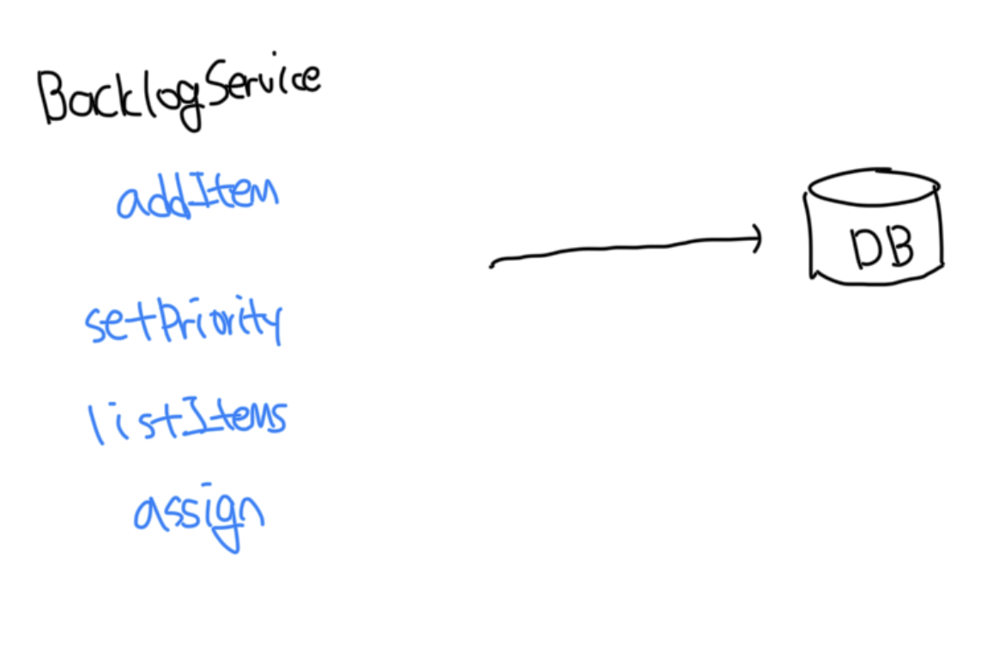

# 트랜잭션 스크립트

- 프로시저를 기반으로 시스템의 비즈니스 로직을 구성함
- 각 프로시저는 퍼블릭 인터페이스를 통해서 시스템 사용자가 실행하는 작업을 구현함
- 실제로 시스템의 퍼블릭 오퍼레이션은 캡슐화의 경계로 사용됨



<br>

### 구현

- 각 프로시저는 간단하고 쉬운 절차지향 스크립트로 구현됨
- 프로시저가 구현해야 하는 유일한 요구사항은 `트랜잭션`으로 각 작업은 성공하거나 실패해야하고 유요하지 않은 상태를 만들면 안됨

```ts
const database = new Database();

database.startTransaction();

const job = database.loadNextJob();
const json = loadFile(job.source);
const xml = convertJsonToXml(json);
writeFile(job.destination, xml.toString());
database.markJobAsCompleted(job);

database.commit();
```

<br>

### 쉽지는 않다

- 트랜잭션 스크립트 패턴은 고급 비즈니스 로직 구현 패턴의 기반이다
- 겉보기에는 단순하지만 가장 틀리기 쉬운 패턴이기도 하다

<br>

### 트랜잭션 동작 구현 실패

#### 트랜잭션이 없음

```ts
class LogVisit {
  private readonly db: Database;

  execute(userId: string, visitedOn: Date) {
    this.db.execute("유저 방문시간 수정 쿼리");
    this.db.execute("방문 기록 테이블에 데이터 삽입");
  }
}
```

<br>

#### 트랜잭션 추가

```ts
class LogVisit {
  private readonly db: Database;

  execute(userId: string, visitedOn: Date) {
    try {
      this.db.startTransaction();

      this.db.execute("유저 방문시간 수정 쿼리");
      this.db.execute("방문 기록 테이블에 데이터 삽입");
    } catch (err) {
      this.db.rollbackTransaction();
      throw err;
    }
  }
}
```

<br>

### 분산 트랜잭션

- 최신 분산 시스템에서는 변경 이후 메세지를 통해서 다른 컴포넌트에게 이러한 변경사항을 알리는게 일반적이다
- 이런 경우는 일반적으로 하나의 주기에 모든 쿼리가 처리되지 않으므로 확장하기 어렵고 오류가 발생하기 쉽다

```ts
class LogVisit {
  private readonly db: Database;
  private readonly messageBus: MessageBus

  execute(userId: string, visitedOn: Date) {
    this.db.execute("유저 방문시간 수정 쿼리");
    this.messageBus.publish("VISITS_TOPIC", new UserVisitedEvent()))
  }
}
```

<br>

### 암시적 분산 트랜잭션

- 아래 예시의 경우는 단순하게 카운트를 1개 증가시키는 로직이다
- 하지만 분산환경에서 로직에 실패한 경우 다시 호출하게되는데 이러면 2개의 카운트가 증가된다
- 이런 문제는 간단하게 해결이 불가능한데 이러한 경우 트랜잭션 동작을 보장하는 방법은 2가지가 존재한다

```ts
class LogVisit {
  private readonly db: Database;
  private readonly messageBus: MessageBus;

  execute(userId: string, visitedOn: Date) {
    this.db.execute(
      "UPDATE user SET visited_count = visited_count + 1 WHERE id = :userId",
      { userId }
    );
  }
}
```

<br>

#### 멱등성으로 만들기

- 같은 요청을 여러번 반복하더라도 그 결과는 매번 동일하게 만드는 것이다
- 예를 들면 사용자게에 카운터 값을 전달받아서 그 값을 증가시키는 방식이다

```ts
class LogVisit {
  private readonly db: Database;
  private readonly messageBus: MessageBus;

  execute(userId: string, visitedCount: number) {
    this.db.execute(
      "UPDATE user SET visited_count = visited_count + :visitedCount WHERE id = :userId",
      { userId, visitedCount }
    );
  }
}
```

<br>

#### 낙관적 동시성 제어

- 호출자는 카운터의 현재 값을 읽고, 매개변수로 전달한다
- `LogVisit`은 호출자가 처음 읽은 값과 동일한 경우에만 카운터 값을 업데이트 하게된다

```ts
class LogVisit {
  private readonly db: Database;
  private readonly messageBus: MessageBus;

  execute(userId: string, expectedVisit: number) {
    this.db.execute(
      "UPDATE user SET visit = visit + 1 WHERE id = ? AND visit = ?",
      userId,
      expectedVisit
    );
  }
}
```

<br>

### 트랜잭션 스크립트를 사용하는 경우

- 비즈니스 로직이 단순한 절차적 작업처럼 매우 간단한 문제 도메인에 효과적임
- 트랜잭션 스크립트 패턴의 주요 장점은 단순함이다
- 하지만 핵심 하위 도메인에서는 트랜잭션 스크립트 패턴을 사용하는건 피해야한다

<br>

# 액티브 레코드

- 마찬가지로 비즈니스 로직이 간단할 때 사용하지만, 좀 더 복잡한 자료구조에서도 비즈니스 로직이 작동할 수 있음
- `액티브 레코드`라고 불리는 전용 객체를 사용해서 복잡한 자료구조를 구현하게됨
- 트랜잭션 스크립트 패턴과의 차이점은 디비에 직접 접근하는 대신 트랜잭션 스크립트가 액티브 레코드 객체를 조작하게됨
- 해당 패턴의 목적은 메모리상의 객체를 디비 스키마에 매핑하는 복잡성을 숨기는것임
- 일반적으로 액티브 레코드의 필드에는 외부 프로시저(함수)가 상태를 수정할 수 있게 해주는 getter, setter가 존재함

```ts
class CreateUser {
  private readonly db: Database;
  execute(userDetail: UserDetail) {
    try {
      this.db.startTransaction();

      const user = new User();
      user.name = userDetail.name;
      user.email = userDetail.email;
      user.save();
    } catch (err) {
      this.db.rollbackTransaction();
      throw err;
    }
  }
}
```

<br>

### 액티브 레코드를 사용하는 경우

- 결국 디비에 접근하는 회수를 줄이는 트랜잭션 스크립트이기 때문에 간단한 비즈니스 로직만 지원이 가능함
- 지원/일반 하위 도메인과 외부 솔루션, 모델 변환 작업에 적합함

<br>

# 실용적인 접근 방식

- 항상 그렇듯이 보편적 법칙은 존재하지 않고 작업중인 비즈니스 도메인에 달려 있음
- 일부 도메인세너는 매일 수십억개의 이벤트 중 0.001%가 중복되거나 손실되는 일은 무시해도 된다
- 결국 위험과 비즈니스 영향을 평가했는지 확인해야한다
