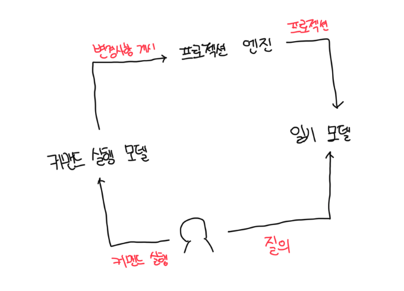
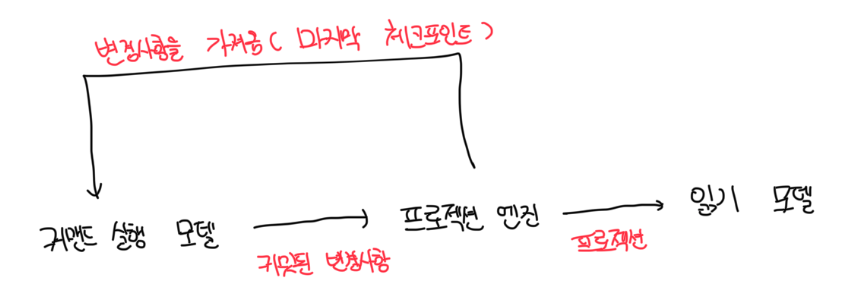
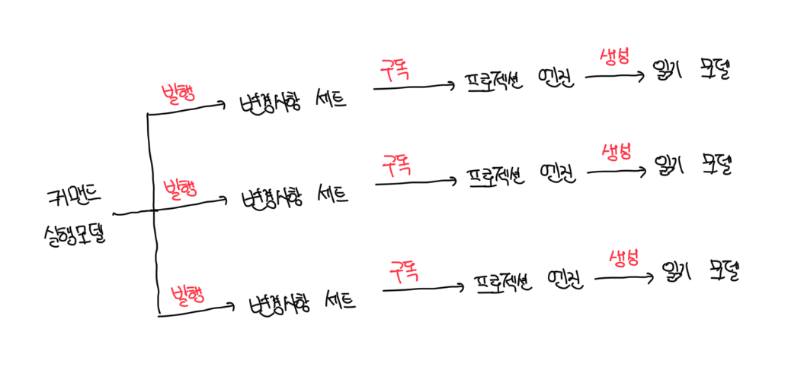

# CQRS

- CQRS 패턴은 포트앤 어댑터 패턴과 동일한 비즈니스 로직과 인프라스트럭처 관심사에 기반한다
- 시스템의 데이터를 관리하는 방식이 다른데, 이 패턴을 쓰면 여러 영속 모델에 시스템의 데이터 표현이 가능하다

 

# 폴리글랏 모델링

- 대부분의 경우 단일 비즈니스 도메인 모델로 시스템의 모든 요구사항 해결이 불가능하지는 않지만 어려울 수 있음
- OLTP, OLAP 시스템 데이터의 다양한 표현이 필요할 수 있음
- 확장성이나 일관성 또는 지원하는 질의모델 간 균형이 필요한데 이 때 완전한 디비의 대안으로 `폴리글랏 영속성 모델`이 있음
- 이벤트 소싱과 밀접하게 관련이 되어있는데 원래 목적은 이벤트 소싱 모델의 질의 한계를 극복하려고 정의됬음

 

# 구현

- 시스템 모델의 책임을 분리시킨다
- 총 2가지의 모델이 존재한다

 

### 커맨드 실행 모델

- 시스템우자 상태를 수정하는 오퍼레이션을 전담으로 수행하는 단일 모델
- 비즈니스 로직을 구현하고 규칙을 검사하며 불변성을 강화하는데 사용됨
- 비즈니스 엔티티의 일관적 상태를 읽을 수 있어야 하고 갱신할 때 낙관적 동시성을 지원해야함

 

### 읽기 모델(프로젝션)

- 시스템은 사용자에게 데이터를 보여주거나 다른 시스템에 정보를 제공하기 위해 필요한 만큼 모델을 정의할 수 있음
- 읽기 모델은 캐시에서 언제든 다시 추출할 수 있는 프로젝션이다
- 읽기 모델은 읽기 전용으로 시스템의 어떠한 오퍼레이션도 읽기 모델의 데이터를 직접 수정이 불가능함

 

# 읽기 모델의 프로젝션

- 읽기 모델이 작동하기 위해서는 시스템은 커맨드 실행 모델에서 변경을 모든 읽기 모델로 프로젝션 해야함
- 원천 테이블이 갱신되면 변경사항은 미리 작성된 뷰에 반영되어야함

 

### 동기식 프로젝션

- 격차 해소 구독 모델을 통해서 OLTP 데이터의 변경사항을 가져옴
- 격자 해소 구독 모델이 잘 작동하러면 커맨드 실행 모델이 추가되거나 갱신되는 모든 디비 레코드를 체크포인트로 관리해야함
- 저장 매커니즘 또한 체크포인트 기반으로 레코드를 조회하는것을 지원해야함
- 체크포인트는 디비의 기능을 사용해서 구현이 가능한데 대표적으로 SQL 서버의 `rowversion`이 있고 기타 다른 디비는 직접 관리해야함
- 마지막 반환된 레코드의 체크포인트가 10이라면 다음번 실행에서 새로운 요청은 10보다 낮은 값을 가지면 안됨

| id  | first_name | last_name | checkpoint     |
| --- | ---------- | --------- | -------------- |
| 1   | Tom        | Cook      | 0X000000001792 |
| 2   | Dong       | woo       | 0X000000001793 |
| 5   | Kimch      | Lover     | 0X000000001798 |

 

### 비동기식 프로젝션

- 커맨드 실행 모델은 모든 커밋된 변경사항을 메세지 버스에 발행함
- 시스템의 프로젝션 엔진은 발행된 메세지를 구독하고 읽기 모델을 갱신하는데 사용됨

 

# 도전과제

- 비동기식 프로젝션 방식의 확실한 확장성과 성능의 장점에도 불구하고 분산 컴퓨팅에서는 문제가 발생하기 더 쉬움
- 메세지의 순서가 잘못되거나 중복 처리되면 읽기 모델에 일관성 없는 데이터가 프로젝션됨
- 또한 새로운 프로젝션을 추가하거나 이미 존재하는 것을 재생성하는 것이 어려움
- 가능하면 동기식 프로젝션 방식을 구현하고 나서, 그 위에 선택적으로 비동기식 프로젝션 방식을 추가하는걸 권장함

 

# 모델 분리

- CQRS 아키텍쳐에서 시스템 모델이 담당하는 책임은 그 타입에 따라 분리됨
- 커맨드는 강한 일관성을 가진 커맨드 실행 모델에서만 동작한다
- 질의는 읽기 모델과 커맨드 실행 모델을 포함하여 그 어떤 시스템의 영속 상태를 직접 수정할 수 없음
- 커맨드의 경우는 데이터를 반환해야 하는데 그래야 호출자 입장에서 커맨드를 어떻게 수정할지 알 수 있음

 

# CQRS를 사용해야 하는 경우

- 여러 모델, 궁극적으로 다양한 종류의 데이터베이스에 저장된 동일한 데이터와 작동할 필요가 있는 앱에 유용함
- 운영의 관점에서는 당면한 과제에 가장 효과적인 모델을 사용하고 비즈니스 도메인 모델을 지속적으로 개선하는 DDD의 핵심가치를 지원함
- 인프라스트럭처 관점에서는 CQRS가 다양한 종류의 디비의 장점을 활용할 수 있게 해줌
- 이벤트 소싱 모델에도 적합한데, 이벤트 소싱 모델은 애그리게이트의 상태에 기반한 레코드 조회가 불가능하지만 CQRS는 상태에 질의가 가능한 디비 상태를 프로젝션 하므로 이것이 가능함
